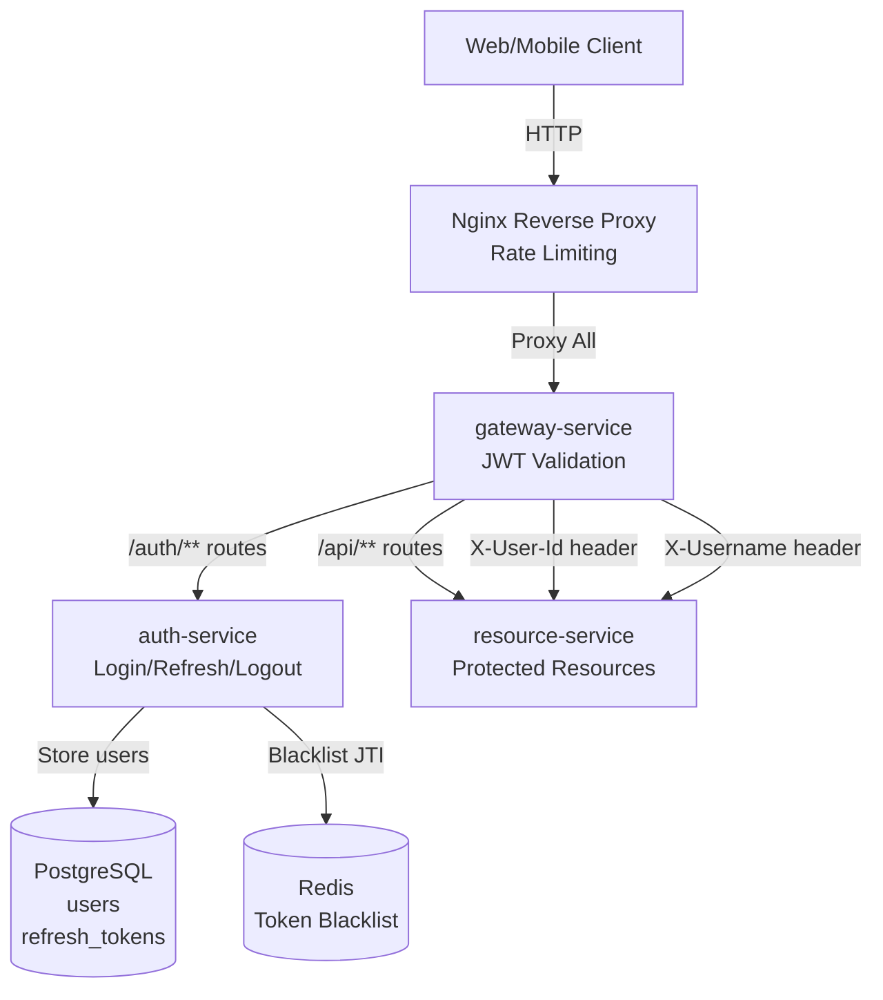
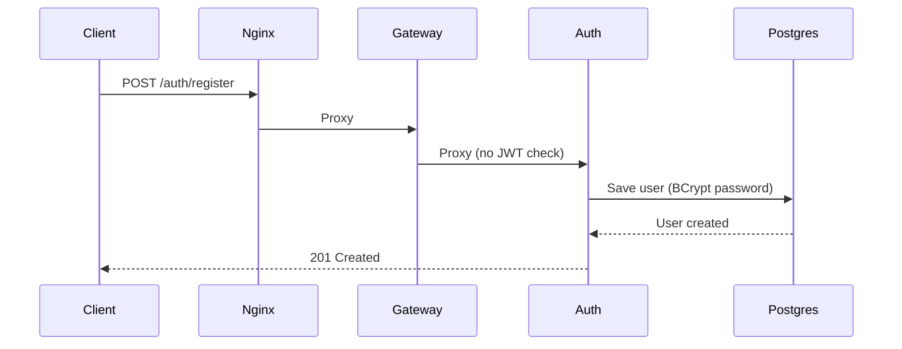
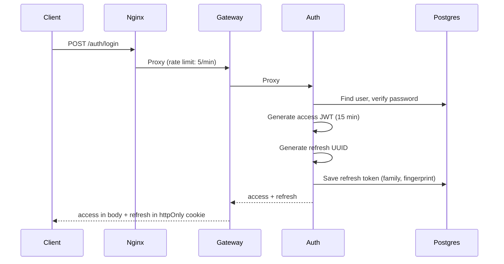
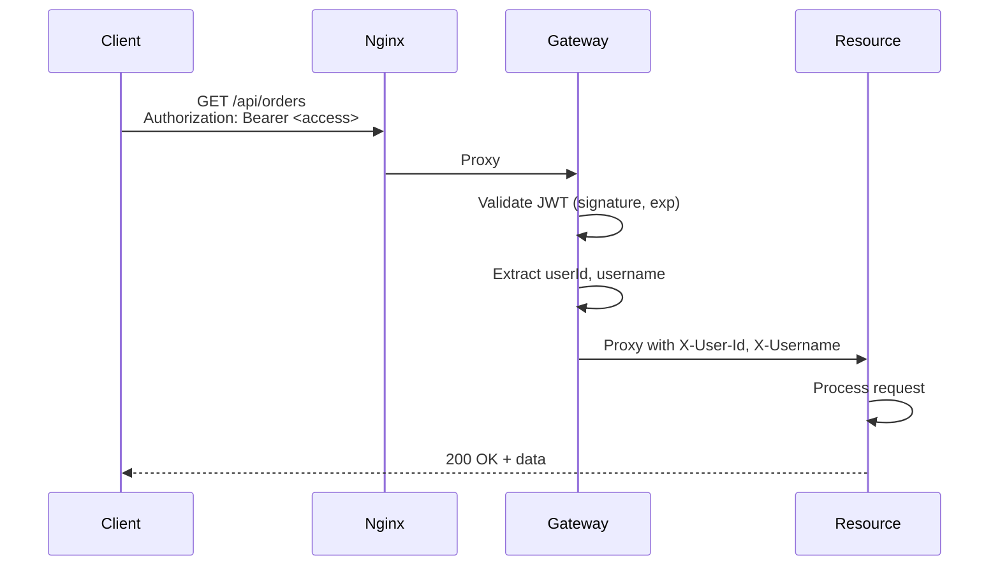
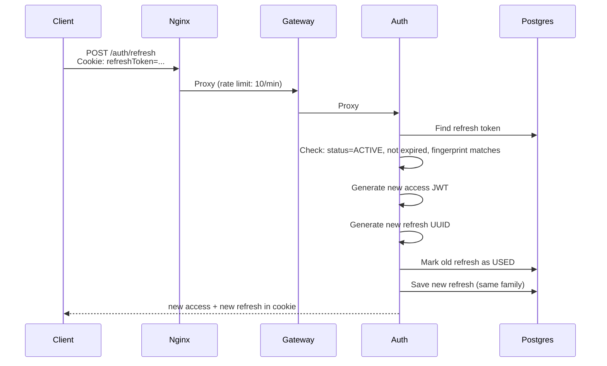
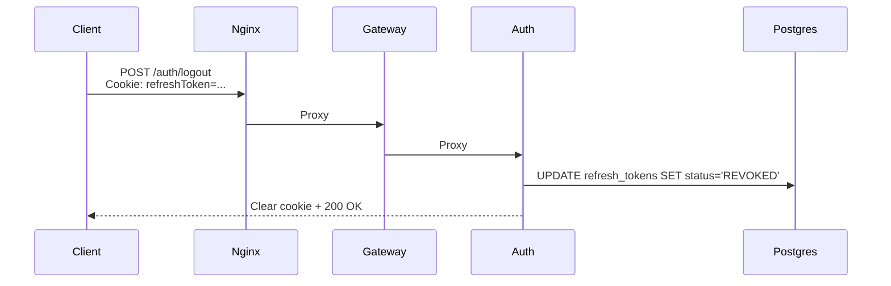
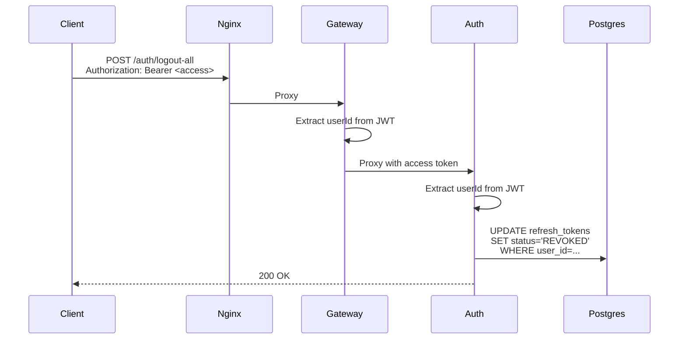

# auth-gateway

## 📌 Проблема

В микросервисной архитектуре возникает необходимость **централизованной аутентификации и авторизации** с требованиями:
- **Безопасность** — защита от кражи токенов, XSS, CSRF атак
- **Масштабируемость** — горизонтальное масштабирование без shared session
- **Отказоустойчивость** — возможность отзыва токенов при компрометации
- **Прозрачность** — единая точка входа для всех защищённых ресурсов
- **Управление жизненным циклом токенов** — выдача, обновление, отзыв

Основные ограничения классического подхода:
- **Session-based auth**  
  Требует shared storage (Redis/DB) для сессий, сложно масштабировать, создаёт stateful архитектуру.
- **Один долгоживущий JWT**  
  При краже токена злоумышленник имеет доступ длительное время. JWT "сам по себе" неотзываем до истечения exp.
- **Отсутствие refresh механизма**  
  Пользователю приходится перелогиниваться при истечении токена, плохой UX.
- **Нет защиты от кражи refresh токена**  
  Если refresh токен украден, его можно использовать для генерации новых access токенов.
- **Проверка JWT в каждом микросервисе**  
  Дублирование логики валидации, сложность обновления секретных ключей.

**Типичные сценарии:**
- Веб/мобильное приложение с аутентификацией пользователей
- API Gateway для защиты множества микросервисов
- Необходимость "выйти со всех устройств"
- Обнаружение кражи токена и автоматическая блокировка

---

## 🎯 Решение

**JWT-based Authentication Gateway** с использованием **access/refresh токенов**, **refresh token rotation** и **централизованной валидацией** в gateway.

Архитектура объединяет:
- **Auth Service** — выдача, обновление и отзыв токенов
- **Gateway Service** — единая точка входа с JWT валидацией
- **Nginx** — reverse proxy с rate limiting на критичные эндпоинты
- **PostgreSQL** — хранение пользователей и refresh токенов
- **Redis** — blacklist для отозванных access токенов (опционально)

Таким образом:
- **Access токен** живёт коротко (15 минут) — ограничивает ущерб при краже
- **Refresh токен** хранится в httpOnly cookie — защита от XSS
- **Refresh rotation** — при каждом обновлении выдаётся новый refresh, старый инвалидируется
- **Fingerprint binding** — refresh привязан к User-Agent и IP клиента
- **Централизованная валидация** — только gateway проверяет JWT, backend сервисы получают уже проверенные заголовки



**Преимущества подхода:**
- ✅ **Безопасность** — короткие access токены + refresh rotation + fingerprint binding
- ✅ **Отзыв токенов** — можно инвалидировать refresh токены в БД
- ✅ **Централизация** — вся логика JWT в gateway, backend сервисы не знают про токены
- ✅ **Масштабируемость** — stateless архитектура, можно горизонтально масштабировать все компоненты
- ✅ **Rate Limiting** — защита от brute force атак на уровне Nginx

---

## 🏗️ Архитектура решения

### Компоненты

1. **Nginx** — reverse proxy с rate limiting для login/refresh эндпоинтов
2. **Gateway Service** — валидирует JWT, маршрутизирует запросы, проставляет заголовки с userId/username
3. **Auth Service** — управление пользователями и токенами (register, login, refresh, logout)
4. **Resource Service** — пример защищённого API (orders, profile, etc.)
5. **PostgreSQL** — хранение пользователей и refresh токенов с семьями (families)
6. **Redis** — опциональный blacklist для отозванных access токенов

### Поток аутентификации

#### 1. Регистрация



#### 2. Логин



**Access Token (JWT):**
```json
{
  "sub": "123",
  "username": "demo",
  "roles": ["USER", "ADMIN"],
  "jti": "550e8400-...",
  "iat": 1704067200,
  "exp": 1704068100
}
```

**Refresh Token:** UUID сохранён в БД с привязкой к userId, fingerprint, family.

#### 3. Запрос к защищённому ресурсу



#### 4. Refresh (rotation)



**Rotation security:**
- Старый refresh помечается как `USED`
- Новый refresh создаётся в той же `family`
- Если кто-то попытается использовать старый refresh — вся семья токенов отзывается

#### 5. Logout (single device)



#### 6. Logout All Devices



---

## 🔧 Жизненный цикл токенов

### Access Token
- **Тип:** JWT (self-contained)
- **Lifetime:** 15 минут
- **Хранение:** В памяти клиента (JS variable) или localStorage
- **Использование:** В каждом запросе к защищённым ресурсам
- **Отзыв:** Через blacklist в Redis (по `jti` claim) или просто ждать истечения

### Refresh Token
- **Тип:** UUID (opaque token)
- **Lifetime:** 30 дней
- **Хранение:** В httpOnly, Secure, SameSite=Lax cookie
- **Использование:** Только для `/auth/refresh` эндпоинта
- **Отзыв:** Через обновление статуса в БД (`REVOKED`)

### Refresh Token Rotation

При каждом `/auth/refresh`:
1. Проверяем статус токена в БД
2. Если статус `ACTIVE` — выдаём новые токены
3. Если статус `USED` — **кто-то пытается использовать старый токен** → отзываем всю семью (family)
4. Если статус `REVOKED` — отклоняем запрос

**Зачем?**
- Если украли refresh токен, легитимный пользователь его обновит → старый станет `USED`
- Злоумышленник попытается использовать старый → мы поймём, что токен скомпрометирован → отзовём всю семью

### Token Family (семья токенов)

Все refresh токены, порождённые от одного логина, имеют один `family` UUID:
- При логине создаётся новый `family`
- При refresh новый токен наследует `family` от старого
- При обнаружении кражи отзывается вся `family`

### Fingerprint Binding

Каждый refresh токен привязан к fingerprint клиента:
```kotlin
fingerprint = "$userAgent|$ip"
```

При попытке refresh с другого fingerprint:
- Отклоняем запрос
- Отзываем семью токенов
- Логируем security violation

**Trade-off:** Легитимный пользователь с динамическим IP будет разлогинен. Для production можно смягчить (только User-Agent или device ID).

---

## Компоненты

## ⚙️ auth-service

Сервис для управления аутентификацией и токенами.

### 🛠️ Стек технологий
- **Kotlin** / Java 21
- **Spring Boot 3** (WebFlux)
- **Spring Security** (password encoding)
- **Spring Data R2DBC** (PostgreSQL)
- **Spring Data Redis** (Reactive)
- **JJWT** (JWT generation/parsing)

### 🔧 Основные компоненты

#### 1. AuthController
REST API для аутентификации:

```kotlin
POST /auth/register    // Регистрация пользователя
POST /auth/login       // Логин (возвращает access + refresh в cookie)
POST /auth/refresh     // Обновление токенов (rotation)
POST /auth/logout      // Выход с текущего устройства
POST /auth/logout-all  // Выход со всех устройств
POST /auth/validate    // Валидация access токена (для gateway)
```

#### 2. AuthService
Бизнес-логика аутентификации:
- Регистрация с BCrypt хешированием пароля
- Логин с генерацией access/refresh токенов
- Refresh с rotation и fingerprint проверкой
- Logout с отзывом токенов
- Автоматический отзыв семьи токенов при обнаружении атаки

#### 3. JwtService
Работа с JWT:
- Генерация access токена с claims (sub, username, roles, jti)
- Парсинг и валидация JWT
- Использование HS256 (HMAC) с общим секретом

**Claims в access токене:**
```json
{
  "sub": "123",            // User ID
  "username": "demo",      // Username
  "roles": ["USER", "ADMIN"],
  "jti": "uuid",           // JWT ID (для blacklist)
  "iat": 1704067200,       // Issued At
  "exp": 1704068100        // Expiration (15 min)
}
```

#### 4. RefreshTokenRepository
Работа с refresh токенами в PostgreSQL:
- Сохранение токенов с fingerprint и family
- Обновление статуса (ACTIVE → USED → REVOKED)
- Отзыв всех токенов пользователя или семьи

**Использование:**

```bash
# Регистрация
curl -X POST http://localhost:8888/auth/register \
  -H "Content-Type: application/json" \
  -d '{
    "username": "testuser",
    "password": "password123",
    "email": "test@example.com"
  }'

# Логин
curl -X POST http://localhost:8888/auth/login \
  -H "Content-Type: application/json" \
  -d '{
    "username": "testuser",
    "password": "password123"
  }' \
  -c cookies.txt

# Response:
# {
#   "accessToken": "eyJhbGciOiJIUzI1NiIsInR5cCI6IkpXVCJ9...",
#   "expiresIn": 900
# }
# Cookie: refreshToken=<uuid>; HttpOnly; SameSite=Lax; Path=/
```

---

## ⚙️ gateway-service

Единая точка входа с JWT валидацией и маршрутизацией.

### 🛠️ Стек технологий
- **Kotlin** / Java 21
- **Spring Boot 3** (WebFlux)
- **Spring Security**
- **JJWT** (JWT validation)
- **Micrometer** (метрики)

### 🔧 Основные компоненты

#### 1. SecurityConfig
Конфигурация Spring Security:
- `/auth/**` — доступны без аутентификации (проксируются на auth-service)
- Все остальные пути — требуют JWT в заголовке `Authorization: Bearer <token>`

#### 2. JwtAuthenticationConverter
Извлечение и валидация JWT:
- Парсинг JWT с проверкой подписи и exp
- Извлечение userId, username, roles
- Создание `Authentication` объекта для SecurityContext

#### 3. JwtAuthenticationFilter
Custom filter для аутентификации:
- Применяется ко всем запросам кроме `/auth/**`
- При успешной валидации JWT пропускает запрос дальше
- При ошибке возвращает 401 Unauthorized
- Собирает метрики (success/failure)

#### 4. ProxyHandler
Маршрутизация запросов:
- `/auth/**` → проксирование на `auth-service:8081`
- `/api/**` → проксирование на `resource-service:8082`
- Добавляет заголовки `X-User-Id`, `X-Username` из JWT для backend сервисов
- Backend сервисы получают уже проверенные данные о пользователе

**Использование:**

```bash
# Запрос к защищённому ресурсу
curl http://localhost:8888/api/me \
  -H "Authorization: Bearer <access_token>"

# Gateway:
# 1. Валидирует JWT
# 2. Извлекает userId=123, username=testuser
# 3. Проксирует на resource-service с заголовками:
#    X-User-Id: 123
#    X-Username: testuser
```

---

## ⚙️ resource-service

Пример защищённого API, который доверяет gateway.

### 🛠️ Стек технологий
- **Kotlin** / Java 21
- **Spring Boot 3** (WebFlux)

### 🔧 Эндпоинты

```kotlin
GET /api/me         // Информация о текущем пользователе
GET /api/orders     // Список заказов пользователя
```

**Особенности:**
- Не проверяет JWT — доверяет gateway
- Читает userId и username из заголовков `X-User-Id`, `X-Username`
- Простая бизнес-логика для демонстрации

**Использование:**

```bash
# Получить информацию о себе
curl http://localhost:8888/api/me \
  -H "Authorization: Bearer <access_token>"

# Response:
# {
#   "userId": 123,
#   "username": "testuser",
#   "email": "testuser@example.com",
#   "roles": ["USER"]
# }
```

---

## 🔒 Безопасность

### 1. Access Token Security

- **Короткое время жизни** (15 минут) — ограничивает ущерб при краже
- **JWT подпись** (HS256) — невозможно подделать без секретного ключа
- **Claims validation** — проверка exp, signature в gateway
- **Опциональный blacklist** — можно добавить в Redis по `jti` claim

### 2. Refresh Token Security

- **HttpOnly cookie** — JS не может прочитать токен (защита от XSS)
- **SameSite=Lax** — защита от CSRF атак
- **Хранение в БД** — можно отозвать в любой момент
- **Fingerprint binding** — привязка к User-Agent + IP клиента
- **Rotation** — новый токен при каждом обновлении
- **Family tracking** — обнаружение кражи через использование старых токенов

### 3. Fingerprint Binding

```kotlin
fingerprint = "$userAgent|$ip"
```

**Что происходит:**
- При логине сохраняется fingerprint клиента
- При refresh проверяется, что fingerprint не изменился
- Если изменился → **security violation** → отзыв всей семьи токенов

**Trade-offs:**
- ✅ Защита от кражи refresh токена на другом устройстве
- ❌ Динамический IP или смена браузера → разлогин

**Для production:** можно использовать только User-Agent или device ID с мобильных приложений.

### 4. Refresh Token Rotation

**Без rotation:**
```
Login → refresh_1 (живёт 30 дней)
  ↓
Refresh → новый access, тот же refresh_1
  ↓
Refresh → новый access, тот же refresh_1
```
**Проблема:** Украденный refresh_1 можно использовать 30 дней.

**С rotation:**
```
Login → refresh_1 (family=A, status=ACTIVE)
  ↓
Refresh → новый access + refresh_2 (family=A, status=ACTIVE)
          refresh_1 → status=USED
  ↓
Refresh → новый access + refresh_3 (family=A, status=ACTIVE)
          refresh_2 → status=USED
```

**Обнаружение атаки:**
```
Если кто-то использует refresh_1 (status=USED):
  → Значит токен украден
  → Отзываем всю family=A (все refresh_2, refresh_3 и т.д.)
  → Легитимный пользователь должен перелогиниться
```

### 5. Rate Limiting в Nginx

```nginx
limit_req_zone $binary_remote_addr zone=login_limit:10m rate=5r/m;
limit_req_zone $binary_remote_addr zone=refresh_limit:10m rate=10r/m;

location /auth/login {
    limit_req zone=login_limit burst=2 nodelay;
    # Максимум 5 логинов в минуту + burst 2
}

location /auth/refresh {
    limit_req zone=refresh_limit burst=3 nodelay;
    # Максимум 10 refresh в минуту + burst 3
}
```

**Защита от:**
- Brute force атак на логин
- Abuse refresh эндпоинта

---

## 🛡️ Отказоустойчивость (Fault Tolerance)

### Stateless архитектура
- **Gateway** — не хранит состояние, можно горизонтально масштабировать
- **Auth Service** — stateless, всё состояние в PostgreSQL
- **Resource Service** — stateless, получает данные пользователя из заголовков

### Управление токенами

- **Refresh токены в БД**  
  Можно отозвать в любой момент. При падении auth-service состояние сохраняется в PostgreSQL.

- **Access токены stateless**  
  JWT проверяется локально в gateway без обращения к БД. Высокая производительность.

- **Redis blacklist** (опционально)  
  Для немедленного отзыва access токенов можно добавить blacklist в Redis по `jti` claim.

### Восстановление после сбоев

- **Auth Service падение**  
  Существующие access токены продолжают работать (gateway валидирует их локально). Новые логины недоступны до восстановления.

- **Gateway падение**  
  Nginx переключается на другой инстанс. Клиенты повторяют запросы.

- **PostgreSQL падение**  
  Access токены работают. Refresh и новые логины недоступны.

---

## 🛡️ Масштабируемость (Scalability)

### Горизонтальное масштабирование

- **Gateway Service**  
  Можно запускать множество инстансов за Nginx. Stateless архитектура позволяет балансировать нагрузку.

- **Auth Service**  
  Несколько инстансов могут работать параллельно. Все обращаются к одной PostgreSQL БД.

- **Resource Service**  
  Независимое масштабирование в зависимости от нагрузки.

### Производительность

- **JWT валидация в gateway**  
  Локальная проверка подписи без обращения к БД или внешним сервисам. Высокая throughput.

- **Backend сервисы без JWT**  
  Получают готовые заголовки с userId/username. Нет накладных расходов на парсинг JWT.

- **Минимальное обращение к БД**  
  Только при login/refresh/logout. Все остальные запросы обрабатываются без БД.

---

## 🎬 Демо

### 1. Запуск окружения

```bash
cd auth-gateway
.././gradlew clean build
docker-compose up -d
```

**Компоненты:**
- Nginx: `http://localhost:8888` (единая точка входа)
- Gateway: `http://localhost:8080` (внутренний)
- Auth Service: `http://localhost:8081` (внутренний)
- Resource Service: `http://localhost:8082` (внутренний)
- PostgreSQL: `localhost:5432`
- Redis: `localhost:6379`

### 2. Регистрация пользователя

```bash
curl -X POST http://localhost:8888/auth/register \
  -H "Content-Type: application/json" \
  -d '{
    "username": "alice",
    "password": "securepass123",
    "email": "alice@example.com"
  }'
```

**Response:**
```json
{
  "message": "User registered successfully"
}
```

### 3. Логин

```bash
curl -X POST http://localhost:8888/auth/login \
  -H "Content-Type: application/json" \
  -d '{
    "username": "alice",
    "password": "securepass123"
  }' \
  -c cookies.txt \
  -v
```

**Response:**
```json
{
  "accessToken": "eyJhbGciOiJIUzI1NiIsInR5cCI6IkpXVCJ9.eyJzdWIiOiIxMjMiLCJ1c2VybmFtZSI6ImFsaWNlIiwicm9sZXMiOlsiVVNFUiJdLCJqdGkiOiI1NTBlODQwMC1lMjliLTQxZDQtYTcxNi00NDY2NTU0NDAwMDAiLCJpYXQiOjE3MDQwNjcyMDAsImV4cCI6MTcwNDA2ODEwMH0.abc123...",
  "expiresIn": 900
}
```

**Cookie:**
```
Set-Cookie: refreshToken=550e8400-...; Path=/; HttpOnly; SameSite=Lax; Max-Age=2592000
```

### 4. Запрос к защищённому ресурсу

```bash
# Извлекаем access token из предыдущего ответа
ACCESS_TOKEN="eyJhbGciOiJIUzI1NiIsInR5cCI6IkpXVCJ9..."

# Запрос информации о себе
curl http://localhost:8888/api/me \
  -H "Authorization: Bearer $ACCESS_TOKEN"
```

**Response:**
```json
{
  "userId": 1,
  "username": "alice",
  "email": "alice@example.com",
  "roles": ["USER"]
}
```

**Что происходит:**
1. Nginx проксирует на gateway
2. Gateway валидирует JWT (подпись, exp)
3. Gateway извлекает userId=1, username=alice
4. Gateway проксирует на resource-service с заголовками:
   - `X-User-Id: 1`
   - `X-Username: alice`
5. Resource-service возвращает данные

### 5. Получение списка заказов

```bash
curl http://localhost:8888/api/orders \
  -H "Authorization: Bearer $ACCESS_TOKEN"
```

**Response:**
```json
[
  {
    "id": 1,
    "userId": 1,
    "productName": "Order #1",
    "amount": 99.99,
    "createdAt": "2025-01-27T10:00:00"
  },
  {
    "id": 2,
    "userId": 1,
    "productName": "Order #2",
    "amount": 149.99,
    "createdAt": "2025-01-30T15:30:00"
  }
]
```

### 6. Refresh токенов (rotation)

```bash
# Через 15+ минут access токен истекает
# Обновляем токены используя refresh из cookie

curl -X POST http://localhost:8888/auth/refresh \
  -b cookies.txt \
  -c cookies.txt
```

**Response:**
```json
{
  "accessToken": "eyJhbGciOiJIUzI1NiIsInR5cCI6IkpXVCJ9.NEW_TOKEN...",
  "refreshToken": "new-refresh-uuid",
  "expiresIn": 900
}
```

**Что происходит:**
1. Auth Service находит refresh токен в БД
2. Проверяет: `status=ACTIVE`, не истёк, fingerprint совпадает
3. Генерирует новый access JWT
4. Генерирует новый refresh UUID
5. Обновляет старый refresh: `status=USED`
6. Сохраняет новый refresh: `status=ACTIVE`, `family=<same>`
7. Возвращает оба токена

### 7. Logout с текущего устройства

```bash
curl -X POST http://localhost:8888/auth/logout \
  -b cookies.txt
```

**Что происходит:**
1. Auth Service находит refresh токен из cookie
2. Обновляет статус: `status=REVOKED`
3. Очищает cookie
4. Текущий access токен продолжает работать до истечения (компромисс stateless)

### 8. Logout со всех устройств

```bash
curl -X POST http://localhost:8888/auth/logout-all \
  -H "Authorization: Bearer $ACCESS_TOKEN"
```

**Что происходит:**
1. Gateway валидирует access токен
2. Auth Service извлекает userId из JWT
3. Отзывает все refresh токены пользователя: `UPDATE refresh_tokens SET status='REVOKED' WHERE user_id=...`
4. Все устройства пользователя больше не могут обновить access токены

### 9. Проверка refresh токенов в БД

```bash
docker exec -it postgres psql -U admin -d auth_db -c \
  "SELECT id, user_id, LEFT(token, 20) as token, family, status, expires_at 
   FROM refresh_tokens 
   ORDER BY created_at DESC 
   LIMIT 10;"
```

**Результат:**
```
 id | user_id |        token         |      family      | status  |     expires_at
----+---------+----------------------+------------------+---------+---------------------
  5 |       1 | 550e8400-e29b-41d4... | abc-123-def-456 | ACTIVE  | 2025-03-02 10:00:00
  4 |       1 | 123e4567-e89b-12d3... | abc-123-def-456 | USED    | 2025-03-02 09:30:00
  3 |       1 | 789abcde-f012-3456... | abc-123-def-456 | USED    | 2025-03-02 09:00:00
```

### 10. Тестирование rotation security

**Сценарий:** Злоумышленник украл старый refresh токен.

```bash
# 1. Легитимный пользователь делает refresh
curl -X POST http://localhost:8888/auth/refresh \
  -b cookies.txt \
  -c cookies.txt

# Старый refresh_1 → status=USED
# Новый refresh_2 → status=ACTIVE (в новом cookies.txt)

# 2. Злоумышленник пытается использовать старый refresh_1
curl -X POST http://localhost:8888/auth/refresh \
  -H "Cookie: refreshToken=old_refresh_uuid"

# Response: 401 Unauthorized
# Логи: "Attempted to use non-active refresh token"
# В БД: ВСЯ СЕМЬЯ токенов (refresh_1, refresh_2, ...) → status=REVOKED
```

**Результат:** Легитимный пользователь тоже будет разлогинен и должен заново залогиниться. Это компромисс безопасности.

### 11. Мониторинг метрик

```bash
# Метрики gateway
curl http://localhost:8080/actuator/metrics/gateway.jwt.success
curl http://localhost:8080/actuator/metrics/gateway.jwt.failure

# Метрики auth service
curl http://localhost:8081/actuator/metrics
```

---

## 📦 Структура проекта

```
auth-gateway/
├── gateway-service/                          # Gateway с JWT валидацией
│   ├── src/main/kotlin/com/andver/gateway/
│   │   ├── GatewayServiceApp.kt              - Main application
│   │   ├── config/
│   │   │   └── SecurityConfig.kt             - Spring Security configuration
│   │   ├── converter/
│   │   │   └── JwtAuthenticationConverter.kt - JWT → Authentication
│   │   ├── filter/
│   │   │   ├── JwtAuthenticationFilter.kt    - JWT validation filter
│   │   │   └── ProxyFilter.kt                - Request proxying
│   │   └── properties/
│   │       ├── JwtProperties.kt              - JWT settings
│   │       └── RoutingProperties.kt          - Routing configuration
│   ├── src/main/resources/
│   │   └── application.yml
│   ├── build.gradle.kts
│   ├── Dockerfile
│   └── .dockerignore
│
├── auth-service/                             # Auth с управлением токенами
│   ├── src/main/kotlin/com/andver/auth/service/
│   │   ├── AuthServiceApp.kt                 - Main application
│   │   ├── config/
│   │   │   └── SecurityConfig.kt             - Security + BCrypt
│   │   ├── controller/
│   │   │   └── AuthController.kt             - REST endpoints
│   │   ├── service/
│   │   │   ├── AuthService.kt                - Auth business logic
│   │   │   └── JwtService.kt                 - JWT generation/validation
│   │   ├── entity/
│   │   │   ├── User.kt                       - User entity
│   │   │   └── RefreshToken.kt               - Refresh token entity
│   │   ├── model/
│   │   │   ├── AuthRequests.kt               - Request DTOs
│   │   │   └── AuthResponses.kt              - Response DTOs
│   │   ├── repository/
│   │   │   ├── UserRepository.kt             - User database operations
│   │   │   └── RefreshTokenRepository.kt     - Token database operations
│   │   └── properties/
│   │       └── JwtProperties.kt              - JWT configuration
│   ├── src/main/resources/
│   │   └── application.yml
│   ├── build.gradle.kts
│   ├── Dockerfile
│   └── .dockerignore
│
├── resource-service/                         # Пример защищённого API
│   ├── src/main/kotlin/com/andver/resource/
│   │   ├── ResourceServiceApp.kt             - Main application
│   │   ├── controller/
│   │   │   └── ResourceController.kt         - Protected endpoints
│   │   └── model/
│   │       └── ResourceModels.kt             - DTOs
│   ├── src/main/resources/
│   │   └── application.yml
│   ├── build.gradle.kts
│   ├── Dockerfile
│   └── .dockerignore
│
├── nginx/
│   └── nginx.conf                            # Reverse proxy + rate limiting
├── postgres/
│   └── init.sql                              # DDL для users и refresh_tokens
├── docker-compose.yml
├── .gitignore
│
├── 📄 Documentation (3800+ lines)
│   ├── README.md                             - Main documentation
│   ├── QUICKSTART.md                         - Quick start guide
│   ├── INTERVIEW_GUIDE.md                    - Interview preparation
│   ├── FEATURES.md                           - Feature descriptions
│   ├── PROJECT_SUMMARY.md                    - One-page overview
│   ├── PROJECT_STRUCTURE.md                  - Structure explanation
│   ├── COMPARISON.md                         - Compare with alternatives
│   ├── PORTFOLIO_VALUE.md                    - Portfolio positioning
│   ├── WHAT_IS_IMPLEMENTED.md                - Scope & TODO
│   └── INDEX.md                              - Navigation index
│
└── 🧪 Testing Scripts
    ├── test-api.sh                           - Full auth flow test
    ├── test-security.sh                      - Security features demo
    └── validate-project.sh                   - Project validation
```

---

## 🔍 Технические детали

### Схема таблицы users

```sql
CREATE TABLE users (
    id         BIGSERIAL PRIMARY KEY,
    username   VARCHAR(100) NOT NULL UNIQUE,
    password   VARCHAR(255) NOT NULL,      -- BCrypt hash
    email      VARCHAR(255) NOT NULL UNIQUE,
    roles      VARCHAR(255) NOT NULL DEFAULT 'USER',
    created_at TIMESTAMP    NOT NULL DEFAULT NOW()
);
```

### Схема таблицы refresh_tokens

```sql
CREATE TABLE refresh_tokens (
    id          BIGSERIAL PRIMARY KEY,
    token       VARCHAR(255) NOT NULL UNIQUE,  -- UUID
    user_id     BIGINT       NOT NULL REFERENCES users(id),
    fingerprint VARCHAR(500) NOT NULL,         -- User-Agent|IP
    family      VARCHAR(100) NOT NULL,         -- UUID для отслеживания семьи
    status      VARCHAR(50)  NOT NULL,         -- ACTIVE, USED, REVOKED
    expires_at  TIMESTAMP    NOT NULL,
    created_at  TIMESTAMP    NOT NULL DEFAULT NOW()
);
```

### Жизненный цикл статусов refresh токена

```
ACTIVE → токен валидный, можно использовать для refresh
  ↓
USED → токен был использован для refresh, выдан новый (rotation)
  ↓ (при повторном использовании USED токена)
REVOKED → токен отозван (logout, security violation, вся семья)
```

### JWT Claims

**Access Token:**
```json
{
  "sub": "123",              // User ID (subject)
  "username": "alice",       // Username
  "roles": ["USER", "ADMIN"], // Roles для авторизации
  "jti": "550e8400-...",     // JWT ID (уникальный для каждого токена)
  "iat": 1704067200,         // Issued At (timestamp)
  "exp": 1704068100          // Expiration (15 минут)
}
```

**Зачем `jti`?**
- Для blacklist в Redis (если нужен немедленный отзыв access токена)
- Для аудита и отслеживания токенов

### Секретный ключ (Secret Key)

**Demo конфигурация (HS256):**
```yaml
jwt:
  secret: "MySecretKeyForJWTTokenGenerationAndValidation1234567890"
```

**Production рекомендации:**
- Использовать RS256 (асимметричная подпись) вместо HS256
- Private key только у auth-service
- Public key у gateway и всех сервисов (через JWKS endpoint)
- Ключи в environment variables или Vault, не в коде
- Rotation ключей: поддержка нескольких ключей одновременно (key ID в JWT header)
