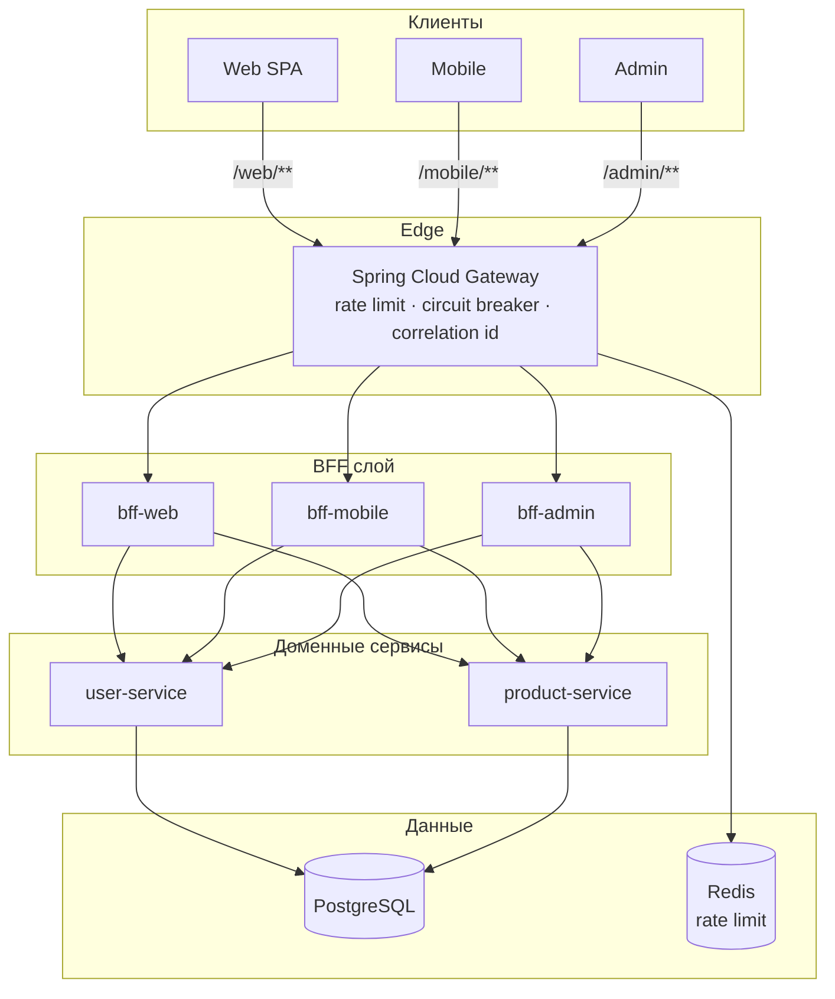

# bff-gateway

## 📌 Проблема

В микросервисной архитектуре **один и тот же набор доменных сервисов** (пользователи, каталог, заказы и т.д.) обычно обслуживает **разные типы клиентов**: браузерное SPA, нативные мобильные приложения, внутренние админ-панели. У них принципиально разные требования к API.

**Типичные противоречия:**

- **Объём и форма данных**  
  Веб-клиенту удобны «толстые» ответы с вложенными сущностями и ссылками (HATEOAS-подобные `links`). Мобильному клиенту нужны компактные DTO, меньше полей и трафика. Админке — расширенные поля (аудит, статусы, массовые операции).

- **Пагинация и сценарии чтения**  
  Для десктопного UI часто выбирают классическую **offset**-пагинацию (`page`, `size`). Для ленты в мобильном приложении устойчивее **cursor**-пагинация при добавлении/удалении элементов.

- **Чаттинг с бэкендом (chattiness)**  
  Если каждый клиент ходит напрямую в несколько микросервисов под один экран, растёт число **round-trip** запросов, дублируется логика агрегации на клиентах и усложняется согласование версий API.

- **«Универсальный» публичный API**  
  Один REST-слой «для всех» либо раздувается опциональными полями и флагами (`?expand=`), либо становится компромиссом, в котором ни один клиент не оптимален.

- **Сквозные нефункциональные требования**  
  Rate limiting, circuit breaking, единая точка входа и **сквозная трассировка** (correlation id) логичнее сосредоточить на **edge**, а не распылять по каждому микросервису и каждому клиенту.

**Итог:** без отдельного слоя адаптации под клиент либо страдает **UX и производительность**, либо **доменные сервисы** начинают знать о специфике UI, либо клиенты **дублируют** одну и ту же агрегацию и обработку ошибок.

---

## 🎯 Решение

Паттерн **Backend for Frontend (BFF)**: для каждого класса клиентов — **свой тонкий API**, который:

- агрегирует вызовы к **внутренним** REST-сервисам (`user-service`, `product-service`);
- отдаёт **свои** DTO и контракты под сценарии web / mobile / admin;
- изолирует UI от деталей доменных API и их эволюции.

Поверх BFF размещается **Spring Cloud Gateway** как **единая точка входа** для внешних клиентов:

- маршрутизация по префиксам `/web/**`, `/mobile/**`, `/admin/**`;
- **RequestRateLimiter** (Redis) — разные лимиты по маршрутам;
- **CircuitBreaker** (Resilience4j) — защита от каскадных сбоев downstream, **fallback** на JSON-ответ при открытой цепи или ошибке;
- глобальные фильтры: **`X-Correlation-Id`** (генерация/проброс) и логирование запросов.

Внутренние сервисы остаются **стабильным доменным API** (R2DBC + PostgreSQL); BFF не заменяет их, а **композирует** и **трансформирует** ответы под клиент.



**Что это даёт:**

- ✅ **Разделение контрактов** — web/mobile/admin эволюционируют независимо, без «зоопарка» query-параметров в одном публичном API.
- ✅ **Меньше round-trip на клиенте** — агрегированные эндпоинты (`/dashboard`, `/feed`) собирают данные на сервере.
- ✅ **Единый edge** — лимиты, breaker и fallback в одном месте; внутренние сервисы не торчат наружу.
- ✅ **Наблюдаемость** — один correlation id на цепочку gateway → BFF → backend.

---

## 🏗️ Архитектура решения

### api-gateway (порт 8080 наружу)

| Возможность | Реализация |
|-------------|------------|
| Маршруты | `Path=/web/**`, `/mobile/**`, `/admin/**` → соответствующий BFF |
| Префикс | `StripPrefix=1` — к BFF уходит путь без `/web`, `/mobile`, `/admin` |
| Клиент | Заголовок `X-Client-Type`: `web` / `mobile` / `admin` |
| Rate limit | Redis token bucket; **разные** `replenishRate` / `burstCapacity` на маршрут (например, mobile строже) |
| Ключ лимита | `KeyResolver` с ключом `rl:{routeId}` — отдельные бакеты для `bff-web`, `bff-mobile`, `bff-admin` |
| Отказоустойчивость | Resilience4j **CircuitBreaker** на каждый BFF; при сбое — `forward:/fallback/...` |
| Fallback | JSON с кодом `SERVICE_UNAVAILABLE`, полем `target` и сообщением (см. `FallbackController`) |
| Observability | **CorrelationIdGlobalFilter**, **RequestLoggingGlobalFilter**; Actuator: `health`, `info`, `metrics` |

### bff-web (8081)

Публичный API для SPA: полноразмерные DTO, offset-пагинация, агрегированный **dashboard**, HATEOAS-подобные `links`. На ключевых сценариях — Resilience4j **@CircuitBreaker** к backend.

| Метод | Путь | Назначение |
|-------|------|------------|
| GET | `/dashboard` | Профиль + популярные продукты + сводная статистика |
| GET | `/products` | Список с пагинацией и сортировкой (прокси к backend) |
| GET | `/products/{id}` | Карточка продукта |
| GET | `/users/me` | Текущий пользователь |

Демо: пользователь задаётся заголовком `X-User-Id` (в коде есть значение по умолчанию); корреляция — `X-Correlation-Id` (прокидывается с gateway).

### bff-mobile (8082)

Укороченные ответы, **cursor**-пагинация продуктов (`afterId`), агрегированный **feed**, `thumbnailUrl` с параметрами под мобильное разрешение.

| Метод | Путь | Назначение |
|-------|------|------------|
| GET | `/feed` | Профиль + highlights + первая страница ленты |
| GET | `/products?cursor=&limit=` | Cursor на базе backend API |
| GET | `/products/{id}` | Компактная карточка |

### bff-admin (8083)

Расширенные DTO, операции управления, **bulk** создание продуктов, dashboard метрик.

| Метод | Путь | Назначение |
|-------|------|------------|
| GET | `/dashboard` | Метрики пользователей и продуктов |
| GET | `/users` | Список (демо: пагинация в памяти) |
| PUT | `/users/{id}` | Обновление пользователя |
| GET/POST/PUT | `/products`, `/products/{id}` | CRUD продуктов |
| POST | `/products/bulk` | Массовое создание |

### user-service (8091) / product-service (8092)

Внутренние REST API (только для BFF в типичной схеме): пользователи, продукты, статистика, cursor/page, popular, bulk — см. контроллеры `UserController`, `ProductController`.

---

## Запуск (Docker Compose)

Из каталога `bff-gateway`:

```bash
docker compose up --build
```

**Точка входа для клиентов:** http://localhost:8080

Примеры:

- Web: `GET http://localhost:8080/web/dashboard` (опционально `-H "X-User-Id: 1"`).
- Mobile: `GET http://localhost:8080/mobile/feed`.
- Admin: `GET http://localhost:8080/admin/dashboard`.

**Инфраструктура:**

- PostgreSQL в Compose **не пробрасывается на хост** по умолчанию — доступна сервисам в сети compose.
- Redis для rate limit на хосте: **localhost:6380** (маппинг из контейнера).

Локальная сборка JAR (из корня монорепозитория):

```bash
./gradlew :bff-gateway:api-gateway:bootJar :bff-gateway:bff-web:bootJar :bff-gateway:bff-mobile:bootJar :bff-gateway:bff-admin:bootJar :bff-gateway:user-service:bootJar :bff-gateway:product-service:bootJar
```

---

## Стек

| Технология | Назначение                              |
|------------|-----------------------------------------|
| Kotlin / Java 21 | Язык и runtime                          |
| Spring Boot 3.1 | Основа сервисов и BFF                   |
| Spring Cloud Gateway 2022.0.x | Edge-маршрутизация, rate limit, фильтры |
| Spring WebFlux + WebClient | Реактивный BFF и вызовы backend         |
| Resilience4j | Circuit breaker на gateway и BFF        |
| Spring Data R2DBC, PostgreSQL | Доменные сервисы                        |
| Redis | Rate limiting в gateway                 |
| Docker Compose | Локальный стенд                         |
