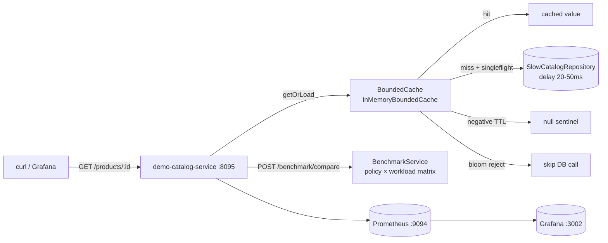
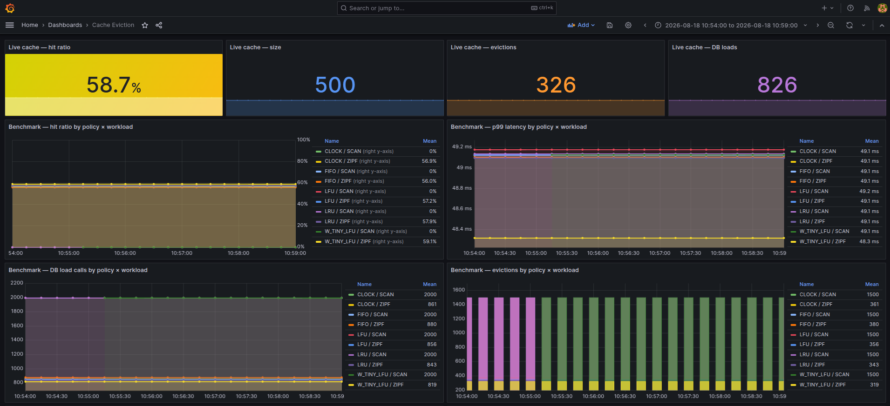

# cache-eviction

## 📌 Проблема

В production-системах локальный кэш в памяти сервиса — стандартный инструмент снижения нагрузки на базу данных. Но при неправильном выборе политики вытеснения и отсутствии защит от типичных cache-сбоев эффект обратный:

- **Неправильная политика для паттерна нагрузки** — LRU даёт высокий hit rate на Zipf-трафике (20% ключей — 80% запросов), но полностью деградирует при Scan (последовательный обход > maxSize вымывает весь горячий рабочий набор).
- **Cache stampede (пробой)** — горячий ключ вытеснен или истёк. Сотни конкурентных запросов одновременно идут в источник данных с задержкой 20–50 ms каждый. Пока один за другим ждут ответа, источник перегружается.
- **Cache penetration (пробитие)** — запросы за несуществующими ключами каждый раз проваливаются сквозь кэш в БД, потому что `null` не кэшируется. Один DDoS по несуществующим ID — и база лежит.
- **Cache avalanche (лавина)** — десятки тысяч ключей добавлены в кэш с одинаковым TTL. Через N минут они истекают одновременно: резкий пик нагрузки на источник.

Взять Caffeine в продакшне — правильное решение. Но понять, **почему** W-TinyLFU выигрывает у LRU на реальных паттернах и **как устроена** защита от stampede, можно только реализовав самому.

---

## 🎯 Решение

**eviction-starter** — Spring Boot Starter с bounded in-memory кэшем, где алгоритмы вытеснения реализованы явно в коде, политика выбирается через конфиг, а эффект измерим в метриках.

**demo-catalog-service** — сервис-демо с медленным каталогом (20–50 ms задержка), кэшем перед ним и `POST /benchmark/compare` для сравнения всех политик на одном и том же workload.



---

## 🧩 Политики вытеснения

Когда кэш заполнен (`size > maxSize`), политика выбирает **жертву** — ключ, который можно выкинуть. Ниже — расшифровка аббревиатур и смысл алгоритмов так, как они реализованы в `eviction-starter`.

| Код | Расшифровка | Жертва |
|---|---|---|
| `FIFO` | First In, First Out | самый старый по **времени вставки** |
| `LRU` | Least Recently Used | самый давно **не читавшийся** |
| `LFU` | Least Frequently Used | с **наименьшей частотой** обращений |
| `CLOCK` | Clock / Second Chance | приближение LRU: кольцо + бит «обращались» |
| `W_TINY_LFU` | Window Tiny Least Frequently Used | новый ключ **не пускают**, если он реже текущего жильца |

---

### FIFO — First In, First Out

**Смысл.** Очередь: кто раньше попал в кэш, того и вытесняют первым. Чтения ключ не «омолаживают».

**Как устроено.** `ArrayDeque` порядка вставки + `HashSet` живых ключей. `onGet` — no-op. `pickVictim` снимает голову очереди.

**Когда уместно.** Baseline для сравнения и данные, которые живут коротко и читаются примерно одинаково. На Zipf проигрывает: горячий ключ, вставленный давно, вылетит, хотя его всё ещё читают.

---

### LRU — Least Recently Used

**Смысл.** Вытесняем то, к чему **дольше всего не обращались**. Идея: недавнее обращение предсказывает следующее.

**Как устроено.** `LinkedHashSet` как access-order список: `get`/`put` переносят ключ в конец, жертва — первый элемент. Амортизированно O(1).

**Когда уместно.** Типичный hot path с локальностью (повторные чтения одних SKU). Ломается на scan: один последовательный обход большого каталога «прогревает» кэш мусором и вымывает рабочий набор.

---

### LFU — Least Frequently Used

**Смысл.** Вытесняем то, что **реже всего спрашивали**. Идея: популярность стабильнее, чем недавность.

**Как устроено.** Счётчик частоты на ключ. При равной частоте tie-break по `tick` последнего доступа (более старый уходит первым) — это лёгкий aging, чтобы два ключа с freq=1 не выбирались случайно.

**Когда уместно.** Zipf-трафик, где топ ключей стабилен долго. Минус классического LFU: ключ, который был хитом вчера, может жить слишком долго с большой частотой. Полный aging (затухание счётчиков) здесь не делаем — только tie-break по recency.

---

### CLOCK — Clock / Second Chance

**Смысл.** Дешёвое приближение LRU из OS page replacement (алгоритм часов). Не двигаем ноду в списке на каждый `get` — только ставим бит «к этой странице обращались».

**Как устроено.** Кольцо ключей и `hand` (стрелка часов):

1. На `get`/`put` выставляется `referenced = true`.
2. `pickVictim` идёт по кольцу:
   - бит `true` → сбрасываем в `false` (**второй шанс**) и идём дальше;
   - бит `false` → это жертва.

Ключ, к которому недавно обращались, переживает один полный оборот стрелки. Ключ без обращений вылетает сразу.

**Когда уместно.** Когда LRU слишком дорог на hot path (move-to-front на каждый get). Hit rate близкий к LRU, константа дешевле.

---

### W-TinyLFU — Window Tiny Least Frequently Used

**Смысл.** Политика Caffeine. Не каждый новый ключ имеет право занять место: сначала смотрим, **насколько он часто встречался недавно**, и сравниваем с кандидатом на выселение. Одноразовый scan-ключ (one-hit wonder) в основной кэш не пускают.

**Как устроено.** Три сегмента + частотный эскиз:

| Часть | Роль |
|---|---|
| **Window (admission window)** | Короткое LRU-окно для новичков. Даёт шанс недавно вставленным ключам |
| **Probation** | Основной кэш «на испытании»: ключ попал, но ещё не доказал повторные чтения |
| **Protected** | Горячий сегмент: повторный `get` из probation повышает ключ сюда |
| **Count-Min Sketch** | Компактная оценка частоты *всех* ключей, даже тех, кого в кэше нет |

При переполнении жертва берётся из window, затем probation, затем protected. Новый ключ **принимают** (`admitted`), только если `sketch.estimate(new) >= sketch.estimate(victim)`. Иначе новичок отбрасывается, жилец остаётся — это и есть защита от cache pollution.

**Когда уместно.** Реальный Zipf-трафик каталогов и сессий. В прогоне: лучший hit ratio (0.5905) и меньше всего DB loads (819 из 2000).

---

## 🛡️ Защиты от cache-сбоев

### Stampede → Singleflight

При конкурентном miss по одному ключу только один поток вызывает loader; остальные ждут тот же `CompletableFuture`.

```
getOrLoad("hot-key"):
  thread-1: miss → запускает loader → CompletableFuture
  thread-2: miss → видит inflight → join()
  thread-3: miss → miss → join()
  loader вызван ровно 1 раз
```

### Penetration → Negative caching + Bloom filter

- Null-ответ от loader кэшируется как sentinel с коротким `negativeTtl`.
- Bloom filter проверяет ключ до обращения к loader: если бит не выставлен — ключ точно отсутствует, loader не вызывается.

### Avalanche → TTL jitter

```kotlin
deadline = now + ttl + random(0, jitter)
```

Ключи, добавленные одновременно, истекают в окне `[ttl, ttl + jitter]`, а не в одну миллисекунду.

---

## 🏗️ Компоненты

### ⚙️ eviction-starter

Spring Boot Starter — единственный артефакт, который подключают сервисы.

#### Публичный API

```kotlin
interface BoundedCache<K : Any, V : Any> {
  fun get(key: K): V?
  fun getOrLoad(key: K, loader: (K) -> V?): V?
  fun put(key: K, value: V)
  fun invalidate(key: K)
  fun stats(): CacheStats
}

data class CacheStats(
  val hits: Long,
  val misses: Long,
  val evictions: Long,
  val loadCount: Long,
  val negativeHits: Long,
  val bloomRejects: Long,
  val size: Int,
  val hitRatio: Double,
)
```

#### Конфигурация

Starter регистрирует `CacheEvictionAutoConfiguration` автоматически.

Поля верхнего уровня — **дефолты**. Несколько кэшей в одном сервисе задаются в `caches.<name>`: указанное поле перекрывает дефолт, остальное наследуется.

```yaml
cache:
  eviction:
    max-size: 10000
    policy: LRU
    ttl: 5m
    ttl-jitter: 30s
    singleflight-enabled: true
    negative-caching-enabled: true
    negative-ttl: 15s
    bloom-filter-enabled: true
    bloom-expected-insertions: 100000
    bloom-false-positive-rate: 0.01
    caches:
      products:
        policy: W_TINY_LFU
        max-size: 50000
      sessions:
        policy: LRU
        ttl: 10m
        max-size: 2000
```

Инжектируется `BoundedCacheRegistry`: инстанс на имя создаётся лениво и переиспользуется.

```kotlin
@Service
class OrderService(
  private val cacheRegistry: BoundedCacheRegistry,
) {
  private val products: BoundedCache<String, CatalogItem> =
    cacheRegistry.get("products")

  private val sessions: BoundedCache<String, Session> =
    cacheRegistry.get("sessions")
}
```

Неизвестное имя падает в дефолты — удобно для ad-hoc / benchmark кэшей. `CacheConfigBuilder.build("products")` отдаёт смерженный `CacheConfig`, если нужен свой `BoundedCacheFactory.create(...)`.

#### Что внутри

- **`FifoPolicy`** — `ArrayDeque` + `HashSet` ключей.
- **`LruPolicy`** — `LinkedHashSet` с access-order move-to-back.
- **`LfuPolicy`** — частота + tick для tie-break по давности.
- **`ClockPolicy`** — circular `ArrayList`, reference bit, hand pointer.
- **`WTinyLfuPolicy`** — window + probation + protected сегменты + `CountMinSketch` (4 rows, width по FP rate).
- **`BloomFilter`** — `BitSet`, 4 hash functions, автовычисление ширины.
- **`InMemoryBoundedCache`** — `ConcurrentHashMap` + `ReentrantLock` + `ConcurrentHashMap<K, CompletableFuture>` для singleflight.

---

### ⚙️ demo-catalog-service

Каталог из 100 000 SKU с искусственной задержкой 20–50 ms на каждое обращение к репозиторию.

#### API

```
GET  /products/{id}          — читает через кэш
GET  /cache/stats             — текущая статистика live-кэша
POST /benchmark               — одиночный прогон (policy + workload)
POST /benchmark/compare       — matrix: одна нагрузка × все (или выбранные) политики
```

#### Workload-профили

| Workload | Описание | Что покажет |
|---|---|---|
| `ZIPF` | `P(k) ∝ 1/k^s`, s=1.0; 20% ключей → 80% запросов | W-TinyLFU и LFU выигрывают по hit rate |
| `SCAN` | Последовательный обход без повторов (`keyspace` > `requests`) | Ни одна политика не даёт hit: ключ не повторяется |
| `LOOPING` | Цикл по working set > maxSize | Все политики thrash; нижняя граница ≈ maxSize / working set |

#### Сравнение политик

```bash
curl -X POST http://localhost:8095/benchmark/compare \
  -H "Content-Type: application/json" \
  -d '{
    "workload": "ZIPF",
    "requests": 2000,
    "maxSize": 500,
    "keyspace": 5000
  }'
```

Реальный ответ прогона (см. [результаты ниже](#результаты-прогона)):

```json
{
  "workload": "ZIPF",
  "requests": 2000,
  "bestByHitRatio": "W_TINY_LFU",
  "bestByP99Latency": "W_TINY_LFU",
  "results": [
    { "policy": "FIFO",       "p99LatencyMicros": 49106, "stats": { "hitRatio": 0.5600, "loadCount": 880, "evictions": 380 } },
    { "policy": "LRU",        "p99LatencyMicros": 49098, "stats": { "hitRatio": 0.5785, "loadCount": 843, "evictions": 343 } },
    { "policy": "LFU",        "p99LatencyMicros": 49130, "stats": { "hitRatio": 0.5720, "loadCount": 856, "evictions": 356 } },
    { "policy": "CLOCK",      "p99LatencyMicros": 49124, "stats": { "hitRatio": 0.5695, "loadCount": 861, "evictions": 361 } },
    { "policy": "W_TINY_LFU", "p99LatencyMicros": 48320, "stats": { "hitRatio": 0.5905, "loadCount": 819, "evictions": 319 } }
  ]
}
```

---

### ⚙️ Observability

#### Метрики (Micrometer → Prometheus)

| Метрика | Тип | Теги |
|---|---|---|
| `cache_demo_live_hit_ratio` | Gauge | `application` |
| `cache_demo_live_size` | Gauge | `application` |
| `cache_demo_live_hits_total` | Gauge | `application` |
| `cache_demo_live_misses_total` | Gauge | `application` |
| `cache_demo_live_evictions_total` | Gauge | `application` |
| `cache_demo_live_load_total` | Gauge | `application` |
| `cache_demo_live_negative_hits_total` | Gauge | `application` |
| `cache_demo_live_bloom_rejects_total` | Gauge | `application` |
| `cache_benchmark_last_hit_ratio` | Gauge | `policy`, `workload` |
| `cache_benchmark_last_p99_micros` | Gauge | `policy`, `workload` |
| `cache_benchmark_last_evictions` | Gauge | `policy`, `workload` |
| `cache_benchmark_last_load_count` | Gauge | `policy`, `workload` |
| `cache_benchmark_runs_total` | Counter | `policy`, `workload` |
| `cache_demo_request_latency_seconds` | Histogram | `policy`, `workload` |

#### Готовый Grafana dashboard

11 панелей: live hit ratio, live size, evictions, DB loads, hit ratio по политикам, p99 по политикам, evictions по политикам, DB loads по политикам, p50/p95/p99 histogram, negative cache hits, Bloom rejects.

> Dashboard: [`grafana/dashboards/cache-eviction.json`](./grafana/dashboards/cache-eviction.json)

---

## 🎬 Демо

### 1. Сборка и запуск

```bash
cd cache-eviction
../gradlew :cache-eviction:demo-catalog-service:bootJar

docker compose up -d --build
```

**Компоненты:**

| Сервис | URL |
|---|---|
| demo-catalog-service | http://localhost:8095 |
| Prometheus | http://localhost:9094 |
| Grafana | http://localhost:3002 (admin/admin) |

### 2. Горячий путь через кэш

```bash
# Первый вызов — miss, идёт в репозиторий (~30 ms)
curl http://localhost:8095/products/sku-42

# Повторный — hit, из памяти (<1 ms)
curl http://localhost:8095/products/sku-42

# Текущая статистика
curl http://localhost:8095/cache/stats
```

### 3. Сравнение политик на Zipf

```bash
curl -X POST http://localhost:8095/benchmark/compare \
  -H "Content-Type: application/json" \
  -d '{"workload":"ZIPF","requests":2000,"maxSize":500,"keyspace":5000}'
```

### 4. Сравнение на Scan (уникальный проход → 0 hits)

```bash
curl -X POST http://localhost:8095/benchmark/compare \
  -H "Content-Type: application/json" \
  -d '{"workload":"SCAN","requests":2000,"maxSize":500,"keyspace":5000}'
```

### 5. Проверка stampede protection

```bash
# 50 параллельных запросов по одному ключу
for i in $(seq 1 50); do
  curl -s http://localhost:8095/products/sku-99999 &
done
wait

# В stats loadCount должен быть 1, несмотря на 50 miss
curl http://localhost:8095/cache/stats | jq '.loadCount'
```

---

## Результаты прогона

Параметры acceptance-прогона: `requests=2000`, `maxSize=500`, `keyspace=5000`, задержка репозитория 20–50 ms. Compose: demo-catalog-service `:8095`, Prometheus `:9094`, Grafana `:3002`.



### Zipf — политика имеет значение

Горячее подмножество ключей повторяется. `W_TINY_LFU` выигрывает и по hit ratio, и по числу обращений в репозиторий, и по p99.

| Политика | Hit ratio | DB loads | Evictions | p99 | Σ latency (2000 req) |
|---|---|---|---|---|---|
| FIFO | 0.5600 | 880 | 380 | 49.1 ms | 30.1 s |
| CLOCK | 0.5695 | 861 | 361 | 49.1 ms | 30.1 s |
| LFU | 0.5720 | 856 | 356 | 49.1 ms | 30.0 s |
| LRU | 0.5785 | 843 | 343 | 49.1 ms | — |
| **W_TINY_LFU** | **0.5905** | **819** | **319** | **48.3 ms** | **27.8 s** |

p99 почти одинаковый: хвост всё ещё определяется miss'ами в медленный репозиторий. Разница политик видна в `hitRatio` / `loadCount` и в суммарном времени прогона. Σ latency для LRU не приведена: histogram накопил 4000 сэмплов (одиночный `/benchmark` + compare).

### Scan — уникальный проход, политика не спасает

`SCAN` с `keyspace=5000` и `requests=2000` не повторяет ни один ключ. Кэш заполняется до `maxSize=500`, дальше каждый get — новый ключ.

| Политика | Hit ratio | DB loads | Evictions | p99 | Σ latency |
|---|---|---|---|---|---|
| FIFO / LRU / LFU / CLOCK / W_TINY_LFU | 0.000 | 2000 | 1500 | ~49.1 ms | ~69 s |

Это ожидаемо: без повторных обращений вытеснение не из чего «спасать». Чтобы увидеть разницу политик на scan-подобной нагрузке, нужен wrap (`LOOPING`) или `requests` > `keyspace`.

---

## 🧪 Тесты

```bash
./gradlew :cache-eviction:eviction-starter:test
```

- **`lru evicts least recently used key`** — LRU вытесняет самый холодный ключ при `put` сверх `maxSize`.
- **`singleflight loads key exactly once under contention`** — 100 потоков, 1 `loadCount`.
- **`negative caching avoids repeated loads for absent key`** — 20 вызовов, 1 обращение в источник.

---

## 📦 Структура проекта

```
cache-eviction/
├── eviction-starter/
│   └── src/main/kotlin/com/andver/cache/
│       ├── api/
│       │   ├── BoundedCache.kt
│       │   ├── BoundedCacheFactory.kt
│       │   ├── CacheConfig.kt
│       │   ├── CacheStats.kt
│       │   └── EvictionPolicyType.kt
│       ├── policy/
│       │   ├── EvictionPolicy.kt
│       │   ├── FifoPolicy.kt
│       │   ├── LruPolicy.kt
│       │   ├── LfuPolicy.kt
│       │   ├── ClockPolicy.kt
│       │   └── WTinyLfuPolicy.kt
│       ├── penetration/
│       │   └── BloomFilter.kt
│       ├── sketch/
│       │   └── CountMinSketch.kt
│       └── runtime/
│           └── InMemoryBoundedCache.kt
├── demo-catalog-service/
│   └── src/main/kotlin/com/andver/cache/demo/
│       ├── DemoCatalogServiceApp.kt
│       ├── model/CatalogItem.kt
│       ├── repo/SlowCatalogRepository.kt
│       ├── workload/
│       │   ├── WorkloadGenerator.kt
│       │   ├── ZipfWorkloadGenerator.kt
│       │   ├── ScanWorkloadGenerator.kt
│       │   └── LoopingWorkloadGenerator.kt
│       ├── service/CatalogCacheService.kt
│       └── api/
│           ├── BenchmarkRequest.kt
│           ├── BenchmarkResult.kt
│           ├── BenchmarkComparisonRequest.kt
│           ├── BenchmarkComparisonResult.kt
│           └── CatalogController.kt
├── prometheus/prometheus.yml
├── grafana/
│   ├── dashboards/cache-eviction.json
│   └── provisioning/
│       ├── datasources/prometheus.yml
│       └── dashboards/dashboard.yml
├── docker-compose.yml
└── README.md
```

---

## 🛠️ Стек

- Kotlin / Java 21
- Spring Boot 3 (Web, Actuator)
- Micrometer + Prometheus + Grafana
- Docker Compose
