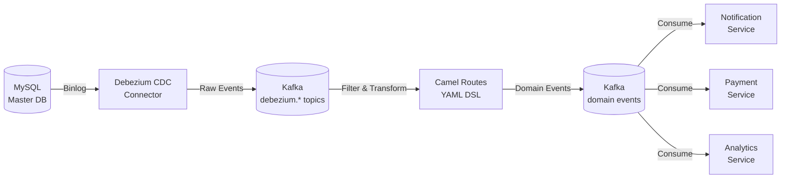

# cdc-application-events-engine

## 📌 Проблема

В микросервисной архитектуре возникает необходимость обеспечения **согласованности данных между сервисами** при выполнении распределённых операций. Классические подходы имеют серьёзные ограничения:

- **Распределённые транзакции (2PC)**  
  Высокая задержка, блокировки ресурсов, сложность реализации. При сбое одного участника вся транзакция откатывается, что снижает доступность системы.

- **Saga Pattern**  
  Требует явной координации между сервисами, сложная компенсационная логика. При ошибке нужно вручную реализовывать откат всех выполненных шагов.

- **Синхронные вызовы (REST/RPC)**  
  Создают тесную связанность между сервисами, каскадные сбои при падении одного сервиса. Нет гарантии доставки сообщений.

- **Прямое чтение из БД**  
  Нарушает принципы микросервисной архитектуры, создаёт зависимости от схемы БД, проблемы с масштабированием.

**Типичные сценарии:**
- При создании пользователя нужно отправить приветственное письмо, создать профиль в другой системе, инициализировать настройки
- При изменении статуса кредита нужно уведомить платежную систему, обновить баланс, отправить уведомление
- При получении платежа нужно обновить баланс кредита, списать средства, обновить статистику

---

## 🎯 Решение

**Change Data Capture (CDC)** через Debezium + **Event-driven архитектура** с Apache Camel для трансформации и маршрутизации событий.

Вместо распределённых транзакций используем **eventual consistency** через события:
- Изменения в основной БД автоматически транслируются в события через CDC
- События обрабатываются асинхронно независимыми сервисами
- Каждый сервис обрабатывает события в своём темпе, обеспечивая отказоустойчивость
- Нет блокировок и координации между сервисами



**Преимущества подхода:**
- ✅ **Слабая связанность** — сервисы не знают друг о друге, общаются только через события
- ✅ **Отказоустойчивость** — события сохраняются в Kafka, можно повторить обработку
- ✅ **Масштабируемость** — независимая обработка событий, горизонтальное масштабирование
- ✅ **Eventual consistency** — данные согласуются асинхронно, без блокировок
- ✅ **Декларативность** — маршруты в YAML, легко добавлять новые обработчики

---

## 🏗️ Архитектура решения

### Компоненты

1. **MySQL** — основная база данных с включённым binlog для CDC
2. **Debezium** — CDC коннектор, отслеживает изменения в MySQL через binlog
3. **Kafka** — event bus для передачи событий между компонентами
4. **Camel Routes** — декларативные маршруты (YAML) для фильтрации и трансформации Debezium событий в доменные события
5. **Domain Events** — бизнес-события для других микросервисов (user-created, credit-expired и т.д.)

### Поток данных

1. **Изменение в MySQL** (INSERT/UPDATE/DELETE) записывается в binlog
2. **Debezium** читает binlog и публикует событие в Kafka топик `debezium.master.{table}`
3. **Camel маршруты** фильтруют события по операциям и полям, трансформируют в доменные события
4. **Доменные события** публикуются в отдельные топики (`user-created`, `credit-expired` и т.д.)
5. **Микросервисы** подписываются на нужные события и обрабатывают их асинхронно

---

## ⚙️ Компоненты

### application-events-handler

Основное приложение на Spring Boot, которое:
- Загружает Camel маршруты из YAML файлов
- Настраивает Kafka компоненты для работы с Debezium и доменными событиями
- Обрабатывает события через декларативные маршруты

### 🛠️ Стек технологий
- **Kotlin** / Java 21
- **Spring Boot 3**
- **Apache Camel 4.4** (YAML DSL)
- **Debezium 2.5**
- **Apache Kafka**
- **MySQL 8.0**

### simple-notification-microservice

Тестовый микросервис на Spring Boot, который демонстрирует потребление доменных событий из Kafka.

**Назначение:**
- Подписывается на все доменные события (user-created, credit-expired, payment-received и т.д.)
- Логирует полученные события для демонстрации работы системы
- Показывает, как микросервисы могут независимо обрабатывать события
---

## 🛡️ Отказоустойчивость (Fault Tolerance)

- **Сохранение событий в Kafka**  
  Все события сохраняются в Kafka с репликацией. При сбое обработчика события не теряются и могут быть обработаны повторно.

- **Независимая обработка**  
  Каждый микросервис обрабатывает события независимо. Сбой одного сервиса не влияет на другие.

- **Retry механизм**  
  Kafka consumer автоматически повторяет обработку при ошибках. Можно настроить dead letter queue для проблемных сообщений.

---

## 🛡️ Масштабируемость (Scalability)

- **Горизонтальное масштабирование**  
  Можно запускать несколько инстансов `application-events-handler`. Kafka автоматически распределяет партиции между consumer'ами.

- **Независимое масштабирование компонентов**  
  Каждый микросервис может масштабироваться независимо в зависимости от нагрузки.

- **Партиционирование топиков**  
  Kafka топики партиционированы, что позволяет параллельную обработку событий.

---

## 🎬 Демо

### 1. Запуск окружения

```bash
cd cdc-application-events-engine
docker-compose up -d
```

### 2. Подключение к MySQL

Для выполнения SQL команд подключитесь к MySQL:
```bash
docker-compose exec mysql mysql -uadmin -padmin master
```

### 3. Тестирование маршрутов

#### Создание пользователя

**SQL команда:**
```sql
INSERT INTO user (name, email, phone_number, address) 
VALUES ('John Doe', 'john.doe@example.com', '+1234567890', '123 Main St');
```

**Лог в simple-notification-microservice:**
```
Consume message: topic=user-created, key=1, value={"userId":1,"email":"john.doe@example.com"}
```

---

#### Изменение персональных данных

**SQL команда:**
```sql
UPDATE user 
SET name = 'Jane Smith', 
    email = 'jane.smith@example.com',
    phone_number = '+9876543210',
    address = '456 Oak Ave'
WHERE id = 1;
```

**Лог в simple-notification-microservice:**
```
Consume message: topic=user-personal-data-change, key=1, value={"userId":"1","name":"Jane Smith","email":"jane.smith@example.com","phone":"+9876543210","address":"456 Oak Ave"}
```

---

#### Блокировка пользователя

**SQL команда:**
```sql
UPDATE user SET is_blocked = TRUE WHERE id = 1;
```

**Лог в simple-notification-microservice:**
```
Consume message: topic=user-block, key=1, value={"userId":1,"blocked":"true"}
```

---

#### Создание кредита

**SQL команда:**
```sql
INSERT INTO credit (user_id, amount, status, start_date, end_date) 
VALUES (1, 10000.00, 'ACTIVE', '2025-01-01', '2025-12-31');
```

**Лог в simple-notification-microservice:**
```
Consume message: topic=credit-created, key=1, value={"creditId":1,"userId":1,"amount":"10000.0"}
```

---

#### Получение платежа

**SQL команда:**
```sql
INSERT INTO payment (credit_id, payment_date, amount) 
VALUES (1, '2025-01-15', 1000.00);
```

**Лог в simple-notification-microservice:**
```
Consume message: topic=payment-received, key=1, value={"paymentId":1,"creditId":1,"amount":"1000.0"}
```

---

#### Отмена кредита

**SQL команда:**
```sql
UPDATE credit SET status = 'CANCELLED' WHERE id = 1;
```

**Лог в simple-notification-microservice:**
```
Consume message: topic=credit-cancelled, key=1, value={"creditId":1}
```

---

#### Просрочка кредита

**SQL команда:**
```sql
UPDATE credit SET status = 'EXPIRED' WHERE id = 1;
```

**Лог в simple-notification-microservice:**
```
Consume message: topic=credit-expired, key=1, value={"creditId":1}
```

---

## 🔍 Мониторинг

### Kafka UI
Откройте http://localhost:8088 для просмотра топиков и сообщений в реальном времени.

### Debezium Connector API
```bash
# Список коннекторов
curl http://localhost:8083/connectors

# Статус коннектора
curl http://localhost:8083/connectors/master-connector/status

# Конфигурация коннектора
curl http://localhost:8083/connectors/master-connector/config
```

---

## 📦 Структура проекта

```
cdc-application-events-engine/
├── application-events-handler/     # Основное приложение (Camel routes)
│   ├── src/main/kotlin/
│   │   └── com/andver/application/events/
│   │       ├── ApplicationEventsHandler.kt
│   │       ├── config/
│   │       │   └── KafkaConfig.kt
│   │       ├── deserializer/
│   │       │   └── DebeziumJsonDeserializer.kt
│   │       └── model/
│   │           └── ChangeRecordEvent.kt
│   └── build.gradle.kts
├── simple-notification-microservice/  # Тестовый микросервис для демонстрации потребления событий
│   ├── src/main/kotlin/
│   │   └── com/andver/example/notification/
│   │       └── SimpleNotificationMicroserviceApp.kt
│   ├── src/main/resources/
│   │   └── application.yml
│   └── build.gradle.kts
├── routes/                         # Camel маршруты (YAML)
│   ├── user/
│   │   ├── user-created-route.yaml
│   │   ├── user-block-route.yaml
│   │   └── user-personal-data-change-route.yaml
│   ├── credit/
│   │   ├── credit-created-route.yaml
│   │   ├── credit-expired-route.yaml
│   │   └── credit-cancelled-route.yaml
│   └── payment/
│       └── payment-received-route.yaml
├── debezium/
│   └── init-debezium.sh           # Инициализация Debezium коннектора
├── mysql/
│   └── init.sql                   # Схема БД
├── docker-compose.yml
└── README.md
```


