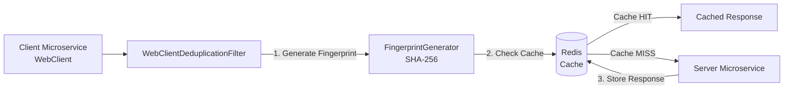

# client-request-deduplicator

## 📌 Проблема

В микросервисной архитектуре возникает необходимость **предотвращения дублирования HTTP-запросов** от клиентских микросервисов к серверным с требованиями:
- **Идемпотентность** — повторные идентичные запросы должны возвращать кэшированный ответ без выполнения реального HTTP-вызова
- **Производительность** — снижение нагрузки на серверные микросервисы за счёт кэширования ответов
- **Гибкость** — возможность настройки правил кэширования для разных эндпоинтов (TTL, исключение полей из fingerprint)
- **Прозрачность** — автоматическая интеграция через Spring Boot Starter без изменения бизнес-логики

Основные ограничения классического подхода:
- **Отсутствие дедупликации на клиенте**  
  При повторных запросах с одинаковыми параметрами каждый раз выполняется реальный HTTP-вызов, что создаёт избыточную нагрузку на сервер.
- **Нет механизма кэширования ответов**  
  Даже если запросы идентичны, они не кэшируются, что приводит к повторной обработке на сервере.
- **Проблемы с временными полями**  
  Поля вроде `timestamp` или `requestId` делают каждый запрос уникальным, даже если бизнес-логика идентична.

---

## 🎯 Решение

**Client-Side Request Deduplicator** с использованием **Redis** для кэширования ответов и **Spring WebClient Filter** для автоматической дедупликации:
- **Генерация fingerprint** — создание уникального идентификатора запроса на основе HTTP метода, URI и тела запроса
- **Исключение полей** — возможность исключать временные поля (например, `timestamp`) из fingerprint для корректной дедупликации
- **Кэширование в Redis** — хранение успешных ответов (2xx) с настраиваемым TTL
- **Автоматическая интеграция** — Spring Boot Starter автоматически добавляет фильтр в WebClient без изменения кода



---

## 🔧 Архитектура

### Генерация Fingerprint

Fingerprint создаётся на основе:
- **HTTP метод** (GET, POST, PUT, DELETE и т.д.)
- **URI** (путь + query параметры, с возможностью исключения некоторых параметров)
- **Тело запроса** (JSON, с возможностью исключения полей)

Алгоритм:
1. Нормализация URI — удаление исключённых query параметров, сортировка оставшихся
2. Канонизация JSON — удаление исключённых полей, сортировка ключей, нормализация дат
3. Хеширование SHA-256 — создание уникального идентификатора из `method|uri|body`

### Кэширование

- **Успешные ответы (2xx)** — кэшируются в Redis с настраиваемым TTL
- **Ошибки (4xx, 5xx)** — не кэшируются, пропускаются (BYPASS)
- **Заголовок X-Cache** — добавляется в ответ для индикации источника (HIT, MISS, BYPASS)

---

## Компоненты

## ⚙️ client-request-deduplicator-starter

Spring Boot стартер для автоматической дедупликации HTTP-запросов через WebClient.

### 🛠️ Стек технологий
- **Java 21 / Kotlin**
- **Spring Boot 3 (WebFlux)**
- **Spring Data Redis (Reactive)**
- **Jackson**
- **Micrometer**

### 🔧 Основные компоненты

#### 1. WebClientDeduplicationFilter
ExchangeFilterFunction для WebClient, который:
- Перехватывает исходящие HTTP-запросы
- Генерирует fingerprint для каждого запроса
- Проверяет наличие кэшированного ответа в Redis
- Кэширует успешные ответы (2xx) с настраиваемым TTL
- Добавляет заголовок `X-Cache: HIT/MISS/BYPASS` в ответ

#### 2. FingerprintGenerator
Генерирует уникальный идентификатор запроса:
- Нормализует URI (удаляет исключённые query параметры)
- Канонизирует JSON (удаляет исключённые поля, сортирует ключи)
- Вычисляет SHA-256 хеш от `method|uri|body`

#### 3. CacheClient
Интерфейс для работы с кэшем (реализация: `RedisCacheClient`):
- `get(fingerprint)` — получение кэшированного ответа
- `set(fingerprint, response, ttl)` — сохранение ответа с TTL

#### 4. CacheRuleMatcher
Определяет, применяется ли правило кэширования для конкретного запроса:
- Сопоставляет HTTP метод и URL паттерн
- Возвращает `CacheRule` с настройками (TTL, исключённые поля)

#### 5. DeduplicatorMetrics
Метрики для мониторинга:
- `hit` — количество cache hit
- `miss` — количество cache miss
- `bypass` — количество запросов, пропущенных без кэширования

**Использование:**

```kotlin
dependencies {
  implementation(project(":client-request-deduplicator:client-request-deduplicator-starter"))
}
```

**Настройки (application.yml):**

```yaml
spring:
  data:
    redis:
      host: redis
      port: 6379

request:
  deduplicator:
    enabled: true
    rules:
      - method: POST
        url: "/order"
        ttl: "PT10S"                    # TTL 10 секунд
        exclude-fields: [ "timestamp" ] # Исключить поле timestamp из fingerprint
        exclude-query-params: [ ]       # Исключить query параметры (например, ["requestId"])
      - method: GET
        url: "/products/*"
        ttl: "PT1M"                      # TTL 1 минута
        exclude-fields: [ ]
        exclude-query-params: [ "requestId", "traceId" ]
```

**Пример использования:**

```kotlin
@RestController
class OrderController(
  private val webClient: WebClient
) {
  
  @GetMapping("/create-order")
  fun createOrder(): Mono<String> {
    return webClient.post()
      .uri("http://order-service:8080/order")
      .contentType(MediaType.APPLICATION_JSON)
      .capturedBody(CreateOrderRequest(productId = 10L, timestamp = LocalDateTime.now()))
      .retrieve()
      .bodyToMono(String::class.java)
      .doOnNext { response ->
        // Заголовок X-Cache: HIT/MISS/BYPASS будет добавлен автоматически
        log.info("Response: $response")
      }
  }
}
```

**Особенности:**
- Автоматическая интеграция через `WebClientCustomizer` — фильтр добавляется ко всем WebClient бинам
- Использование `capturedBody()` для захвата тела запроса (необходимо для генерации fingerprint)
- Поддержка исключения полей и query параметров для корректной дедупликации запросов с временными данными

---

## 🛡️ Гарантии и Fault Tolerance

### Идемпотентность
- Одинаковые запросы (с одинаковым fingerprint) возвращают кэшированный ответ без выполнения реального HTTP-вызова
- Исключение временных полей позволяет дедуплицировать запросы, которые отличаются только метаданными

### Производительность
- Снижение нагрузки на серверные микросервисы за счёт кэширования ответов
- Минимальные накладные расходы на проверку кэша (один Redis GET запрос)

### Надёжность
- При недоступности Redis фильтр пропускает запросы без кэширования (graceful degradation)
- Ошибки кэширования не влияют на выполнение запросов — они просто пропускаются

### Масштабируемость
- Redis позволяет масштабировать кэш горизонтально
- Кэш разделяется между всеми инстансами клиентских микросервисов

---

## 🎬 Демо

### 1. Запуск окружения

```bash
cd client-request-deduplicator
.././gradlew clean build
docker-compose up -d
```

### 2. Выполнение запроса (первый раз)

```bash
curl http://localhost:7777/test-call
```

**Что происходит:**
1. Клиентский микросервис генерирует fingerprint для запроса
2. Проверяет кэш в Redis — cache MISS
3. Выполняет реальный HTTP-запрос к серверному микросервису
4. Кэширует ответ в Redis с TTL 10 секунд
5. Возвращает ответ с заголовком `X-Cache: MISS`

**Логи:**
```
INFO 1 --- [or-http-epoll-4] c.a.c.s.f.WebClientDeduplicationFilter   : Fingerprint=d1122dafa0562abb671e5897504e537a61eb1493106eee5d7ae206f16658ae75 for POST http://simple-server-microservice:7778/order
INFO 1 --- [or-http-epoll-5] c.a.c.s.f.WebClientDeduplicationFilter   : Cache miss for POST http://simple-server-microservice:7778/order
INFO 1 --- [llEventLoop-5-1] com.andver.example.client.Controller     : Received order creation response={"orderId":20}
```

### 3. Повторный запрос (в течение TTL)

```bash
curl http://localhost:7777/test-call
```

**Что происходит:**
1. Генерируется тот же fingerprint (поле `timestamp` исключено)
2. Проверяется кэш в Redis — cache HIT
3. Возвращается кэшированный ответ **без выполнения HTTP-запроса**
4. Заголовок `X-Cache: HIT` указывает на использование кэша

**Логи:**
```
INFO 1 --- [or-http-epoll-7] c.a.c.s.f.WebClientDeduplicationFilter   : Fingerprint=d1122dafa0562abb671e5897504e537a61eb1493106eee5d7ae206f16658ae75 for POST http://simple-server-microservice:7778/order
INFO 1 --- [llEventLoop-5-1] c.a.c.s.f.WebClientDeduplicationFilter   : Cache hit for POST http://simple-server-microservice:7778/order
INFO 1 --- [llEventLoop-5-1] com.andver.example.client.Controller     : Received order creation response={"orderId":20}
```

**Важно:** В логах серверного микросервиса не будет записи о втором запросе, так как он не выполняется.

### 4. Проверка кэша в Redis

```bash
docker exec -it redis redis-cli
KEYS *
GET <fingerprint>
```

### 5. Проверка метрик

```bash
curl http://localhost:7777/actuator/metrics/request.deduplicator.hit
curl http://localhost:7777/actuator/metrics/request.deduplicator.miss
curl http://localhost:7777/actuator/metrics/request.deduplicator.bypass
```

---

## 📦 Структура проекта

```
client-request-deduplicator/
├── client-request-deduplicator-starter/  # Spring Boot Starter для дедупликации
│   ├── src/main/kotlin/
│   │   └── com/andver/clientdeduplicator/starter/
│   │       ├── ClientDeduplicatorAutoConfiguration.kt
│   │       ├── cache/
│   │       │   ├── CacheClient.kt
│   │       │   ├── CacheRuleMatcher.kt
│   │       │   └── RedisCacheClient.kt
│   │       ├── filter/
│   │       │   ├── WebClientDeduplicationFilter.kt
│   │       │   └── DeduplicationWebClientCustomizer.kt
│   │       ├── fingerprint/
│   │       │   ├── FingerprintGenerator.kt
│   │       │   └── DefaultFingerprintGenerator.kt
│   │       ├── inserter/
│   │       │   └── CapturingBodyInserter.kt
│   │       ├── metrics/
│   │       │   ├── DeduplicatorMetrics.kt
│   │       │   └── DefaultDeduplicatorMetrics.kt
│   │       └── properties/
│   │           └── CacheProperties.kt
│   ├── src/main/resources/
│   │   └── META-INF/spring/
│   │       └── org.springframework.boot.autoconfigure.AutoConfiguration.imports
│   └── build.gradle.kts
├── simple-client-microservice/           # Тестовый клиентский микросервис
│   ├── src/main/kotlin/
│   │   └── com/andver/example/client/
│   │       └── SimpleClientMicroserviceApp.kt
│   ├── src/main/resources/
│   │   └── application.yml
│   ├── build.gradle.kts
│   └── Dockerfile
├── simple-server-microservice/           # Тестовый серверный микросервис
│   ├── src/main/kotlin/
│   │   └── com/andver/example/server/
│   │       └── SimpleServerMicroserviceApp.kt
│   ├── src/main/resources/
│   │   └── application.yml
│   ├── build.gradle.kts
│   └── Dockerfile
├── docker-compose.yml
└── README.md
```

---

## 🔍 Технические детали

### Формат fingerprint

Fingerprint создаётся из строки:
```
{method}|{normalizedUri}|{canonicalBody}
```

Пример:
```
POST|/order?param1=value1|{"productId":10}
```

После SHA-256:
```
abc123def456...
```

### Исключение полей из JSON

При генерации fingerprint поля из `exclude-fields` удаляются из JSON перед хешированием:

**Исходный запрос:**
```json
{
  "productId": 10,
  "timestamp": "2024-01-01T12:00:00"
}
```

**После исключения `timestamp`:**
```json
{
  "productId": 10
}
```

### Исключение query параметров

Параметры из `exclude-query-params` удаляются из URI перед генерацией fingerprint:

**Исходный URI:**
```
/order?productId=10&requestId=abc123&timestamp=1234567890
```

**После исключения `requestId` и `timestamp`:**
```
/order?productId=10
```

### Заголовок X-Cache

В каждый ответ добавляется заголовок `X-Cache`:
- **HIT** — ответ получен из кэша
- **MISS** — ответ получен от сервера и закэширован
- **BYPASS** — запрос пропущен без кэширования (ошибка, фильтр отключён, правило не найдено)

---

