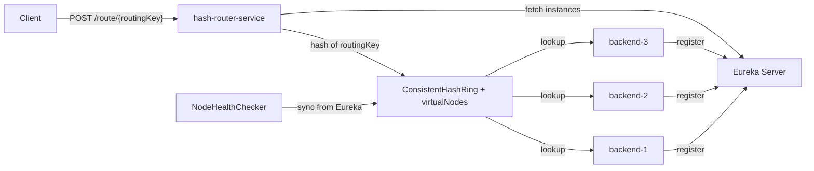
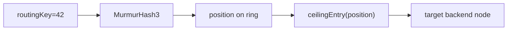

# consistent-hash-router

## 📌 Проблема

В распределённых системах часто нужно маршрутизировать запросы по ключу (например, `userId`) к нужному backend-инстансу.

Классический подход `hash(key) % N` плохо масштабируется при изменении числа инстансов: при добавлении/удалении ноды почти все ключи “переезжают” на другие узлы.

Например, для **stateful-сервисов**, где состояние хранится локально в памяти конкретного инстанса:
- сервисы пользовательских сессий/корзин;
- игровые комнаты или чаты с in-memory состоянием;
- шардированный кэш, где ключ должен стабильно попадать на один и тот же узел.

Если запросы одного `userId` начинают ходить по разным инстансам, нужны постоянные синхронизации или внешнее общее хранилище. Consistent hashing снижает такие “скачки” маршрута при масштабировании и упрощает работу stateful-компонентов.


## Решение

Компонент роутинга на базе **Consistent Hashing**:

- ключ запроса (`routingKey`) хешируется
- выбирается ближайшая виртуальная нода на кольце
- запрос проксируется в выбранный backend
- при изменении состава нод перераспределяется только часть ключей





## Архитектура

- `hash-router-service` — основной роутер, consistent hash ring, sync с Eureka, admin API
- `simple-backend-service` — простой backend для демонстрации маршрутизации
- `docker-compose.yml` — поднимает Eureka, роутер и 3 backend-инстанса

Ключевые компоненты:

- `ConsistentHashRing` — `ConcurrentSkipListMap`, виртуальные ноды, поиск через `ceilingEntry`
- `MurmurHash3Function` — быстрая детерминированная хеш-функция
- `NodeRegistry` — хранение активных backend-нод и add/remove из ring
- `NodeHealthChecker` — периодическая синхронизация состава нод из Eureka
- `RequestRouter` — proxy-запрос на выбранную ноду + заголовок `X-Routed-To`

## API

- `POST /route/{routingKey}` — маршрутизация запроса в backend
- `GET /admin/nodes` — список текущих нод, которые участвуют в ring
- `GET /admin/ring/stats` — число виртуальных нод на каждый backend
- `GET /admin/ring/lookup?key=user-42` — debug lookup по ключу

## Конфигурация

`hash-router-service`:

- `router.virtual-nodes-per-node` — число виртуальных нод на backend (по умолчанию `150`)
- `router.backend-service-name` — имя сервиса в Eureka (по умолчанию `stateful-backend`)
- `router.sync-interval-ms` — период синхронизации состава нод из Eureka (по умолчанию `10000`)
- `eureka.client.service-url.defaultZone` — адрес Eureka

`simple-backend-service`:

- `backend.id` — id backend-инстанса (используется в ответах и metadata)
- `eureka.instance.metadata-map.backendId` — id ноды для роутера
- `eureka.instance.metadata-map.weight` — вес ноды для виртуальных реплик (по умолчанию `1`)

## Тесты

- `ConsistentHashRingTest`:
  - равномерность распределения
  - ограниченное перераспределение при add/remove нод
  - стабильность при единственной ноде

Интеграционные сценарии можно проверять через `docker-compose` и admin endpoints.

## Демо

1) Собрать jar:

```bash
./gradlew :consistent-hash-router:hash-router-service:bootJar
./gradlew :consistent-hash-router:simple-backend-service:bootJar
```

2) Поднять окружение:

```bash
docker-compose -f consistent-hash-router/docker-compose.yml up --build
```

3) Проверить, что backend-ноды появились в Eureka:

```bash
curl http://localhost:8761/actuator/health
```

4) Проверить sticky-routing:

```bash
curl -i -X POST http://localhost:8080/route/42 -d '{"event":"a"}'
curl -i -X POST http://localhost:8080/route/42 -d '{"event":"b"}'
```

В ответе будет заголовок `X-Routed-To` — для одинакового `routingKey` он должен быть одинаковым.

5) Диагностика ring:

```bash
curl http://localhost:8080/admin/nodes
curl http://localhost:8080/admin/ring/stats
curl http://localhost:8080/admin/ring/lookup?key=42
```

## Стек

- Kotlin / Java 21
- Spring Boot 3 (WebFlux, Scheduling, Configuration Properties)
- Spring Cloud Netflix Eureka Client
- Reactor WebClient
- MockWebServer (integration tests)
- Docker Compose
