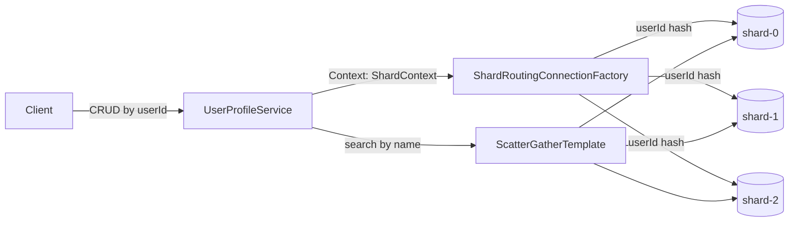

# db-sharding

## 📌 Проблема

В микросервисных системах данные часто приходится **шардировать** (горизонтально распределять) по ключу (например, `userId`) из‑за:
- роста объёма данных и необходимости “растить” БД горизонтально;
- hot-keys и неравномерной нагрузки при хранении всего в одном кластере;
- ограничений по размеру/производительности одного экземпляра PostgreSQL.

При этом бизнес-клиентам важно оставаться в модели “обычного CRUD”:
- клиентский код не должен знать, сколько шардов и как они устроены;
- CRUD по ключу должен идти **только в один нужный shard** (без лишних round-trip’ов);
- запросы по атрибутам, которые не входят в shard key (например, `search by name`), логично должны собирать результат с нескольких шардов.

## 🎯 Решение

Реализовано **прозрачное application-level шардирование PostgreSQL** на уровне Spring R2DBC:

- `simple-user-service` использует обычный `ReactiveCrudRepository` и не содержит явной логики “какой shard выбрать”.
- выбранный shard определяется по `userId` и кладётся в **Reactor Context** (`ShardContext`).
- `sharding-starter` подменяет стандартный R2DBC `ConnectionFactory` на routing-вариант (`ShardRoutingConnectionFactory`) — запрос автоматически выполняется в нужном shard.
- для операций, где ключ не однозначно определяет shard (поиск по имени), выполняется **scatter-gather** по всем шардам и результаты объединяются.

## Основные идеи
- CRUD по `userId` выполняется **только на нужном шардe** (routing по Reactor Context).
- Поиск “по имени” (`search by name`) делает запрос **на все шарды** (scatter-gather) и объединяет результаты.

## Архитектура



## Модули

- `sharding-starter` — Spring Boot Starter:
  - `ShardingAutoConfiguration`
  - `ShardRoutingConnectionFactory` (R2DBC routing)
  - `ScatterGatherTemplate` (multi-shard search)
- `simple-user-service` — демо-сервис CRUD + search.

## Демо через Docker Compose

1. Собрать jar:

```bash
./gradlew :db-sharding:sharding-starter:jar
./gradlew :db-sharding:simple-user-service:bootJar
```

2. Поднять окружение:

```bash
docker-compose -f db-sharding/docker-compose.yml up --build
```

3. Проверить API:

```bash
curl -s -X POST http://localhost:8082/users \
  -H 'Content-Type: application/json' \
  -d '{"userId":"u-1","name":"Alice","email":"alice@example.com"}'

curl -s http://localhost:8082/users/u-1
curl -s 'http://localhost:8082/users/search?name=Ali'
curl -s http://localhost:8082/admin/shards
```

## Конфигурация

- `sharding.defaultShard` — shard по умолчанию
- `sharding.shards[*]`:
  - `name`, `host`, `port`, `database`, `username`, `password`

## Стек

- Kotlin / Java 21
- Spring Boot 3 (WebFlux, R2DBC)
- Spring R2DBC (`AbstractRoutingConnectionFactory`)
- PostgreSQL
- Docker Compose

