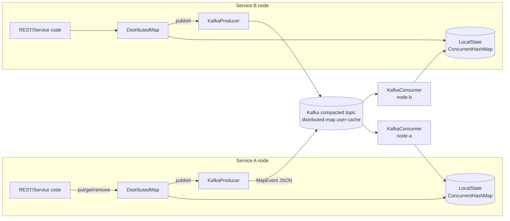
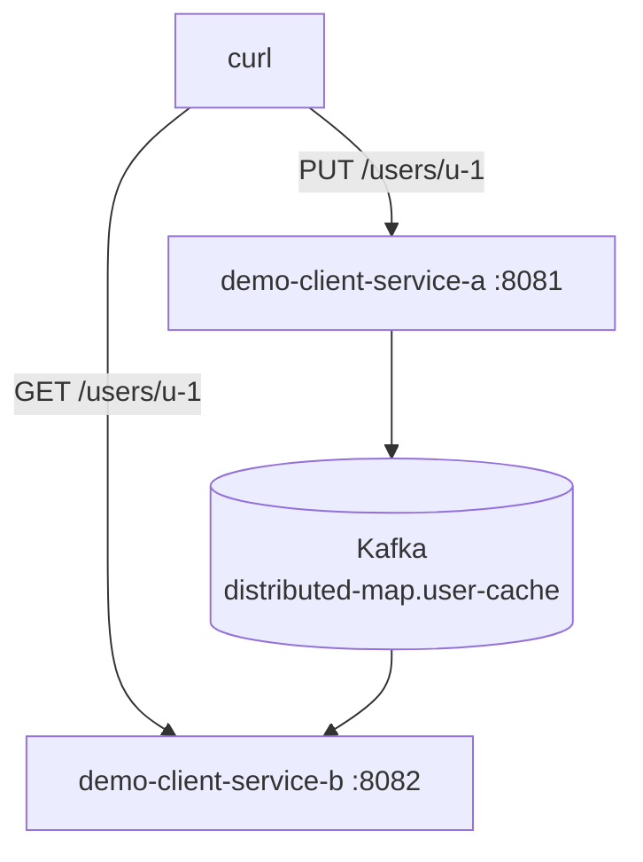
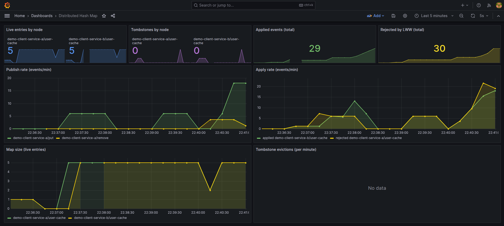

# distributed-hash-map

## 📌 Проблема

В микросервисной архитектуре регулярно нужны **shared in-memory структуры**, к которым обращаются десятки инстансов одного сервиса:

- кэш справочников (валюты, фиче-флаги, профили клиентов);
- routing-таблицы (sharding map, leader hints);
- горячие словари в hot path API, где `Redis round-trip` — это уже слишком дорого.

Базовые альтернативы каждая со своими недостатками:

- **Локальный `ConcurrentHashMap`** — самый быстрый доступ, но **нет согласованности** между нодами. Обновление на одной ноде не видно на других.
- **Redis / Hazelcast** — согласованность есть, но появляется внешний инфраструктурный компонент со своим латентси, пулом соединений и операционным риском.

Хочется решение, которое:

- читает локально, без сетевых hop’ов;
- **реплицирует записи между всеми нодами** автоматически;
- **переживает рестарты**: новая нода поднимается уже с актуальным состоянием;
- использует уже имеющуюся в стеке Kafka вместо ещё одного key-value store.

---

## 🎯 Решение

Реализован **Distributed Hash Map** в виде Spring Boot Starter, в основе которого:

- **Полная репликация данных в RAM каждой ноды** через локальный `ConcurrentHashMap`.
- **Источник истины — Kafka compacted topic**: один map = один топик с `cleanup.policy=compact`.
- **Eventual consistency + Last-Write-Wins**: каждая запись несёт `updatedAt` и `sourceNodeId`, конфликт детерминированно разруливается на каждой ноде.
- **Tombstone flow**: `REMOVE` публикуется как logical-tombstone, после retention переходит в Kafka compaction tombstone (`record value = null`), и брокер физически освобождает диск.
- **Startup restore + readiness barrier**: при старте нода читает compacted-topic с начала до end-of-log; до завершения restore `actuator/health` отдаёт `OUT_OF_SERVICE` и трафик не идёт.

Результат: для приложения это обычная `Map<String, V>`, для оператора — кэш, который согласуется между десятками подов через одну инфраструктуру (Kafka), которая уже стоит в продакшне.



---

## 🧩 Гарантии и осознанные trade-offs

| Свойство            | Реализация                                       |
|---------------------|--------------------------------------------------|
| Consistency         | Eventual consistency, LWW по `updatedAt`         | 
| Delivery            | At-least-once публикация и apply                 |
| Conflict resolution | Strict `updatedAt` → tie-break по `sourceNodeId` |
| Сохранность данных  | Compacted topic = долгоживущее состояние         |
| Объём               | Полная репликация → ограничено RAM ноды          |

---

## 🏗️ Компоненты

### ⚙️ map-starter

Spring Boot Starter — единственный артефакт, который подключают сервисы.

#### Что внутри

- **`DistributedMap<V>`** — публичный API: `get / put / remove / containsKey / size / snapshot`.
- **`DistributedMapRegistry`** — точка входа для пользователя: `registry.get("user-cache", UserProfile::class.java)`.
- **`MapEvent`** — wire-формат: `mapName`, `key`, `operation`, `valueJson`, `updatedAt`, `sourceNodeId`.
- **`LocalState<V>`** — внутренний стор на `ConcurrentHashMap` с tombstone-эпохами.
- **`LwwResolver`** — детерминированное разрешение конфликтов по `(updatedAt, sourceNodeId)`.
- **`MapEventProducer`** / **`MapEventApplier`** / **`MapEventConsumerLoop`** — Kafka-интеграция с двухфазным consumer-loop’ом (`bootstrapRestore` → `steadyState`).
- **`TopicEnsurer`** — идемпотентное создание compacted-топиков на старте.
- **`TombstoneCleaner`** — фоновая GC tombstones + публикация Kafka compaction tombstone.
- **`MapReadinessTracker` + `DistributedMapHealthIndicator`** — actuator-health, который остаётся `OUT_OF_SERVICE` до окончания restore.
- **`DistributedMapMetrics`** — Micrometer counters/gauges/timers (см. ниже).
- **`DistributedMapAdminController`** — REST-эндпоинты `/distributed-map/**` для диагностики (включается, если на classpath есть WebFlux).

#### Подключение

```kotlin
dependencies {
  implementation(project(":distributed-hash-map:map-starter"))
}
```

```yaml
distributed:
  map:
    enabled: true
    node-id: ${NODE_ID:service-a}
    bootstrap:
      timeout: 60s
    cleanup:
      interval: 30s
      tombstone-retention: 2m
    maps:
      user-cache:
        value-type: com.example.UserProfile
        partitions: 3
        replication-factor: 1
```

#### Использование в коде

```kotlin
@RestController
class UserCacheController(private val registry: DistributedMapRegistry) {

  private val users: DistributedMap<UserProfile> =
    registry.get("user-cache", UserProfile::class.java)

  @PutMapping("/users/{id}")
  fun put(@PathVariable id: String, @RequestBody profile: UserProfile) =
    users.put(id, profile.copy(userId = id))

  @GetMapping("/users/{id}")
  fun get(@PathVariable id: String): ResponseEntity<UserProfile> =
    users.get(id)?.let { ResponseEntity.ok(it) } ?: ResponseEntity.notFound().build()

  @DeleteMapping("/users/{id}")
  fun remove(@PathVariable id: String) = users.remove(id)
}
```

---

### ⚙️ demo-client-service-a / demo-client-service-b

Два независимых Spring Boot-сервиса, оба зависят **только от `map-starter`** и держат один и тот же `user-cache`. Используются для cross-node демо: `PUT` на `:8081` мгновенно виден на `:8082` и наоборот.



---

### ⚙️ Observability

#### Метрики (Micrometer → Prometheus)

| Метрика | Тип | Теги |
|---|---|---|
| `distributed_map_size` | Gauge | `map`, `application` |
| `distributed_map_tombstones` | Gauge | `map`, `application` |
| `distributed_map_publish_total` | Counter | `map`, `operation`, `application` |
| `distributed_map_applied_total` | Counter | `map`, `application` |
| `distributed_map_rejected_total` | Counter | `map`, `application` |
| `distributed_map_tombstones_evicted_total` | Counter | `map`, `application` |
| `distributed_map_bootstrap_duration_seconds` | Timer | `map`, `application` |

#### Готовый Grafana dashboard

8 панелей: live entries по нодам, tombstones, applied/rejected total, publish rate, apply rate, map size over time, tombstone evictions.

> Dashboard: [`grafana/dashboards/distributed-hash-map.json`](./grafana/dashboards/distributed-hash-map.json)

#### Actuator

- `GET /actuator/health` — `UP` только когда **все** map’ы прошли bootstrap restore. До этого — `OUT_OF_SERVICE`, что подходит для readinessProbe в Kubernetes.
- `GET /actuator/prometheus` — все метрики выше.
- `GET /distributed-map` — JSON со статусом всех map’ов на ноде (live size, tombstones, applied, rejected, ready).
- `GET /distributed-map/{mapName}` — снапшот всех живых ключей в map’е.

---

## 🎬 Демо

### 1. Сборка и запуск

```bash
cd distributed-hash-map
../gradlew \
  :distributed-hash-map:map-starter:jar \
  :distributed-hash-map:demo-client-service-a:bootJar \
  :distributed-hash-map:demo-client-service-b:bootJar

docker compose up -d --build
```

**Компоненты:**

| Сервис | URL |
|---|---|
| demo-client-service-a | http://localhost:8081 |
| demo-client-service-b | http://localhost:8082 |
| Kafka UI (Redpanda Console) | http://localhost:8088 |
| Prometheus | http://localhost:9090 |
| Grafana | http://localhost:3001 (admin/admin) |

### 2. Cross-node репликация

```bash
# PUT на ноду A
curl -X PUT http://localhost:8081/users/u-1 \
  -H 'Content-Type: application/json' \
  -d '{"userId":"u-1","name":"Alice","email":"alice@example.com","tier":"gold"}'

# Через ~50–200 ms — GET на ноде B возвращает то же значение
curl http://localhost:8082/users/u-1
# {"userId":"u-1","name":"Alice","email":"alice@example.com","tier":"gold"}
```

### 3. Удаление и tombstone

```bash
curl -X DELETE http://localhost:8081/users/u-1
curl -i http://localhost:8082/users/u-1
# HTTP/1.1 404 Not Found
```

### 4. Просмотр состояния ноды

```bash
curl -s http://localhost:8081/distributed-map | jq
# {
#   "nodeId": "service-a",
#   "ready": true,
#   "maps": {
#     "user-cache": {
#       "valueType": "com.andver.dhm.demo.a.UserProfile",
#       "size": 0,
#       "tombstones": 1,
#       "applied": 4,
#       "rejected": 0,
#       "ready": true
#     }
#   }
# }
```

### 5. Restore из compacted topic

```bash
# Положили данные
for i in 1 2 3 4 5; do
  curl -s -X PUT http://localhost:8081/users/u-$i \
    -H 'Content-Type: application/json' \
    -d "{\"userId\":\"u-$i\",\"name\":\"User$i\",\"email\":\"u$i@x.io\"}" > /dev/null
done

# Полностью убили service-b и подняли заново
docker compose restart demo-client-service-b
sleep 5

# Видим, что состояние восстановилось из compacted topic, без обращения к service-a
curl -s http://localhost:8082/users | jq 'keys'
# ["u-1","u-2","u-3","u-4","u-5"]
```

### 6. Просмотр compacted topic напрямую

```bash
docker exec -it distributed-hash-map-kafka-1 \
  kafka-console-consumer \
  --bootstrap-server localhost:9092 \
  --topic distributed-map.user-cache \
  --from-beginning \
  --property print.key=true
```

### Скриншот Grafana



---

## 🧪 Тесты

### Unit (`./gradlew :distributed-hash-map:map-starter:test`)

- `LwwResolverTest` — все ветки LWW + tie-break.
- `LocalStateTest` — apply, tombstone, late-PUT-after-REMOVE, resurrect, tombstone GC, snapshot.
- `MapEventCodecTest` — round-trip envelope/value, tombstone-сериализация.

### Integration (`./gradlew :distributed-hash-map:map-starter:integrationTest`)

`DistributedMapKafkaIntegrationTest` поднимает **два полноценных Spring Boot контекста** на одном `EmbeddedKafkaBroker` (без Docker — тест работает в любой CI) и проверяет:

1. PUT на node-A виден на node-B;
2. REMOVE на node-A создаёт tombstone и на node-B;
3. LWW по timestamp детерминированно выбирает победителя при concurrent writes;
4. **Bootstrap restore**: третья нода, поднятая позже, восстанавливает state из compacted topic.

---

## 📦 Структура проекта

```
distributed-hash-map/
├── map-starter/                                 # Spring Boot Starter (единственный артефакт для подключения)
│   └── src/main/kotlin/com/andver/dhm/
│       ├── api/
│       │   ├── DistributedMap.kt
│       │   └── DistributedMapRegistry.kt
│       ├── envelope/
│       │   ├── MapEvent.kt
│       │   ├── Operation.kt
│       │   └── MapEventCodec.kt
│       ├── runtime/
│       │   ├── DistributedMapImpl.kt
│       │   ├── LocalState.kt
│       │   ├── LocalEntry.kt
│       │   ├── LwwResolver.kt
│       │   └── MapRuntimeRegistry.kt
│       ├── kafka/
│       │   ├── TopicResolver.kt
│       │   ├── TopicEnsurer.kt
│       │   ├── MapEventProducer.kt
│       │   ├── MapEventApplier.kt
│       │   └── MapEventConsumerLoop.kt
│       ├── readiness/
│       │   ├── MapReadinessTracker.kt
│       │   └── DistributedMapHealthIndicator.kt
│       ├── cleanup/TombstoneCleaner.kt
│       ├── metrics/DistributedMapMetrics.kt
│       ├── admin/DistributedMapAdminController.kt
│       ├── properties/DistributedMapProperties.kt
│       └── DistributedMapAutoConfiguration.kt
├── demo-client-service-a/                       # Демо #1, порт 8081
├── demo-client-service-b/                       # Демо #2, порт 8082
├── prometheus/prometheus.yml
├── grafana/
│   ├── dashboards/distributed-hash-map.json
│   └── provisioning/...
├── docker-compose.yml
└── README.md
```

---

## 🛠️ Стек

- Kotlin / Java 21
- Spring Boot 3 (autoconfigure, actuator, WebFlux)
- Spring Kafka + Apache Kafka client (compacted topics, AdminClient, AbstractRoutingConnectionFactory-style ConcurrentHashMap)
- Micrometer + Prometheus + Grafana
- Testcontainers / EmbeddedKafkaBroker для интеграционных тестов
- Docker Compose
