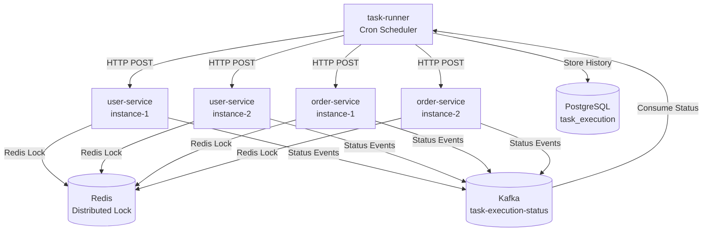

# distributed-task-scheduler

## 📌 Проблема

В микросервисной архитектуре возникает необходимость выполнения **распределённых задач по расписанию** (scheduled tasks) с гарантиями:
- **Отсутствие дублирования выполнения** — задача должна выполняться только один раз, даже при наличии нескольких инстансов сервиса
- **Отслеживание статусов выполнения** — необходимо знать, успешно ли выполнилась задача, произошла ли ошибка или была пропущена
- **Централизованное управление** — единая точка для настройки расписания задач без изменения кода микросервисов
- **Масштабируемость** — система должна работать при горизонтальном масштабировании микросервисов

Основные ограничения классического подхода:
- **@Scheduled в Spring**  
  Задачи выполняются на каждом инстансе, что приводит к дублированию. Нет механизма координации между узлами.
- **Отсутствие отслеживания**  
  Нет истории выполнения задач, невозможно понять, когда последний раз выполнялась задача и с каким результатом.
- **Жёсткая привязка к коду**  
  Изменение расписания требует перезапуска приложения и изменения кода.
- **Нет защиты от зависших задач**  
  При падении процесса задача может остаться в "выполняющемся" состоянии навсегда.

---

## 🎯 Решение

**Распределённая система планирования задач**, которая объединяет:
- **task-runner** — централизованный оркестратор, который планирует задачи по cron-расписанию и отправляет запросы на выполнение в микросервисы
- **task-starter** — Spring Boot Starter для автоматической интеграции в микросервисы, который обрабатывает запросы на выполнение задач
- **Redis** — распределённые блокировки для предотвращения дублирования выполнения на разных инстансах
- **Kafka** — асинхронная передача статусов выполнения задач от микросервисов обратно в task-runner
- **PostgreSQL** — хранение истории выполнения задач с метаданными (UUID, время старта/завершения, статус)

Таким образом:
- задачи выполняются **только один раз** благодаря распределённым блокировкам,
- все выполнения **отслеживаются** в базе данных,
- расписание настраивается **централизованно** через конфигурацию,
- система **масштабируется** горизонтально без дублирования задач.



---

# Компоненты

## ⚙️ task-runner

Централизованный сервис-оркестратор, который:
- читает конфигурацию задач из `application.yml` (cron-выражения, параметры, целевые микросервисы)
- планирует выполнение задач по расписанию с помощью `ThreadPoolTaskScheduler`
- отправляет HTTP-запросы на выполнение задач в микросервисы через `WebClient`
- получает статусы выполнения через Kafka consumer
- сохраняет историю выполнения в PostgreSQL

### 🛠️ Стек технологий
- **Java 21 / Kotlin**
- **Spring Boot 3 (WebFlux, R2DBC)**
- **Spring Kafka**
- **PostgreSQL**

### 🔧 Основные компоненты

#### 1. CronTaskScheduler
- Планирует задачи по cron-выражениям из конфигурации
- Использует `ThreadPoolTaskScheduler` для выполнения задач в отдельных потоках
- Валидирует cron-выражения при старте приложения

#### 2. TaskRunner
- Создаёт UUID для каждого выполнения задачи
- Сохраняет запись о начале выполнения в PostgreSQL (статус `PREPARE`)
- Отправляет HTTP-запрос в микросервис через `WebClientComponentConnector`
- Обрабатывает ошибки и обновляет статус на `ERROR` при неудаче

#### 3. TaskExecutionStatusConsumer
- Подписывается на топик `task-execution-status` в Kafka
- Получает статусы выполнения (`IN_PROGRESS`, `FINISHED`, `ERROR`, `SKIPPED`)
- Обновляет записи в PostgreSQL через `TaskExecutionHandler`

#### 4. WebClientComponentConnector
- Выполняет HTTP POST-запросы к микросервисам
- Реализует retry-механизм с exponential backoff для временных ошибок (5xx, таймауты)
- Логирует все попытки повторных запросов

Настройки task-runner (application.yml):

```yaml
scheduler:
  pool-size: 4                    # Размер пула потоков для планировщика
  status-topic: task-execution-status  # Kafka топик для статусов
  tasks: # запланированные задачи
    blockInactiveUsers:
      cron: "*/10 * * * * ?"      
      component: "user-service"   # Имя микросервиса (hostname)
      params:                     # параметры для выполнения задачи
        param1: "testParam"
        param2: "testParam2"
    checkOrderDelivery:
      cron: "0 0/5 * ? * *"      
      component: "order-service"
      params:
        batchSize: 10
```

---

## ⚙️ task-starter

Spring Boot Starter для автоматической интеграции планирования задач в микросервисы.

### 🛠️ Стек технологий
- **Java 21 / Kotlin**
- **Spring Boot 3 (WebFlux)**
- **Spring Kafka**
- **Redisson (Redis)**

### 🔧 Основные компоненты

#### 1. TaskAutoConfiguration
Автоматически регистрирует следующие бины:
- **TaskController** — REST endpoint `/scheduled-task/run` для приёма запросов на выполнение задач
- **TaskDispatcher** — маршрутизирует запросы к соответствующим обработчикам задач
- **TaskExecutionHandler** — выполняет задачи с использованием распределённых блокировок
- **TaskStatusProducer** — отправляет статусы выполнения в Kafka
- **RedissonReactiveClient** — клиент для работы с Redis блокировками

#### 2. TaskExecutionHandler
- Получает распределённую блокировку через Redisson (`task:{taskName}`)
- Если блокировка получена — выполняет задачу асинхронно
- Если блокировка не получена — отправляет статус `SKIPPED` (задача уже выполняется на другом инстансе)
- Отправляет статусы в Kafka: `IN_PROGRESS` → `FINISHED` / `ERROR`
- Автоматически освобождает блокировку после завершения

#### 3. Task
Интерфейс для реализации задач в микросервисах:

```kotlin
interface Task {
  val taskName: String
  val scheduler: Scheduler
  fun execute(param: Map<String, Any>): Mono<Void>
}
```

Пример реализации:

```kotlin
@Component
class BlockInactiveUsersTask : Task {
  override val taskName: String = "blockInactiveUsers"
  override val scheduler: Scheduler = Schedulers.boundedElastic()
  
  override fun execute(param: Map<String, Any>): Mono<Void> {
    // Бизнес-логика задачи
    return Mono.delay(Duration.ofSeconds(15)).then()
  }
}
```

Использование task-starter в build.gradle.kts:

```kotlin
dependencies {
  implementation(project(":distributed-task-scheduler:task-starter"))
}
```

Настройки task-starter (application.yml):

```yaml
spring:
  data:
    redis:
      host: redis
      port: 6379
  kafka:
    bootstrap-servers: kafka:9092

task:
  status-topic: task-execution-status  # Топик для отправки статусов
```

---

## 🛡️ Отказоустойчивость (Fault Tolerance)

- **Распределённые блокировки (Redis)**  
  Предотвращают дублирование выполнения задач при наличии нескольких инстансов микросервиса. Только один инстанс получает блокировку и выполняет задачу.

- **Retry-механизм для HTTP-запросов**  
  При временных ошибках (5xx, таймауты) task-runner автоматически повторяет запрос с exponential backoff.

- **Асинхронная обработка статусов через Kafka**  
  Статусы выполнения отправляются асинхронно, что гарантирует доставку даже при временных проблемах с сетью.

- **Хранение истории в PostgreSQL**  
  Все выполнения задач сохраняются в базе данных, что позволяет отслеживать историю и анализировать проблемы.

- **Защита от зависших задач**  
  Блокировки в Redis имеют время жизни (lease time), что предотвращает ситуацию, когда задача остаётся заблокированной навсегда при падении процесса.

---

## 🛡️ Масштабируемость (Scalability)

- **Горизонтальное масштабирование микросервисов**  
  Можно запускать несколько инстансов одного микросервиса. Благодаря распределённым блокировкам задачи будут выполняться только один раз.

- **Независимое масштабирование компонентов**  
  task-runner, микросервисы и инфраструктура (Kafka, Redis, PostgreSQL) могут масштабироваться независимо.

- **Реактивная архитектура**  
  Использование Spring WebFlux и R2DBC обеспечивает неблокирующую обработку запросов и эффективное использование ресурсов.

---

## 🎬 Демо

### 1. Запуск окружения

```bash
cd distributed-task-scheduler
.././gradlew clean build
docker-compose up -d
```

### 2. Проверка выполнения задач

Задачи выполняются автоматически по расписанию. Можно проверить логи:

```bash
# Логи task-runner
docker logs task-runner

# Логи микросервисов
docker logs simple-user-microservice
docker logs simple-order-microservice
```

Пример логов:
```
[blockInactiveUsers] Running task uuid = 550e8400-e29b-41d4-a716-446655440000
Starting blockInactiveUsers task
Task blockInactiveUsers finished
```

### 3. Просмотр истории выполнения

Подключитесь к PostgreSQL:

```bash
docker exec -it postgres psql -U postgres -d master
```

Запрос истории:

```sql
SELECT uuid, name, component, status, start_time, finish_time 
FROM task_execution 
ORDER BY start_time DESC 
LIMIT 10;
```

### 4. Ручной запуск задачи

Можно запустить задачу вручную через REST API:

```bash
curl -X POST http://localhost:9090/run \
  -H "Content-Type: application/json" \
  -d '{"taskName": "blockInactiveUsers"}'
```

### 5. Мониторинг через Kafka UI

Откройте Kafka UI в браузере:
```
http://localhost:8089
```

Проверьте топик `task-execution-status` для просмотра статусов выполнения задач.

### 6. Проверка распределённых блокировок

При запуске нескольких инстансов микросервиса можно увидеть, что задачи выполняются только один раз:

```bash
# Запуск второго инстанса user-service
docker-compose up -d --scale simple-user-microservice=2

# В логах будет видно, что одна задача выполняется, а вторая получает статус SKIPPED
```

