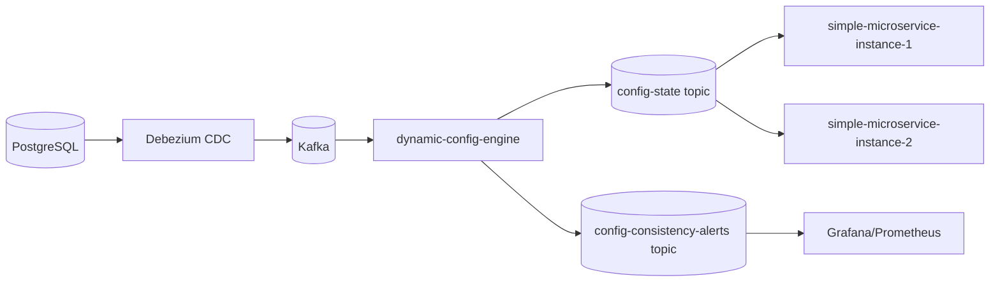

# dynamic-application-config  

## 📌 Проблема

В распределённых системах конфигурационные данные являются частью критической бизнес‑логики и должны удовлетворять 
требованиям: **eventual consistency**, **high availability** и **fault tolerance**.  
Основные ограничения:
- **Статическая загрузка конфигураций**  
  Конфиги читаются только при старте приложения. Любое изменение требует перезапуска узла.
- **Отсутствие механизма согласованности**  
  Нет встроенного протокола репликации или механизма *state synchronization*. В результате разные инстансы одного сервиса могут работать с устаревшими значениями.
- **Нет гарантии доставки и восстановления состояния**  
  При сбое или перезапуске узел теряет актуальные конфиги. Отсутствует механизм *state replay*, что делает невозможным автоматическое восстановление состояния.
- **Изменения в базе данных конфигураций не транслируются напрямую в сервисы**
---

### 🎯 Решение
Postgres -> Debezium (CDC) -> Kafka -> Engine (Kafka Streams) -> Kafka -> Microservices
- Хранения конфигураций в PostgreSQL,
- Реализуем **real‑time propagation** конфигураций через Kafka и Debezium.
- Обеспечиваем **eventual consistency** между всеми узлами за счёт compact‑топиков.
- Внедряем механизм **state replay** для восстановления состояния после перезапуска.
- Добавляем модуль **consistency analysis**, который выявляет рассинхронизацию и публикует алерты в отдельный топик для мониторинга.
- Spring Boot Starter для автоматической интеграции динамических конфигураций.


---
# Компоненты

## ⚙️ dynamic-config-starter

Spring Boot стартер для использования динамических конфигураций  
### 🛠️ Стек технологий
- **Java 21 / Kotlin**
- **Spring Boot 3**
- **Spring Kafka**
- **Actuator**

Стартер автоматически регистрирует следующие бины:

- **DynamicConfigStorage**  
  Интерфейс для доступа к конфигурациям.
  ```kotlin
  interface DynamicConfigStorage {
      fun get(key: String): String?
      fun getAll(): Map<String, String>
  }
  ```
  Реализация: `DefaultDynamicConfigStorage` (основан на потокобезопасной ConcurrentHashMap).
- **ConfigChangeConsumer**  
  Kafka‑консьюмер, подписывающийся на топик `config-state` и обновляющий локальное хранилище.

- **ConfigStateProducer**  
  Kafka‑продюсер, который периодически публикует снапшот состояния конфигураций в топик `config-snapshot`.

- **ConfigEndpoint**  
  Actuator‑эндпоинт `/actuator/dynamic-config`, возвращающий все текущие конфигурации.

Настройки dynamic-config-starter (application.yml):

```yaml
dynamic-config:
  enabled: true                 # Включает работу стартера
  bootstrap-servers: kafka:9092 # Kafka брокер
  topic: config-state           # Топик, из которого читаются изменения конфигов
  snapshot-topic: config-snapshot # Топик, куда публикуются снапшоты состояния
  state-send-interval-ms: 10000 # Интервал отправки снапшотов (мс)

management:
  endpoints:
    web:
      exposure:
        include: dynamic-config # Включение ендпоинта актуатора для динамических конфигов
```
Использование стартера в build.gradle.kts:

```kotlin
implementation("com.andver:dynamic-config-starter:1.0.0")
```
---

## ⚙️ dynamic-config-engine
`dynamic-config-engine` — это сервис, который обрабатывает события CDC (Change Data Capture) из PostgreSQL через Debezium и обеспечивает:
- трансляцию изменений конфигураций в Kafka‑топик `config-state`,
- анализ консистентности конфигураций между узлами,
- публикацию алертов в случае расхождений.

---

### 🛠️ Стек технологий
- **Java 21 / Kotlin**
- **Spring Boot 3**
- **Spring Kafka / Kafka Streams**

---

### 🔧 Основные компоненты

#### 1. DebeziumStreamConfig
- Подписывается на топик Debezium (`configs.public.business_configs`).
- Фильтрует операции `c` (create) и `u` (update).
- Извлекает ключ и значение конфигурации.
- Публикует результат в топик `config-state`.

#### 2. ConsistencyAnalyzerConfig
- Сравнивает снапшоты узлов (`config-snapshot`) с эталонным состоянием (`config-state`).
- Использует оконную агрегацию (`TimeWindows`) для группировки результатов.
- Формирует список несогласованностей и публикует их в топик `config-consistency-alerts`.  
Пример алерта:
```json
{
  "appName": "simple-service",
  "configKey": "discount_rate",
  "expected": "0.10",
  "actual": "0.15"
}
```
Настройки dynamic-config-engine (application.yml):
```yaml
dynamic-config:
  topic: config-state                 # Основной топик, куда Engine публикует изменения конфигураций
  debezium-topic: configs.public.business_configs # Топик, куда Debezium транслирует изменения из таблицы business_configs
  analyze-consistency-enabled: true  # Флаг включения анализа консистентности (false = анализ отключён)
  snapshot-topic: config-snapshot     # Топик, куда микросервисы публикуют свои снапшоты состояния
  window-seconds: 30                  # Размер временного окна (сек) для агрегации несогласованностей
  alerts-topic: config-consistency-alerts # Топик для публикации алертов о несогласованности конфигов
```
## 🛡️ Fault Tolerance

Система спроектирована так, чтобы быть устойчивой к сбоям и перезапускам:

- **Compact‑топики Kafka**  
  Все конфигурации хранятся в топике `config-state` с политикой `cleanup.policy=compact`.  
  Это гарантирует, что для каждого ключа (`configKey`) всегда доступно последнее актуальное значение.

- **Восстановление состояния микросервисов**  
  При перезапуске микросервис вычитывает историю из compact‑топика `config-state` и восстанавливает локальное хранилище 
     (`DynamicConfigStorage`).

- **Engine и Streams**  
  dynamic-config-engine построен на Kafka Streams, что обеспечивает автоматическое восстановление состояния потоков при сбоях и репликацию данных.

---

## 🔎 Observability

Для наблюдаемости и контроля согласованности реализован модуль анализа консистентности:
- **Сбор снапшотов**  
  Каждый микросервис периодически публикует своё состояние конфигов в топик `config-snapshot`.
- **Сравнение с эталоном**  
  dynamic-config-engine сравнивает значения из снапшотов с эталонным состоянием (`config-state`).
- **Выявление несогласованности**  

## 🎬 Демо

### 1. Тестовый микросервис

Микросервис `simple-microservice` на базе Spring Boot, который использует `DynamicConfigStorage`.

### 2. Запуск окружения
```bash
cd dynamic-application-config  
.././gradlew clean build
docker-compose up -d
```
### 3. Восстановление состояния конфигов при старте микросевисов
Логи:
```bash
dynamic-application-config-simple-microservice-1-1: Updated config with key:discount_rate and value:0.10
dynamic-application-config-simple-microservice-1-1: Updated config with key:max_order_amount and value:5000
dynamic-application-config-simple-microservice-1-1: Updated config with key:delivery_days and value:3
dynamic-application-config-simple-microservice-1-1: Updated config with key:support_email and value:support@company.com
dynamic-application-config-simple-microservice-1-1: Updated config with key:feature_new_checkout and value:enabled
dynamic-application-config-simple-microservice-2-1: Updated config with key:discount_rate and value:0.10
dynamic-application-config-simple-microservice-2-1: Updated config with key:max_order_amount and value:5000
dynamic-application-config-simple-microservice-2-1: Updated config with key:delivery_days and value:3
dynamic-application-config-simple-microservice-2-1: Updated config with key:support_email and value:support@company.com
dynamic-application-config-simple-microservice-2-1: Updated config with key:feature_new_checkout and value:enabled
```
### 4. Проверка состояния конфигов
```bash
curl http://localhost:9001/configs/discount_rate
curl http://localhost:9002/configs/discount_rate

или через актуатор

curl http://localhost:9001/actuator/dynamic-config
curl http://localhost:9002/actuator/dynamic-config
```
### 5. Real-time обновление конфигов
Обновление в базе данных
```bash
docker exec -it postgres psql -U demo -d master -c \
"UPDATE business_configs SET value = '0.15' WHERE key = 'discount_rate';"
```
Логи обновления:
```bash
dynamic-application-config-simple-microservice-2-1: Updated config with key:discount_rate and value:0.15
dynamic-application-config-simple-microservice-1-1: Updated config with key:discount_rate and value:0.15
```
### 6. Проверка алертов несогласованного состояния
```bash
docker exec -it kafka kafka-console-consumer \
  --bootstrap-server kafka:9092 \
  --topic config-consistency-alerts \
  --from-beginning
```
