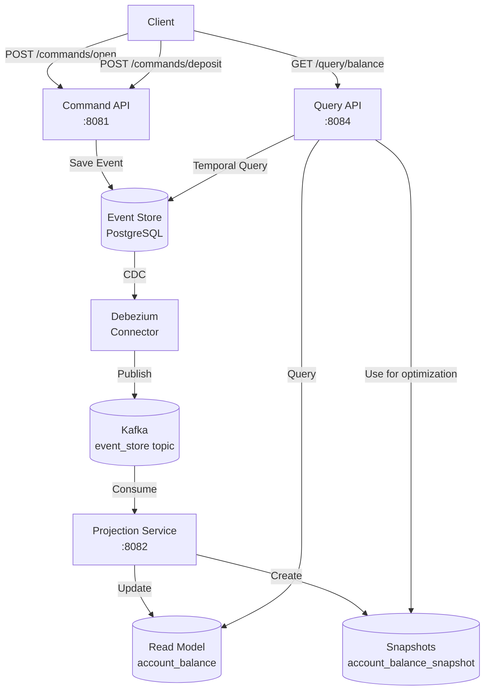

# event-sourcing-cqrs-banking

## 📌 Проблема

В традиционных системах с CRUD-подходом возникают серьёзные ограничения при работе с критичными бизнес-данными:

- **Потеря истории изменений**  
  Обновление записи перезаписывает предыдущее состояние. Невозможно восстановить состояние на конкретный момент времени или проследить историю изменений.

- **Отсутствие audit trail**  
  Нет встроенного механизма аудита операций. Сложно ответить на вопросы: "Кто и когда изменил баланс?", "Какой был баланс неделю назад?".

- **Сложность масштабирования чтения и записи**  
  В традиционном подходе операции чтения и записи работают с одной моделью данных, что создаёт конкуренцию за ресурсы и усложняет независимое масштабирование.

- **Проблемы с eventual consistency**  
  При работе с распределёнными системами сложно обеспечить согласованность данных между различными представлениями.

- **Отсутствие возможности replay событий**  
  Невозможно воспроизвести последовательность событий для восстановления состояния, отладки или создания новых проекций.

**Типичные сценарии в банковской системе:**
- Получение баланса счёта на конкретную дату для формирования отчётов
- Аудит всех операций по счёту (кто, когда, какую операцию выполнил)
- Восстановление состояния счёта после сбоя
- Создание различных представлений данных (текущий баланс, история транзакций, аналитика)

---

## 🎯 Решение

**Event Sourcing + CQRS Pattern** с использованием **Debezium CDC** для автоматической публикации событий в Kafka.

Вместо обновления состояния напрямую, сохраняем **последовательность событий** (Event Store), которые привели к текущему состоянию:
- Все изменения записываются как immutable события в Event Store
- Текущее состояние восстанавливается путём воспроизведения (replay) событий
- CQRS разделяет модели чтения (Query) и записи (Command)
- Debezium CDC автоматически публикует события из Event Store в Kafka для асинхронной обработки
- Snapshots для оптимизации восстановления состояния при большом количестве событий



**Преимущества подхода:**
- ✅ **Полная история** — все события сохраняются, можно восстановить любое состояние в прошлом
- ✅ **Audit trail** — встроенный аудит всех операций с timestamp и версионированием
- ✅ **Независимое масштабирование** — read и write модели масштабируются отдельно
- ✅ **Temporal queries** — получение состояния на любой момент времени
- ✅ **Event replay** — возможность пересоздать проекции или создать новые на основе истории
- ✅ **Snapshots** — оптимизация производительности при большом количестве событий

---

## 🏗️ Архитектура решения

### Компоненты

1. **banking-command-api** — Command API для обработки команд (OpenAccount, Deposit, Withdraw)
2. **banking-query-api** — Query API для чтения данных (текущий баланс, баланс на дату)
3. **projection-balance** — Projection Service для обновления Read Model из событий
4. **banking-domain** — общая доменная модель (команды, события, типы)
5. **Event Store** — PostgreSQL таблица для хранения событий с версионированием
6. **Read Model** — денормализованные данные для быстрого чтения
7. **Snapshots** — снимки состояния для оптимизации восстановления

### Event Sourcing Flow

1. **Команда** → Command API валидирует и сохраняет событие в Event Store
2. **Event Store** → Debezium отслеживает изменения через CDC
3. **Kafka** → события публикуются в топик для асинхронной обработки
4. **Projection** → обновляет Read Model и создаёт snapshots
5. **Query** → читает данные из Read Model или восстанавливает из Event Store

---

## Компоненты

## ⚙️ banking-command-api

Command API для обработки write операций (команд).

### 🛠️ Стек технологий
- **Kotlin** / Java 21
- **Spring Boot 3** (WebFlux)
- **Spring Data R2DBC**
- **PostgreSQL** (Event Store)

### 🔧 Основные компоненты

#### 1. AccountCommandController
REST API для обработки команд:

```kotlin
@PostMapping("/open")
fun openAccount(@RequestBody req: OpenAccountRequest): Mono<Void>

@PostMapping("/deposit")
fun deposit(@RequestBody req: DepositRequest): Mono<Void>

@PostMapping("/withdraw")
fun withdraw(@RequestBody req: WithdrawRequest): Mono<Void>
```

#### 2. CommandHandler
Обработчик команд с бизнес-логикой:
- Проверяет существование аккаунта
- Генерирует события с инкрементной версией
- Сохраняет в Event Store атомарно
- Использует optimistic locking через версионирование

#### 3. EventStoreRepository
Репозиторий для работы с Event Store:

```kotlin
@Query("""
  INSERT INTO event_store 
    (event_id, aggregate_id, aggregate_type, event_type, payload, version, created_at)
  VALUES 
    (:eventId, :aggregateId, :aggregateType, :eventType, CAST(:payload AS jsonb), :version, :createdAt)
  RETURNING *
""")
fun saveWithJsonb(...): Mono<BankingEvent>
```

**Особенности:**
- Атомарная запись событий с версией
- JSONB payload для гибкости структуры
- Уникальный индекс `(aggregate_id, version)` для optimistic locking

**Пример запроса:**

```bash
# Открыть счёт
curl -X POST http://localhost:8081/api/v1/commands/open \
  -H "Content-Type: application/json" \
  -d '{"accountId": 1, "owner": 100}'

# Пополнить счёт
curl -X POST http://localhost:8081/api/v1/commands/deposit \
  -H "Content-Type: application/json" \
  -d '{"accountId": 1, "amount": 1000.50}'

# Снять деньги
curl -X POST http://localhost:8081/api/v1/commands/withdraw \
  -H "Content-Type: application/json" \
  -d '{"accountId": 1, "amount": 250.00}'
```

---

## ⚙️ banking-query-api

Query API для чтения данных с поддержкой temporal queries.

### 🛠️ Стек технологий
- **Kotlin** / Java 21
- **Spring Boot 3** (WebFlux)
- **Spring Data R2DBC**
- **PostgreSQL**

### 🔧 Основные компоненты

#### 1. AccountBalanceController
REST API для чтения данных:

```kotlin
@GetMapping("/account/{id}/balance")
fun getAccountBalance(@PathVariable id: Long): Mono<BalanceResponse>

@PostMapping("/account/balance-at")
fun getAccountBalanceAt(@RequestBody request: BalanceAtRequest): Mono<BalanceResponse>
```

#### 2. AccountBalanceService
Сервис с двумя стратегиями получения баланса:

**Текущий баланс:**
- Читает из денормализованной таблицы `account_balance`
- O(1) — мгновенный доступ

**Баланс на дату (Temporal Query):**
1. Ищет ближайший snapshot до указанной даты
2. Если snapshot найден — загружает события после snapshot до указанной даты
3. Если snapshot нет — загружает все события до указанной даты
4. Применяет события к начальному балансу

**Особенности:**
- Snapshots значительно ускоряют temporal queries
- Event replay из истории для точности
- Поддержка любой даты в прошлом

**Пример запросов:**

```bash
# Получить текущий баланс
curl http://localhost:8084/api/v1/query/account/1/balance

# Получить баланс на конкретную дату
curl -X POST http://localhost:8084/api/v1/query/account/balance-at \
  -H "Content-Type: application/json" \
  -d '{
    "accountId": 1,
    "time": "2025-01-15T12:00:00"
  }'
```

---

## ⚙️ projection-balance

Projection Service для асинхронного обновления Read Model из событий.

### 🛠️ Стек технологий
- **Kotlin** / Java 21
- **Spring Boot 3**
- **Spring Kafka**
- **Spring Data R2DBC**
- **PostgreSQL**

### 🔧 Основные компоненты

#### 1. CommandEventConsumer
Kafka consumer для обработки событий:

```kotlin
@KafkaListener(topics = ["debezium.public.event_store"])
fun consume(event: BankingEvent)
```

**Подписывается на:**
- `debezium.public.event_store` — топик с событиями из Event Store

#### 2. BalanceUpdateHandler
Обработчик событий для обновления проекций:
- Применяет событие к текущему балансу
- Обновляет таблицу `account_balance`
- Периодически создаёт snapshots для оптимизации

**Логика работы:**
1. Получает событие из Kafka
2. Применяет изменение баланса (deposit/withdraw)
3. Обновляет Read Model
4. При достижении порога создаёт snapshot

---

## 🛡️ Гарантии и Fault Tolerance

### Атомарность и Консистентность
- **Optimistic Locking** через версионирование событий
- Уникальный индекс `(aggregate_id, version)` предотвращает конкурентные записи
- Атомарная запись событий в Event Store

### Eventual Consistency
- Command API немедленно сохраняет события
- Read Model обновляется асинхронно через Kafka
- Гарантия доставки событий через Debezium CDC
- Идемпотентная обработка на стороне projection

### Восстановление состояния
- **Event Replay** — восстановление Read Model из Event Store
- **Snapshots** — ускорение восстановления при большом количестве событий
- **Debezium offset tracking** — продолжение с последней обработанной позиции

### Отказоустойчивость
- События сохраняются в PostgreSQL с репликацией
- Kafka гарантирует доставку событий
- При сбое projection можно пересоздать Read Model из Event Store

---

## 🎬 Демо

### 1. Запуск окружения

```bash
cd event-sourcing-cqrs-banking
.././gradlew clean build
docker-compose up -d
```

**Компоненты:**
- PostgreSQL: `localhost:5432`
- Command API: `localhost:8081`
- Query API: `localhost:8084`
- Projection Service: `localhost:8082`
- Kafka UI: `http://localhost:8088`
- Debezium Connect: `localhost:8083`

### 2. Открытие счёта

```bash
curl -X POST http://localhost:8081/api/v1/commands/open \
  -H "Content-Type: application/json" \
  -d '{"accountId": 1, "owner": 100}'
```

**Что происходит:**
1. Событие `ACCOUNT_OPENED` сохраняется в Event Store (version = 1)
2. Debezium публикует событие в Kafka
3. Projection создаёт запись в `account_balance` с балансом 0

### 3. Пополнение счёта

```bash
curl -X POST http://localhost:8081/api/v1/commands/deposit \
  -H "Content-Type: application/json" \
  -d '{"accountId": 1, "amount": 5000.00}'
```

**Что происходит:**
1. Событие `MONEY_DEPOSITED` сохраняется (version = 2)
2. Projection обновляет баланс: 0 + 5000 = 5000

### 4. Снятие средств

```bash
curl -X POST http://localhost:8081/api/v1/commands/withdraw \
  -H "Content-Type: application/json" \
  -d '{"accountId": 1, "amount": 1500.00}'
```

**Что происходит:**
1. Событие `MONEY_WITHDRAWN` сохраняется (version = 3)
2. Projection обновляет баланс: 5000 - 1500 = 3500

### 5. Получение текущего баланса

```bash
curl http://localhost:8084/api/v1/query/account/1/balance
```

**Ответ:**
```json
{
  "balance": 3500.00
}
```

### 6. Получение баланса на дату

```bash
curl -X POST http://localhost:8084/api/v1/query/account/balance-at \
  -H "Content-Type: application/json" \
  -d '{
    "accountId": 1,
    "time": "2025-01-15T12:00:00"
  }'
```

**Что происходит:**
1. Ищется ближайший snapshot до указанной даты
2. Загружаются события между snapshot и указанной датой
3. События применяются к балансу из snapshot
4. Возвращается восстановленный баланс

### 7. Проверка Event Store

```bash
docker exec -it postgres psql -U admin -d master -c \
  "SELECT aggregate_id, event_type, version, created_at FROM event_store ORDER BY version;"
```

**Результат:**
```
 aggregate_id |   event_type    | version |         created_at
--------------+-----------------+---------+----------------------------
            1 | ACCOUNT_OPENED  |       1 | 2025-02-09 10:00:00.123
            1 | MONEY_DEPOSITED |       2 | 2025-02-09 10:01:15.456
            1 | MONEY_WITHDRAWN |       3 | 2025-02-09 10:02:30.789
```

### 8. Проверка Read Model

```bash
docker exec -it postgres psql -U admin -d master -c \
  "SELECT * FROM account_balance WHERE id = 1;"
```

**Результат:**
```
 id | owner_id | balance  |         updated_at
----+----------+----------+----------------------------
  1 |      100 | 3500.00  | 2025-02-09 10:02:30.789
```

### 9. Проверка событий в Kafka

```bash
# Список топиков
docker exec -it kafka kafka-topics --list --bootstrap-server localhost:9092

# Просмотр событий
docker exec -it kafka kafka-console-consumer \
  --bootstrap-server localhost:9092 \
  --topic debezium.public.event_store \
  --from-beginning
```

---

## 📦 Структура проекта

```
event-sourcing-cqrs-banking/
├── banking-domain/                  # Общая доменная модель
│   └── src/main/kotlin/
│       └── com/andver/banking/domain/
│           ├── AccountCommand.kt    # Команды (OpenAccount, Deposit, Withdraw)
│           ├── AggregateType.kt     # Типы агрегатов
│           ├── EventType.kt         # Типы событий
│           └── entity/
│               ├── BankingEvent.kt         # Event Store entity
│               ├── AccountBalance.kt       # Read Model entity
│               └── AccountBalanceSnapshot.kt # Snapshot entity
├── banking-command-api/             # Command API (Write Side)
│   ├── src/main/kotlin/
│   │   └── com/andver/banking/command/
│   │       ├── BankingCommandApiApp.kt
│   │       ├── controller/
│   │       │   └── AccountCommandController.kt
│   │       ├── handler/
│   │       │   ├── CommandHandler.kt
│   │       │   └── CommandSerializer.kt
│   │       └── repository/
│   │           └── EventStoreRepository.kt
│   ├── src/main/resources/
│   │   └── application.yml
│   ├── build.gradle.kts
│   └── Dockerfile
├── banking-query-api/               # Query API (Read Side)
│   ├── src/main/kotlin/
│   │   └── com/andver/banking/query/
│   │       ├── BankingQueryApiApp.kt
│   │       ├── controller/
│   │       │   └── AccountBalanceController.kt
│   │       ├── service/
│   │       │   └── AccountBalanceService.kt
│   │       └── repository/
│   │           ├── EventStoreRepository.kt
│   │           ├── AccountBalanceRepository.kt
│   │           └── AccountBalanceSnapshotRepository.kt
│   ├── src/main/resources/
│   │   └── application.yml
│   ├── build.gradle.kts
│   └── Dockerfile
├── projection-balance/              # Projection Service (Read Model updater)
│   ├── src/main/kotlin/
│   │   └── com/andver/banking/projection/
│   │       ├── ProjectionBalanceApp.kt
│   │       ├── consumer/
│   │       │   └── CommandEventConsumer.kt
│   │       ├── handler/
│   │       │   └── BalanceUpdateHandler.kt
│   │       ├── model/
│   │       │   └── BankingEvent.kt
│   │       └── repository/
│   │           ├── AccountBalanceRepository.kt
│   │           └── AccountBalanceSnapshotRepository.kt
│   ├── src/main/resources/
│   │   └── application.yml
│   ├── build.gradle.kts
│   └── Dockerfile
├── postgres/
│   └── init.sql                     # DDL (event_store, account_balance, snapshots)
├── debezium/
│   └── init-debezium.sh            # Debezium connector initialization
├── docker-compose.yml
└── README.md
```

---

## 🔍 Технические детали

### Схема Event Store

```sql
CREATE TABLE event_store
(
    id             BIGSERIAL PRIMARY KEY,
    event_id       UUID         NOT NULL,
    aggregate_id   BIGINT       NOT NULL,
    aggregate_type VARCHAR(100) NOT NULL DEFAULT 'Account',
    event_type     VARCHAR(100) NOT NULL,
    payload        JSONB        NOT NULL,
    version        BIGINT       NOT NULL,
    created_at     TIMESTAMP(3) NOT NULL DEFAULT NOW(),
    UNIQUE (aggregate_id, version)
);
```

**Особенности:**
- `aggregate_id` + `version` — уникальный индекс для optimistic locking
- `payload` — JSONB для гибкости структуры событий
- `created_at` — timestamp для temporal queries
- Immutable — события никогда не удаляются и не обновляются

### Схема Read Model

```sql
CREATE TABLE account_balance
(
    id         BIGSERIAL       NOT NULL PRIMARY KEY,
    owner_id   BIGINT          NOT NULL,
    balance    NUMERIC(19, 2)  NOT NULL DEFAULT 0,
    updated_at TIMESTAMP(3)    NOT NULL DEFAULT NOW()
);
```

### Схема Snapshots

```sql
CREATE TABLE account_balance_snapshot
(
    id          BIGSERIAL       NOT NULL PRIMARY KEY,
    account_id  BIGINT          NOT NULL,
    balance     NUMERIC(19, 2)  NOT NULL DEFAULT 0,
    created_at  TIMESTAMP(3)    NOT NULL DEFAULT NOW()
);
```

### Версионирование событий

Каждое событие имеет инкрементную версию:
- **OpenAccount** → version = 1
- **DepositMoney** → version = 2
- **WithdrawMoney** → version = 3

Версия используется для:
- Optimistic locking при конкурентных записях
- Упорядочивание событий при replay
- Определение актуальности данных

### Debezium Configuration

```json
{
  "name": "event-store-connector",
  "config": {
    "connector.class": "io.debezium.connector.postgresql.PostgresConnector",
    "database.hostname": "postgres",
    "database.port": "5432",
    "database.user": "admin",
    "database.password": "admin",
    "database.dbname": "master",
    "table.include.list": "public.event_store",
    "topic.prefix": "debezium",
    "plugin.name": "pgoutput"
  }
}
```

---
