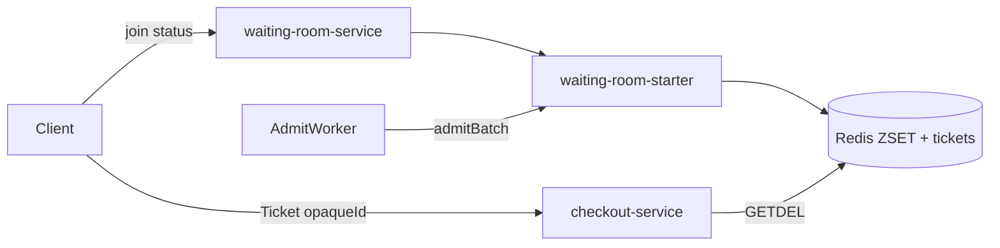
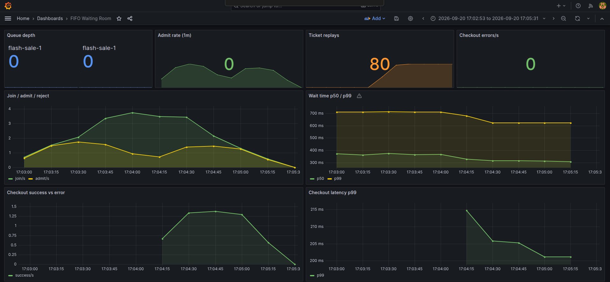

# fifo-waiting-room

## Проблема

Flash sale / ticket drop / массовая регистрация создают **refresh-storm** на checkout:

- **Rate limit (429)** в nginx / Spring Cloud Gateway отрезает лишних — UX «сайт мёртв», покупки теряются.
- **Прямой вход в checkout** без очереди убивает p99: медленный обработчик + ограниченные слоты → каскад 503.
- Нужен не «откажи», а **«поставь в FIFO и впускай с контролируемой скоростью»**.

## Решение

Virtual waiting room на Redis:

1. Клиент делает `join` → позиция в ZSET (score = монотонный `INCR`, не timestamp).
2. `AdmitWorker` раз в секунду впускает до `admitRate` человек с головы очереди.
3. Выдаётся **opaque Redis ticket** (UUID, `SET NX EX`) — не JWT.
4. Checkout принимает только `Authorization: Ticket <id>` и делает **single-use** `GETDEL`.

Почему не JWT: для one-shot всё равно нужен Redis anti-replay. Opaque ticket честнее — истина только в Redis, без подписи на hot path.



## Модули

| Модуль | Роль |
|--------|------|
| `waiting-room-starter` | Lua FIFO queue, opaque tickets, `TicketWebFilter`, metrics |
| `waiting-room-service` | REST + AdmitWorker (Redis lock, 2 инстанса в compose) |
| `checkout-service` | Slow/limited checkout за ticket filter |

## Redis

| Key | Type | Назначение |
|-----|------|------------|
| `wr:{event}:seq` | STRING | FIFO score |
| `wr:{event}:q` | ZSET | очередь |
| `wr:{event}:v:{visitorId}` | HASH | status / ticketId / joinedAt |
| `wr:{event}:meta` | HASH | admitRate, maxQueue, open |
| `wr:ticket:{id}` | STRING NX+TTL | opaque pass |
| `wr:admit:{event}:lock` | STRING NX+PX | лидер admit |

Join идемпотентен: повторный join того же `visitorId` не двигает позицию (защита от refresh-storm).

## API

### waiting-room-service (`:8100`)

```bash
# войти в очередь
curl -s -X POST localhost:8100/events/flash-sale-1/join \
  -H 'Content-Type: application/json' \
  -d '{"visitorId":"u-1"}'

# статус / ticket после admit
curl -s localhost:8100/events/flash-sale-1/status/u-1

# meta (admit rate)
curl -s -X PUT localhost:8100/events/flash-sale-1/meta \
  -H 'Content-Type: application/json' \
  -d '{"admitRate":50,"maxQueue":10000,"open":true}'
```

### checkout-service (`:8101`)

```bash
curl -s -X POST localhost:8101/checkout \
  -H "Authorization: Ticket <opaqueId>"
```

Повтор того же ticket → `401`. Без ticket → `401`. Перегруз concurrency → `503`.

## Стек

- Kotlin / Java 21 / Spring Boot 3 (WebFlux)
- Spring Data Redis Reactive + Lua
- Micrometer / Prometheus / Grafana
- Docker Compose / Gatling

## Запуск

```bash
# из корня репозитория
./gradlew :fifo-waiting-room:waiting-room-starter:test
./gradlew :fifo-waiting-room:waiting-room-service:bootJar \
          :fifo-waiting-room:checkout-service:bootJar

cd fifo-waiting-room
docker compose up -d --build
```

- Waiting room: http://localhost:8100  
- Checkout: http://localhost:8101  
- Grafana: http://localhost:3003 (admin/admin) — dashboard **FIFO Waiting Room**  
- Prometheus: http://localhost:9095  
- Redis: localhost:6381  

Второй инстанс waiting-room: `:8102` (admit lock → один лидер).

## Нагрузка (Gatling)

Отдельный Gradle-модуль [`scripts/gatling`](./scripts/gatling) (Java DSL, как в `server-push-gateways`).

Плагин Gatling 3.13: одна задача `gatlingRun` + `--simulation=...` (не `gatlingRun-Name`).

```bash
# FIFO join + poll until admitted
./gradlew :fifo-waiting-room:scripts:gatling:gatlingRun \
  --simulation=com.andver.waitingroom.gatling.JoinStormSimulation \
  --non-interactive \
  -DUSERS=100 -DDURATION_SECONDS=60

# refresh не двигает позицию
./gradlew :fifo-waiting-room:scripts:gatling:gatlingRun \
  --simulation=com.andver.waitingroom.gatling.RefreshStormSimulation \
  --non-interactive \
  -DUSERS=50 -DDURATION_SECONDS=30

# queued path: ticket → checkout 200, replay 401
./gradlew :fifo-waiting-room:scripts:gatling:gatlingRun \
  --simulation=com.andver.waitingroom.gatling.QueuedCheckoutSimulation \
  --non-interactive \
  -DUSERS=80

# direct path: без ticket → 401
./gradlew :fifo-waiting-room:scripts:gatling:gatlingRun \
  --simulation=com.andver.waitingroom.gatling.DirectCheckoutSimulation \
  --non-interactive \
  -DUSERS=80 -DDURATION_SECONDS=45
```

Отчёт HTML: `fifo-waiting-room/scripts/gatling/build/reports/gatling/`.

Системные свойства: `WAITING_ROOM_URL`, `CHECKOUT_URL`, `EVENT_ID`, `USERS`, `DURATION_SECONDS`, `MAX_POLLS`.

## Метрики

| Metric | Смысл |
|--------|-------|
| `wr_queue_depth` | размер очереди |
| `wr_join_total` / `wr_join_rejected_total` | join ok / full\|closed |
| `wr_admit_total` | впускаемые / сек |
| `wr_ticket_issued_total` / `wr_ticket_replay_rejected_total` | opaque tickets |
| `wr_wait_seconds` (+ `_bucket` histogram) | время ожидания до ADMITTED |
| `checkout_success_total` / `checkout_error_total` | итог checkout |
| `checkout_latency_seconds` (+ `_bucket` histogram) | latency stub |



## Тесты

```bash
./gradlew :fifo-waiting-room:waiting-room-starter:test
./gradlew :fifo-waiting-room:waiting-room-starter:integrationTest
```

Integration (Docker Redis via CLI): idempotent join, FIFO admit order, maxQueue reject, ticket replay, admit lock.
