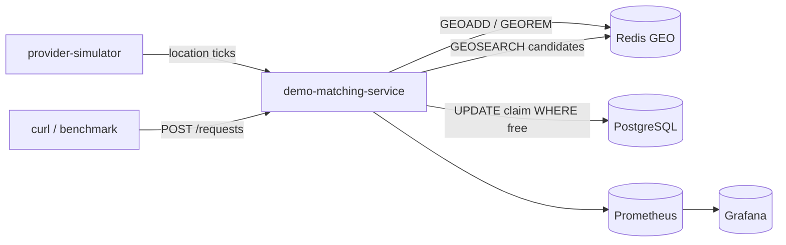
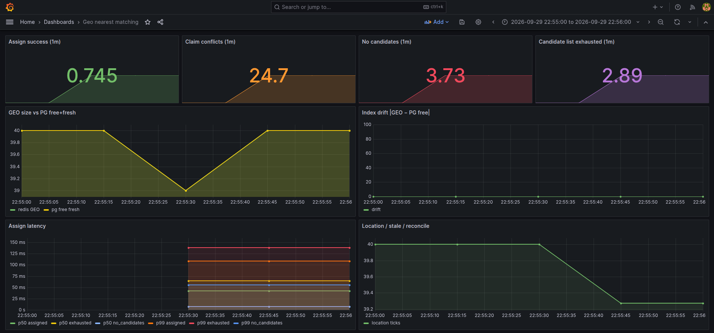

# geo-nearest-matching

## Проблема

«Найти ближайшего свободного исполнителя» выглядит как один Redis GEO-запрос. На практике это два разных вопроса:

- **где сейчас ищутся свободные** — частые GPS-тики, spatial search;
- **кто получил заказ** — нельзя отдать одного provider двум request.

`GEOSEARCH` не атомен с назначением. Если статусы живут в Redis Hash, а claim — в Lua, Redis становится источником истины для матчинга: рестарт Redis / dual-write со статусами в PG даёт split-brain. Если искать через PostGIS на каждый request — hot path упирается в БД.

## Решение

**Redis — только производный GEO-индекс.** В ключе только `free + fresh`. Никаких Hash со статусами.

**PostgreSQL — источник истины.** Статус, `last_seen_at`, request, atomic claim:

```sql
UPDATE providers
SET status = 'busy', current_request_id = :rid
WHERE id = :id AND status = 'free' AND last_seen_at > :cutoff
RETURNING id
```

Два request на одного provider: второй UPDATE получает 0 rows и берёт следующего кандидата. Double-assign невозможен.



Расхождение индекса чинит reconcile. Stale heartbeat → `offline` + `GEOREM`.

## Модули

Один сервис: Redis GEO-индекс, PG claim, REST, симулятор, benchmark и метрики.

## Инварианты

- В Redis только **free + fresh**. Busy/offline сразу `GEOREM` (best-effort).
- Location: сначала PG, потом GEO. Heartbeat с `offline` **оживляет** в `free`.
- Assign: insert `pending` → TX (`tryClaim` + `assigned`) → `GEOREM`.
- `NO_PROVIDERS` терминален для этого request id. Пустой GEO ≠ кончился список кандидатов (`COUNT N` проиграли гонку).
- Dual-write не в XA: если `GEOREM` не успел, следующий assign получит conflict, reconcile вычистит drift.

## API (`:8103`)

```bash
# координаты (upsert; offline → free)
curl -s -X PUT localhost:8103/providers/p-1/location \
  -H 'Content-Type: application/json' \
  -d '{"lng":27.5615,"lat":53.9023}'

# nearest assign
curl -s -X POST localhost:8103/requests \
  -H 'Content-Type: application/json' \
  -d '{"lng":27.5615,"lat":53.9023,"radiusM":3000}'

curl -s localhost:8103/requests/<id>
curl -s -X POST localhost:8103/requests/<id>/complete

# drift: |ZCARD − COUNT free+fresh|
curl -s localhost:8103/admin/stats

# параллельные assign в одну точку
curl -s -X POST localhost:8103/benchmark/load \
  -H 'Content-Type: application/json' \
  -d '{"requests":80,"concurrency":40,"lng":27.56,"lat":53.90,"radiusM":4000}'
```

Второй инстанс `:8104` без симулятора — тот же PG claim, гонка между процессами.

## Стек

- Kotlin / Java 21 / Spring Boot 3 (WebFlux, R2DBC)
- Redis GEO (`GEOSEARCH`) / PostgreSQL
- Micrometer / Prometheus / Grafana / Docker Compose

## Запуск

```bash
./gradlew :geo-nearest-matching:test
./gradlew :geo-nearest-matching:bootJar

cd geo-nearest-matching
docker compose up -d --build
```

- API: http://localhost:8103 (реплика :8104)
- Grafana: http://localhost:3004 (admin/admin) — **Geo nearest matching**
- Prometheus: http://localhost:9096
- Redis: localhost:6382
- PostgreSQL: localhost:5436 (`geo` / `geo` / `geo_matching`)

Симулятор гоняет ~40 provider по bbox вокруг Минска, auto-complete возвращает их в индекс через ~4s.

## Что смотреть в Grafana

1. **Conflicts** под `POST /benchmark/load` — TOCTOU: GEO сказал «ближайший», PG claim уже нет.
2. **Drift** после kill Redis / паузы — индекс расходится, reconcile сходится.
3. **Candidate list exhausted ≠ no candidates** — список из `COUNT` кончился, свободные дальше по радиусу могли остаться.



## Почему не Lua на Redis Hash

Быстрее на hot path, но тогда Redis — SoT для назначения. Рестарт Redis теряет busy; PG и GEO расходятся без единого claim. Здесь потеря индекса = лишние conflict/miss, не double-assign.
