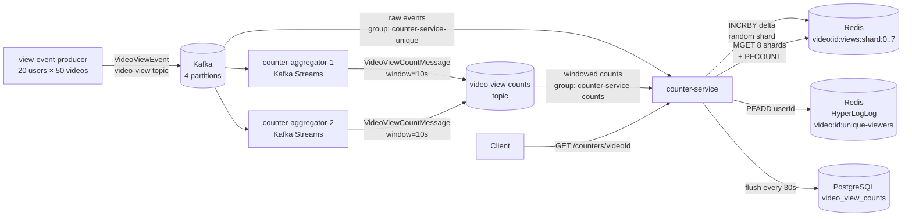

# high-load-counter

## 📌 Проблема

Современные видеоплатформы (YouTube, TikTok, Instagram) обрабатывают **миллиарды просмотров и лайков в сутки**.
Классические подходы не справляются с такой нагрузкой:

- **Прямая запись в БД** — `UPDATE videos SET views = views + 1` при 100k+ просмотров/сек создаёт мёртвый lock на строке и кладёт базу
- **Единый Redis-ключ** — `INCR video:123:views` — это **hot key**: один ключ на одном слоте, throughput ограничен пропускной способностью одного узла
- **Батчевая агрегация** без буфера — при пиковой нагрузке (вирусное видео) накапливается backpressure, события теряются
- **Уникальные зрители** — хранить set userId'ов для каждого видео при миллионах пользователей требует терабайты памяти

---

## 🎯 Решение



---

## 🔧 Архитектура

### ⚙️ Уровень 1: Буферизация через Kafka

`view-event-producer` публикует события `VideoViewEvent` в топик `video-view` (4 партиции).
Kafka поглощает пиковые нагрузки: даже если `counter-service` лагает, события не теряются.

### ⚙️ Уровень 2: Windowed Aggregation (Kafka Streams)

`counter-aggregator` агрегирует события в **10-секундных tumbling windows** с grace period 2 сек.
Благодаря `Suppressed.untilWindowCloses()` в Redis отправляется **один финальный счётчик** на окно — без
накопительных промежуточных значений, которые привели бы к overcounting.

Два инстанса (`counter-aggregator-1`, `counter-aggregator-2`) делят партиции между собой,
масштабируя обработку горизонтально.

### ⚙️ Уровень 3: Sharded Counter (Redis)

Проблема hot key решается шардированием:

```
INCRBY video:123:views:shard:{random(0..7)} {delta}
```

При N инстансах `counter-service` каждый пишет в **случайный** шард.
Запись масштабируется линейно с числом инстансов × шардов.

Чтение суммирует все 8 шардов через `MGET`:

```
views = MGET video:123:views:shard:0 ... shard:7  →  SUM
```

### ⚙️ Уровень 4: HyperLogLog для уникальных зрителей

`counter-service` параллельно слушает сырые события `video-view` и добавляет userId в HyperLogLog:

```
PFADD video:123:unique-viewers {userId}   →  O(1), 12 KB на любое число пользователей
PFCOUNT video:123:unique-viewers           →  ~0.81% погрешность
```

Классический SET с userId'ами потребовал бы сотни МБ на видео с миллионами зрителей.

### ⚙️ Flush Scheduler (Durability)

Каждые 30 секунд `FlushScheduler` снимает текущее состояние Redis и сохраняет в PostgreSQL:

```sql
INSERT INTO video_view_counts ... ON CONFLICT DO UPDATE SET total_views = ...
```

**Trade-off:** при падении Redis между flush-итерациями теряется до 30 сек данных.
PostgreSQL всегда хранит последний известный срез, не дельту.

---

## 🛠️ Стек технологий

- **Spring WebFlux** — неблокирующий HTTP-сервер
- **Spring Data Redis Reactive** — реактивный клиент Redis (sharded counter + HyperLogLog)
- **Spring Kafka + Kafka Streams** — буфер событий + windowed aggregation
- **Spring Data R2DBC** — реактивный PostgreSQL-клиент для flush
- **Spring Scheduling** — периодический flush в PostgreSQL
- **Kafka** — 4 партиции топика `video-view`, 2 партиции `video-view-counts`
- **Redis 7.2** — sharded counter (8 шардов) + HyperLogLog
- **PostgreSQL 15** — долговременное хранилище

---

## 🛡️ Масштабируемость

| Компонент | Горизонтальное масштабирование |
|---|---|
| `view-event-producer` | Независимые инстансы, разные userId-диапазоны |
| `counter-aggregator` | До 4 инстансов (по числу партиций `video-view`) |
| `counter-service` | Неограничено — каждый пишет в случайный Redis-шард |
| Redis | Cluster mode: шарды распределяются по нодам |
| PostgreSQL | Только append/upsert при flush, не hot path |

---

## 🎬 Демо

**1. Запустить инфраструктуру**

```bash
./gradlew :high-load-counter:view-event-producer:bootJar
./gradlew :high-load-counter:counter-aggregator:bootJar
./gradlew :high-load-counter:counter-service:bootJar
docker-compose -f high-load-counter/docker-compose.yml up --build
```

**2. Запросить счётчик видео (через ~15 сек после старта)**

```bash
curl http://localhost:8080/counters/1
```

Ответ:

```json
{
  "videoId": 1,
  "totalViews": 4320,
  "uniqueViewers": 14
}
```

**3. Записать просмотр вручную**

```bash
curl -X POST "http://localhost:8080/counters/100/view?userId=42"
curl -X POST "http://localhost:8080/counters/100/view?userId=42"
curl -X POST "http://localhost:8080/counters/100/view?userId=99"
curl http://localhost:8080/counters/100
```

Ответ:

```json
{
  "videoId": 100,
  "totalViews": 3,
  "uniqueViewers": 2
}
```

**4. Посмотреть Redis-шарды напрямую**

```bash
docker exec -it redis redis-cli
> MGET video:1:views:shard:0 video:1:views:shard:1 video:1:views:shard:2 video:1:views:shard:3 \
       video:1:views:shard:4 video:1:views:shard:5 video:1:views:shard:6 video:1:views:shard:7
> PFCOUNT video:1:unique-viewers
```

**5. Посмотреть события в Kafka UI**

```
http://localhost:8088
```

---

## 📦 Структура проекта

```
high-load-counter/
├── view-event-producer/        # Java: симулятор просмотров → Kafka
│   ├── emulator/               # CommandLineRunner, Zipf-распределение трафика
│   ├── model/VideoViewEvent    # userId, videoId, timestamp
│   └── producer/               # KafkaTemplate<Long, String>
├── counter-aggregator/         # Kotlin: Kafka Streams, tumbling window 10s
│   └── stream/CounterAggregatorTopology
├── counter-service/            # Kotlin: WebFlux + Redis + R2DBC + Kafka
│   ├── controller/             # GET /counters/{videoId}, POST /counters/{videoId}/view
│   ├── service/                # CounterService, DefaultCounterService
│   ├── redis/                  # ShardedCounterService (8 шардов + HyperLogLog)
│   ├── consumer/               # VideoViewCountConsumer, VideoViewConsumer
│   ├── scheduler/              # FlushScheduler → PostgreSQL
│   ├── tracker/                # VideoIdTracker (ConcurrentHashMap)
│   └── repository/             # VideoCounterRepository (DatabaseClient, UPSERT)
├── postgres/init.sql
└── docker-compose.yml
```
