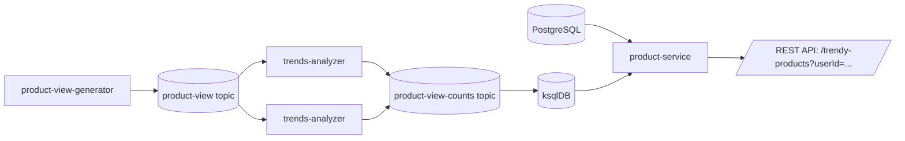

# realtime-trends

## 📌 Проблема

Современные e‑commerce и контент‑платформы сталкиваются с проблемой предоставления **персонализированных рекомендаций** 
пользователям в условиях постоянно меняющихся трендов.

Основные ограничения классического подхода:
- **Батчевая обработка**  
  Рекомендации формируются оффлайн (например, раз в сутки). Пользователь видит устаревшие данные, тренды теряют актуальность.
- **Отсутствие персонализации в реальном времени**  
  Система не учитывает индивидуальные предпочтения клиента при формировании списка популярных товаров.
- **Высокая задержка**  
  Между событием (просмотр продукта) и появлением его в рекомендациях может пройти часы.
- **Сложность масштабирования**  
  При росте числа пользователей и событий батчевые пайплайны становятся узким местом.
---

## 🎯 Решение

**Реактивная рекомендательная система**, которая объединяет:
- **Kafka** для сбора событий просмотров продуктов,
- **Kafka Streams** для агрегации и подсчёта трендов в реальном времени,
- **ksqlDB** потоковая база данных, для SQL‑доступа к агрегированным данным,
- **PostgreSQL** для хранения пользовательских предпочтений,
- **Spring WebFlux + R2DBC** для реактивного REST‑сервиса, который объединяет тренды и персональные категории.

Таким образом:
- рекомендации формируются **онлайн**, без задержек,
- учитываются **индивидуальные интересы** каждого клиента,
- система легко масштабируется за счёт горизонтального масштабирования Kafka Streams и ksqlDB.


---
# Компоненты

### ⚙️ product-view-generator
Генератор событий просмотров продуктов.
- Симулирует активность пользователей для тестирования системы.
- Публикует JSON‑события в топик `product-view`.

### ⚙️ trends-analyzer
Kafka Streams приложение, которое:
- агрегирует просмотры по продуктам,
- считает количество за окно времени,
- фильтрует по порогу популярности,
- публикует результат в топик `product-view-counts`.

### ⚙️ ksqlDB
Сервер для выполнения SQL‑запросов к потокам и таблицам.
- REST‑интерфейс для получения трендов через pull‑query.

### ⚙️ product-service
Spring Boot WebFlux сервис:
- достаёт категории пользователя из Postgres,
- делает SQL‑запрос в ksqlDB по этим категориям,
- возвращает список трендовых продуктов с учетом персонализации пользователя.

### 🛠️ Стек технологий
- **Java 21 / Kotlin**
- **Spring Boot 3 (WebFlux, R2DBC)**
- **Apache Kafka/Kafka Streams**
- **ksqlDB**
- **Postgres 15**
---

## 🛡️ Scalability

- **Горизонтальное масштабирование**  
  Несколько инстансов `trends-analyzer` могут работать параллельно. Kafka автоматически распределяет партиции между ними, обеспечивая баланс нагрузки.
- **ksqlDB масштабируется**  
  Возможность запуска нескольких серверов ksqlDB для обработки большого числа запросов и распределения нагрузки.

---
## 🛡️ Отказоустойчивость (Fault Tolerance)

- **Kafka Streams**  
  Автоматически восстанавливает состояние при сбоях, используя changelog‑топики. При падении узла его задачи перераспределяются на другие инстансы.
- **ksqlDB**  
  Поддерживает репликацию и перезапуск запросов. При сбое одного узла запросы могут быть выполнены на другом.
- **Compact‑топики**  
  Используются для хранения последних актуальных значений, что позволяет быстро восстановить состояние после перезапуска.

---


## 🎬 Демо

### 1. Запуск окружения
```bash
cd realtime-trends  
.././gradlew clean build
docker-compose up -d
```
### 2. Запрос трендов для пользователя
REST‑сервис предоставляет персонализированные рекомендации:
```bash
curl "http://localhost:8080/trendy-products?userId=1"
```
Пример ответа:
```bash
[
    {
        "productId": 14,
        "categoryId": 1
    },
    {
        "productId": 16,
        "categoryId": 2
    },
    {
        "productId": 17,
        "categoryId": 2
    }
]
```
