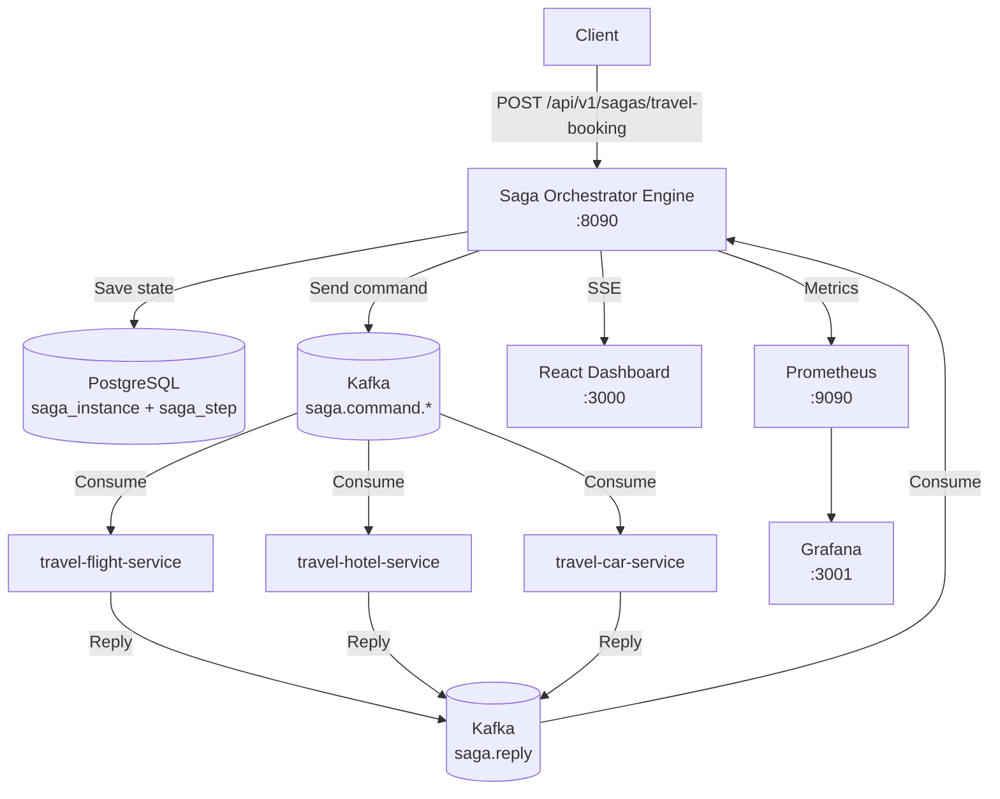
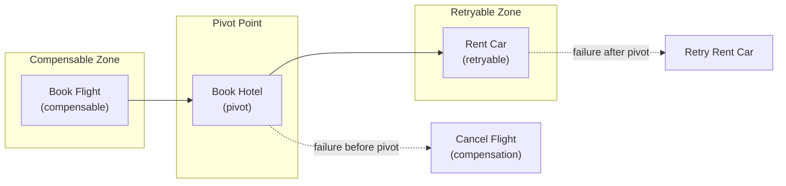

# saga-orchestrator

## 📌 Проблема

В микросервисной архитектуре бизнес-операции часто охватывают несколько сервисов. Каждый сервис владеет своей базой данных, и нет единой ACID-транзакции, которая гарантирует согласованность:

- **Распределённые транзакции (2PC)**  
  Two-Phase Commit блокирует ресурсы, создаёт single point of failure (координатор) и не масштабируется в cloud-native среде.

- **Частичное выполнение**  
  Если один из сервисов упал посреди цепочки операций, система остаётся в несогласованном состоянии. Нет встроенного механизма отката.

- **Отсутствие видимости**  
  Без централизованного контроля сложно отследить, на каком этапе находится бизнес-процесс, какие шаги завершились, а какие требуют компенсации.

- **Сложность компенсационной логики**  
  Каждый сервис должен знать, как откатить свои действия, и порядок отката зависит от контекста.

**Типичный сценарий — бронирование путешествия:**
- Бронирование авиабилета → оплата отеля → аренда автомобиля
- Если аренда автомобиля не удалась после успешного бронирования рейса — нужно отменить рейс
- Если отель уже подтверждён (pivot) — отмена невозможна, аренду нужно повторить

---

## 🎯 Решение

**Orchestrated Saga Pattern** с моделью **SEC (Compensable → Pivot → Retryable)** из книги *"Microservices Patterns"* (Chris Richardson).

Централизованный оркестратор управляет жизненным циклом саги:
- Определяет шаги через **Kotlin DSL**
- Координирует выполнение через **Kafka** (command/reply)
- Хранит состояние каждого шага в **PostgreSQL**
- Применяет **SEC модель** для обработки ошибок:
  - **Compensable** — шаги до pivot, при ошибке выполняется компенсация в обратном порядке
  - **Pivot** — точка невозврата, после неё только forward
  - **Retryable** — шаги после pivot, при ошибке повторяются с backoff



### SEC модель (Compensable → Pivot → Retryable)



**Преимущества подхода:**
- ✅ **Полный контроль** — оркестратор знает состояние каждого шага в реальном времени
- ✅ **SEC модель** — корректная обработка ошибок: компенсация, pivot, retry
- ✅ **Kotlin DSL** — декларативное определение саг как Spring beans
- ✅ **Persistence** — все состояния хранятся в PostgreSQL, восстановление после сбоев
- ✅ **Observability** — React Dashboard + Grafana + Prometheus метрики
- ✅ **Spring Boot Starter** — plug-and-play интеграция для сервисов-участников

---

## 🏗️ Компоненты

### ⚙️ saga-model

Общие Kafka-модели для обмена командами и ответами между оркестратором и участниками.

- `SagaCommand` — команда от оркестратора к участнику (sagaId, stepName, payload, isCompensation)
- `SagaReply` — ответ от участника (sagaId, stepName, status, payload, errorMessage)
- `SagaStatus`, `StepStatus`, `StepType` — enum'ы состояний

---

### ⚙️ saga-orchestrator-engine

Центральный сервис оркестрации саг.

#### 🛠️ Стек технологий
- **Kotlin** / Java 21
- **Spring Boot 3** (WebFlux, R2DBC)
- **Spring Kafka**
- **PostgreSQL**
- **Micrometer** + Prometheus Registry
- **SSE** (Server-Sent Events) для real-time обновлений

#### 🔧 Kotlin DSL для определения саг

```kotlin
@Configuration
class TravelBookingSagaDefinition {

  @Bean
  fun travelBookingSaga() = saga<TravelBookingData>("travel-booking") {

    step("book-flight") {
      type = COMPENSABLE
      participant = "flight-service"
      command { data -> BookFlightCommand(data.flightId, data.passengerId) }
      onReply { data, reply -> data.copy(flightBookingId = reply.get("bookingId")?.asText()) }
      compensation { data -> CancelFlightCommand(data.flightBookingId!!) }
      timeout = Duration.ofSeconds(30)
    }

    step("book-hotel") {
      type = PIVOT
      participant = "hotel-service"
      command { data -> BookHotelCommand(data.hotelId, data.passengerId) }
      onReply { data, reply -> data.copy(hotelBookingId = reply.get("bookingId")?.asText()) }
      timeout = Duration.ofSeconds(30)
    }

    step("rent-car") {
      type = RETRYABLE
      participant = "car-service"
      command { data -> RentCarCommand(data.carId, data.passengerId) }
      onReply { data, reply -> data.copy(carRentalId = reply.get("rentalId")?.asText()) }
      maxRetries = 3
      retryBackoff = Duration.ofSeconds(5)
      timeout = Duration.ofSeconds(30)
    }
  }
}
```

#### 🔧 REST API

```
POST   /api/v1/sagas/{sagaType}      — запуск новой саги
GET    /api/v1/sagas                  — список саг (фильтры: status, sagaType)
GET    /api/v1/sagas/{sagaId}         — детали саги + шаги
GET    /api/v1/sagas/{sagaId}/steps   — история шагов
GET    /api/v1/sagas/stats            — агрегированная статистика
GET    /api/v1/sagas/stream           — SSE для real-time обновлений
```

#### 🔧 Метрики (Micrometer → Prometheus)

| Метрика | Тип | Теги |
|---------|-----|------|
| `saga.started.total` | Counter | saga_type |
| `saga.completed.total` | Counter | saga_type, outcome |
| `saga.active.count` | Gauge | saga_type |
| `saga.compensating.count` | Gauge | saga_type |
| `saga.step.duration.seconds` | Timer | saga_type, step_name, step_type |
| `saga.step.retries.total` | Counter | saga_type, step_name |
| `saga.step.failures.total` | Counter | saga_type, step_name |

---

### ⚙️ saga-participant-starter

Spring Boot Starter для интеграции сервисов-участников.

#### Подключение

```kotlin
dependencies {
  implementation(project(":saga-orchestrator:saga-participant-starter"))
}
```

#### Реализация обработчика

```kotlin
@Component
class FlightBookingHandler : SagaCommandHandler {
  override val commandType = "flight-service"

  override fun handle(command: SagaCommand): Mono<SagaReply> {
    // бизнес-логика бронирования
  }

  override fun compensate(command: SagaCommand): Mono<SagaReply> {
    // логика отмены бронирования
  }
}
```

#### Настройка (application.yml)

```yaml
saga:
  participant:
    enabled: true
    command-topic: saga.command.flight-service
    reply-topic: saga.reply
```

---

### ⚙️ Демо-сервисы участников

| Сервис | Тип шага | Поведение |
|--------|----------|-----------|
| `travel-flight-service` | COMPENSABLE | Бронирование рейса, ~10% failure rate, поддержка компенсации |
| `travel-hotel-service` | PIVOT | Бронирование отеля, точка невозврата |
| `travel-car-service` | RETRYABLE | Аренда авто, ~20% failure rate для демонстрации ретраев |

---

### ⚙️ saga-dashboard-ui

React SPA для мониторинга саг в реальном времени.

**Стек:** React 18, TypeScript, Vite, Tailwind CSS, Lucide Icons

**Функции:**
- Таблица саг с фильтрацией по статусу
- Детальная страница с timeline шагов
- Статистика: total, active, completed, compensated, failed
- Real-time обновления через SSE
- Индикатор подключения

---

### ⚙️ Мониторинг (Grafana + Prometheus)

Готовый Grafana dashboard с 8 панелями:
- **Saga Overview** — stat панели: started, active, completed, compensated
- **Saga Rate** — график саг в минуту (started/completed/compensated/failed)
- **Step Duration (p95)** — латентность по шагам
- **Step Retries** — частота ретраев по шагам
- **Step Failures** — частота ошибок по шагам

---

## 🛡️ Гарантии и Fault Tolerance

### SEC модель
- **Compensable** шаги (до pivot) — при ошибке компенсируются в обратном порядке
- **Pivot** шаг — точка невозврата, после неё saga только forward
- **Retryable** шаги (после pivot) — при ошибке повторяются с exponential backoff

### Persistence
- Все состояния саг и шагов хранятся в PostgreSQL
- При перезапуске оркестратора состояние восстанавливается из БД
- Timeout Scheduler обнаруживает зависшие шаги

### Kafka
- Command/Reply паттерн через выделенные топики
- Гарантия доставки через Kafka consumer offsets
- Партицирование по sagaId для упорядоченной обработки

---

## 🎬 Демо

### 1. Сборка и запуск

```bash
cd saga-orchestrator
.././gradlew clean build
docker-compose up -d
```

**Компоненты:**
- Saga Orchestrator Engine: `http://localhost:8090`
- React Dashboard: `http://localhost:3000`
- Kafka UI: `http://localhost:8088`
- Grafana: `http://localhost:3001` (admin/admin)
- Prometheus: `http://localhost:9090`

### 2. Запуск саги (успешный сценарий)

```bash
curl -X POST http://localhost:8090/api/v1/sagas/travel-booking \
  -H "Content-Type: application/json" \
  -d '{
    "passengerId": 1,
    "flightId": "FL-100",
    "hotelId": "HT-200",
    "carId": "CAR-300"
  }'
```

**Что происходит:**
1. Оркестратор создаёт saga_instance и 3 saga_step записи в PostgreSQL
2. Отправляет команду `BookFlightCommand` в `saga.command.flight-service`
3. Flight service обрабатывает и отвечает в `saga.reply`
4. Оркестратор обновляет шаг, отправляет `BookHotelCommand` (pivot)
5. После успеха pivot — отправляет `RentCarCommand` (retryable)
6. При ошибке rent-car — автоматический retry до 3 раз
7. Dashboard обновляется в реальном времени через SSE

### 3. Просмотр саг

```bash
# Список саг
curl http://localhost:8090/api/v1/sagas

# Детали конкретной саги
curl http://localhost:8090/api/v1/sagas/{sagaId}

# Статистика
curl http://localhost:8090/api/v1/sagas/stats
```

### 4. Просмотр состояния в БД

```bash
docker exec -it postgres psql -U postgres -d master -c \
  "SELECT saga_id, saga_type, status, current_step FROM saga_instance ORDER BY created_at DESC LIMIT 5;"

docker exec -it postgres psql -U postgres -d master -c \
  "SELECT si.saga_id, ss.step_name, ss.step_type, ss.status, ss.retry_count 
   FROM saga_step ss 
   JOIN saga_instance si ON ss.saga_instance_id = si.id 
   ORDER BY si.created_at DESC, ss.step_order;"
```

### 5. Просмотр Kafka

```bash
docker exec -it kafka kafka-topics --list --bootstrap-server localhost:9092

docker exec -it kafka kafka-console-consumer \
  --bootstrap-server localhost:9092 \
  --topic saga.reply \
  --from-beginning
```

---

## 📦 Структура проекта

```
saga-orchestrator/
├── saga-model/                               # Общие Kafka-модели
│   └── src/main/kotlin/
│       └── com/andver/saga/model/
│           ├── SagaCommand.kt
│           ├── SagaReply.kt
│           ├── SagaStatus.kt
│           ├── StepStatus.kt
│           └── StepType.kt
├── saga-orchestrator-engine/                 # Центральный оркестратор
│   ├── src/main/kotlin/
│   │   └── com/andver/saga/orchestrator/
│   │       ├── SagaOrchestratorApp.kt
│   │       ├── dsl/                          # Kotlin DSL
│   │       │   ├── SagaDsl.kt
│   │       │   └── SagaRegistry.kt
│   │       ├── definition/travel/            # Travel Booking saga
│   │       │   ├── TravelBookingSagaDefinition.kt
│   │       │   ├── TravelBookingData.kt
│   │       │   └── TravelCommands.kt
│   │       ├── engine/                       # Core orchestration
│   │       │   ├── SagaOrchestrator.kt
│   │       │   └── SagaStateMachine.kt
│   │       ├── kafka/                        # Kafka integration
│   │       │   ├── KafkaConfig.kt
│   │       │   ├── SagaCommandProducer.kt
│   │       │   └── SagaReplyConsumer.kt
│   │       ├── entity/
│   │       │   ├── SagaInstanceEntity.kt
│   │       │   └── SagaStepEntity.kt
│   │       ├── repository/
│   │       │   ├── SagaInstanceRepository.kt
│   │       │   └── SagaStepRepository.kt
│   │       ├── controller/                   # REST API + SSE
│   │       │   ├── SagaTriggerController.kt
│   │       │   ├── SagaDashboardController.kt
│   │       │   └── SagaSseController.kt
│   │       ├── sse/
│   │       │   └── SagaEventPublisher.kt
│   │       ├── metrics/
│   │       │   └── SagaMetrics.kt
│   │       └── scheduler/
│   │           └── SagaTimeoutScheduler.kt
│   ├── src/main/resources/
│   │   └── application.yml
│   ├── build.gradle.kts
│   └── Dockerfile
├── saga-participant-starter/                 # Spring Boot Starter для участников
│   ├── src/main/kotlin/
│   │   └── com/andver/saga/participant/
│   │       ├── SagaParticipantAutoConfiguration.kt
│   │       ├── handler/
│   │       │   └── SagaCommandHandler.kt
│   │       ├── consumer/
│   │       │   └── SagaCommandConsumer.kt
│   │       └── producer/
│   │           └── SagaReplyProducer.kt
│   ├── src/main/resources/
│   │   └── META-INF/spring/
│   │       └── org.springframework.boot.autoconfigure.AutoConfiguration.imports
│   └── build.gradle.kts
├── travel-flight-service/                    # Демо: COMPENSABLE шаг
│   ├── src/main/kotlin/.../
│   │   ├── FlightServiceApp.kt
│   │   └── FlightBookingHandler.kt
│   ├── build.gradle.kts
│   └── Dockerfile
├── travel-hotel-service/                     # Демо: PIVOT шаг
│   ├── src/main/kotlin/.../
│   │   ├── HotelServiceApp.kt
│   │   └── HotelBookingHandler.kt
│   ├── build.gradle.kts
│   └── Dockerfile
├── travel-car-service/                       # Демо: RETRYABLE шаг
│   ├── src/main/kotlin/.../
│   │   ├── CarServiceApp.kt
│   │   └── CarRentalHandler.kt
│   ├── build.gradle.kts
│   └── Dockerfile
├── saga-dashboard-ui/                        # React Dashboard
│   ├── src/
│   │   ├── components/
│   │   │   ├── StatusBadge.tsx
│   │   │   ├── StatsOverview.tsx
│   │   │   ├── SagaList.tsx
│   │   │   ├── SagaFilters.tsx
│   │   │   ├── StepTimeline.tsx
│   │   │   └── ConnectionIndicator.tsx
│   │   ├── pages/
│   │   │   ├── SagaListPage.tsx
│   │   │   └── SagaDetailPage.tsx
│   │   ├── hooks/
│   │   │   ├── useApi.ts
│   │   │   └── useSagaSSE.ts
│   │   └── types/
│   │       └── saga.ts
│   ├── package.json
│   ├── Dockerfile
│   └── nginx.conf
├── grafana/
│   ├── dashboards/
│   │   └── saga-dashboard.json
│   └── provisioning/
│       ├── dashboards/dashboard.yml
│       └── datasources/prometheus.yml
├── prometheus/
│   └── prometheus.yml
├── postgres/
│   └── init.sql
├── docker-compose.yml
└── README.md
```

---

## 🔍 Технические детали

### Схема таблицы saga_instance

```sql
CREATE TABLE saga_instance (
    id           BIGSERIAL PRIMARY KEY,
    saga_id      UUID         NOT NULL UNIQUE,
    saga_type    VARCHAR(100) NOT NULL,
    status       VARCHAR(30)  NOT NULL DEFAULT 'STARTED',
    current_step VARCHAR(100),
    payload      JSONB        NOT NULL,
    created_at   TIMESTAMP(3) NOT NULL DEFAULT NOW(),
    updated_at   TIMESTAMP(3) NOT NULL DEFAULT NOW(),
    completed_at TIMESTAMP(3)
);
```

### Схема таблицы saga_step

```sql
CREATE TABLE saga_step (
    id               BIGSERIAL PRIMARY KEY,
    saga_instance_id BIGINT       NOT NULL REFERENCES saga_instance(id),
    step_name        VARCHAR(100) NOT NULL,
    step_type        VARCHAR(30)  NOT NULL,
    step_order       INT          NOT NULL,
    status           VARCHAR(30)  NOT NULL DEFAULT 'PENDING',
    command_payload  JSONB,
    reply_payload    JSONB,
    error_message    TEXT,
    retry_count      INT          NOT NULL DEFAULT 0,
    started_at       TIMESTAMP(3),
    completed_at     TIMESTAMP(3),
    UNIQUE(saga_instance_id, step_name)
);
```

### Kafka Topics

| Topic | Назначение |
|-------|-----------|
| `saga.command.flight-service` | Команды к flight service |
| `saga.command.hotel-service` | Команды к hotel service |
| `saga.command.car-service` | Команды к car service |
| `saga.reply` | Ответы всех участников к оркестратору |

### Жизненный цикл саги

1. **STARTED** → оркестратор создал saga_instance, шаги в PENDING
2. **EXECUTING** → выполняется текущий шаг
3. **COMPENSATING** → произошла ошибка, выполняется компенсация
4. **COMPLETED** → все шаги успешно завершены
5. **COMPENSATED** → все компенсации выполнены
6. **FAILED** → retryable шаг исчерпал попытки

---
