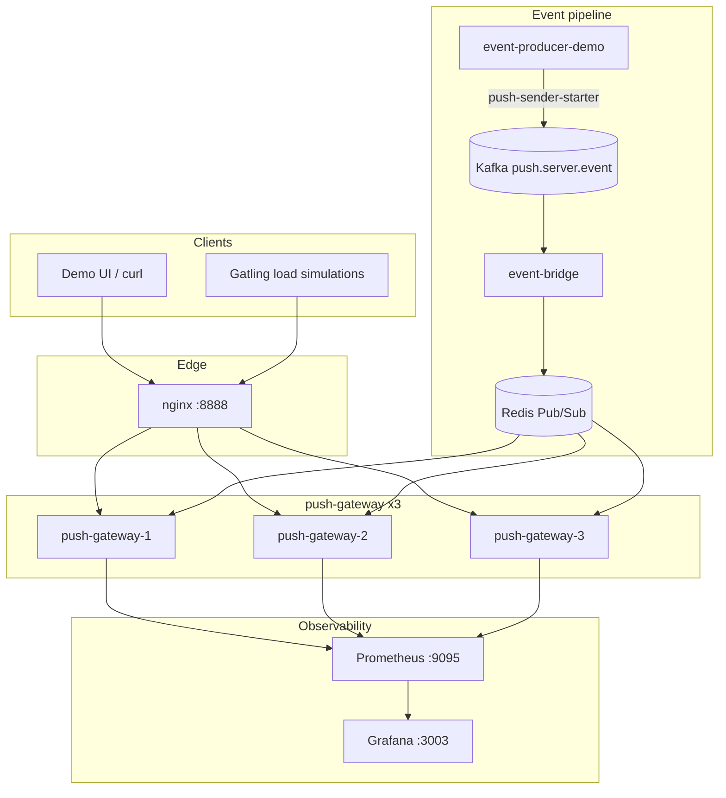
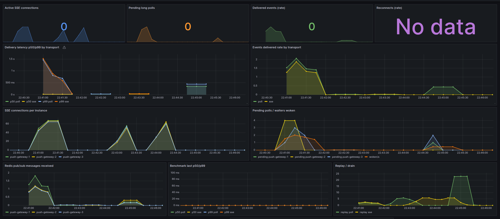

# server-push-gateways

## 📌 Проблема

В микросервисной архитектуре серверу часто нужно **доставлять события клиенту** (статус заказа, прогресс задачи, уведомление), не заставляя UI долбить API коротким polling'ом.

Классические ограничения:

- **HTTP short polling** — лишний overhead запросов, задержка доставки до интервала опроса, лишняя нагрузка на nginx и JVM.
- **WebSocket** уже есть в [`websocket-gateway`](../websocket-gateway/README.md), но это **двусторонний** канал с upgrade-протоколом и JWT. Для одностороннего server→client push он избыточен.
- **SSE vs long polling** — разные trade-offs по nginx-конфигу, reconnect semantics и стоимости соединений. Без явного сравнения легко выбрать transport «наугад».
- **Scale-out** — локальный реестр ожидающих клиентов живёт в памяти инстанса. Без fan-out (Redis Pub/Sub) событие, попавшее на другой pod, клиенту не дойдёт. Sticky sessions — костыль, а не решение.

Auth намеренно **вне scope**: идентификация через `clientId` в query. Фокус проекта — transport, nginx и горизонтальное масштабирование.

---

## 🎯 Решение

**server-push-gateways** — один проект с двумя transport-слоями за общим nginx:

- **SSE** (`GET /sse/stream`) — одно долгоживущее HTTP-соединение, `Last-Event-ID`, heartbeat
- **Long polling** (`GET /poll/updates`) — hold до 30s или до события, курсор `since`

Общий pipeline доставки:

`event-producer-demo` → Kafka `push.server.event` → `event-bridge` → Redis Pub/Sub `PUSH_CHANNEL:{clientId}` → `push-gateway` ×3

Масштабирование **без sticky sessions**: каждый gateway подписан на каналы своих клиентов; событие приходит на все инстансы через Redis, доставляет только тот, у кого есть локальный waiter / SSE session.



---

## 🧩 Transport comparison

| | SSE | Long polling |
|---|---|---|
| Направление | server → client | server → client (через request/response) |
| Соединение | одно долгое | серия коротких hold-запросов |
| Reconnect | `Last-Event-ID` + replay buffer | `since` cursor + replay buffer |
| Nginx | `proxy_buffering off`, `proxy_read_timeout 3600s` | `proxy_read_timeout 35s` (> server 30s) |
| Browser API | `EventSource` | `fetch` в цикле |
| Overhead | низкий | выше (заголовки на каждый цикл) |

Контрапункт к WebSocket: см. [`websocket-gateway`](../websocket-gateway/README.md) — двусторонний канал + JWT + `Upgrade`.

---

## 🏗️ Компоненты

### ⚙️ push-gateway

Реактивный шлюз (WebFlux) с SSE, long poll, static demo UI, in-process benchmark и graceful drain.

#### 🛠️ Стек
- Kotlin / Java 21
- Spring Boot 3 (WebFlux)
- Spring Data Redis Reactive
- Micrometer + Prometheus

#### 🔧 Основные компоненты

1. **SseController** — `text/event-stream`, replay по `Last-Event-ID`, heartbeat `:keepalive`
2. **LongPollController** — немедленный ответ из replay или hold до timeout
3. **SseConnectionManager** / **PendingPollRegistry** — локальные waiters
4. **EventFanoutService** — Redis subscribe → deliver SSE / wake poll
5. **EventReplayService** — Redis LIST `PUSH_REPLAY:{clientId}` (max 100)
6. **ConnectionGate** — saturation + draining → 503 + `Retry-After`
7. **GracefulShutdownHandler** — `SmartLifecycle` drain при SIGTERM
8. **BenchmarkService** — `POST /benchmark/run` и `/benchmark/compare`

#### API

```
GET  /sse/stream?clientId=alice
GET  /poll/updates?clientId=alice&since=0
POST /benchmark/run
POST /benchmark/compare
GET  /                         — demo UI
GET  /actuator/prometheus
```

---

### ⚙️ event-bridge

Kafka consumer → assign monotonic `eventId` (`INCR push:event:seq`) → append replay LIST → `PUBLISH PUSH_CHANNEL:{clientId}`.

---

### ⚙️ event-producer-demo

Демо-микросервис на `push-sender-starter`:

```
POST /events
POST /events/burst
```

Порт: **8097**.

---

## 🔄 Reconnect semantics

**SSE.** Браузер шлёт `Last-Event-ID` при reconnect. Gateway читает Redis LIST и догоняет события с `eventId > lastId`, затем подписывается на live-канал.

**Long poll.** Клиент передаёт `since`. Если в replay есть события — сразу 200. Иначе hold до события или 30s (пустой список).

Replay buffer живёт в Redis — reconnect на **другой** инстанс за nginx всё равно догоняет историю (at-least-once в пределах окна 100 событий).

---

## 📦 push-sender-starter

```kotlin
dependencies {
  implementation(project(":server-push-gateways:push-sender-starter"))
}
```

```kotlin
@Autowired
lateinit var pushEventSender: PushEventSender

fun notify(clientId: String) {
  pushEventSender.send(
    PushEvent(clientId = clientId, type = "order.updated", payload = mapOf("orderId" to 1))
  ).subscribe()
}
```

```yaml
push:
  sender:
    enabled: true
spring:
  kafka:
    bootstrap-servers: localhost:9092
```

Автоматически создаёт: `PushEventSender`, `KafkaTemplate<String, PushEvent>`.

---

## ⚙️ Observability

| Метрика | Тип | Tags |
|---|---|---|
| `push_active_sse_connections` | Gauge | — |
| `push_pending_long_poll_requests` | Gauge | — |
| `push_events_delivered_total` | Counter | `transport` |
| `push_events_replayed_total` | Counter | `transport`, `reason` |
| `push_delivery_latency_seconds` | Histogram | `transport` |
| `push_reconnect_total` | Counter | `transport` |
| `push_connections_rejected_total` | Counter | `reason` |
| `push_connections_drained_total` | Counter | — |
| `push_drain_duration_seconds` | Timer | — |
| `push_redis_messages_received_total` | Counter | — |
| `push_local_waiters_woken_total` | Counter | `transport=poll` |
| `push_benchmark_last_p50_ms` | Gauge | `transport` |
| `push_benchmark_last_p99_ms` | Gauge | `transport` |

Dashboard: [`grafana/dashboards/server-push-gateways.json`](./grafana/dashboards/server-push-gateways.json)

---

## 🛡️ Масштабируемость

- 3 инстанса `push-gateway` за nginx upstream (паттерн как в `unique-id-generator`)
- Fan-out через Redis Pub/Sub — **без sticky sessions**
- `push.gateway.max-connections` (default 2000) → 503 при saturation

---

## 🛡️ Graceful shutdown

При `SIGTERM` / `docker compose stop push-gateway-3`:

1. `ConnectionGate.beginDrain()` — новые SSE/poll → **503** + `Retry-After: 1`
2. Open SSE закрываются, pending long poll получают 503
3. Метрики `push_connections_drained_total`, `push_drain_duration_seconds`
4. Клиент переподключается через nginx на живой инстанс и догоняет через replay

```bash
# клиент слушает SSE
curl -N "http://localhost:8888/sse/stream?clientId=alice"

# в другом терминале — убрать два инстанса
docker compose stop push-gateway-3 push-gateway-2
# EventSource / клиент должен переподключиться на push-gateway-1
```

---

## 🎬 Демо

### 1. Сборка и запуск

```bash
cd server-push-gateways
../gradlew :server-push-gateways:push-gateway:bootJar \
  :server-push-gateways:event-bridge:bootJar \
  :server-push-gateways:event-producer-demo:bootJar
docker compose up -d --build
```

| Сервис | URL |
|---|---|
| Demo UI / nginx LB | http://localhost:8888 |
| push-gateway-1 (direct) | http://localhost:8086 |
| event-producer-demo | http://localhost:8097 |
| Kafka UI | http://localhost:8088 |
| Prometheus | http://localhost:9095 |
| Grafana | http://localhost:3003 (admin/admin) |

### 2. SSE

```bash
# терминал 1 — слушать поток
curl -N "http://localhost:8888/sse/stream?clientId=alice"

# терминал 2 — опубликовать событие
curl -X POST http://localhost:8097/events \
  -H "Content-Type: application/json" \
  -d '{"clientId":"alice","type":"order.updated","payload":{"orderId":42}}'
```

В первом терминале появится SSE `data:` с `eventId`, `type`, `publishedAt`.

### 3. Long polling

```bash
curl "http://localhost:8888/poll/updates?clientId=bob&since=0"
# держит до ~30s или до события

curl -X POST http://localhost:8097/events \
  -H "Content-Type: application/json" \
  -d '{"clientId":"bob","type":"task.done","payload":{"taskId":7}}'
```

### 4. Demo UI

Открыть http://localhost:8888 — вкладки SSE / Long poll, кнопка Publish event.

### 5. In-process benchmark

```bash
curl -X POST http://localhost:8888/benchmark/compare \
  -H "Content-Type: application/json" \
  -d '{"clients":100,"eventsPerClient":5}'
```

Лимит in-process: до 500 клиентов. Для 1000 / 5000 — Gatling.

### 6. Gatling (внешняя нагрузка)

Отдельный Gradle-проект в [`scripts/gatling`](./scripts/gatling) (Java DSL, плагин `io.gatling.gradle`, Java 21: `--add-opens` уже в `build.gradle.kts`).

```bash
cd scripts/gatling

# long poll
../../../gradlew gatlingRun \
  --simulation=com.andver.push.gatling.PollLoadSimulation \
  --non-interactive \
  -DUSERS=300 -DDURATION_SECONDS=30

# SSE
../../../gradlew gatlingRun \
  --simulation=com.andver.push.gatling.SseLoadSimulation \
  --non-interactive \
  -DUSERS=300 -DDURATION_SECONDS=30

# reconnect / replay catch-up
../../../gradlew gatlingRun \
  --simulation=com.andver.push.gatling.ReconnectStormSimulation \
  --non-interactive \
  -DUSERS=200

# SSE vs poll side-by-side
../../../gradlew gatlingRun \
  --simulation=com.andver.push.gatling.CompareTransportsSimulation \
  --non-interactive \
  -DUSERS=200
```

Отчёт HTML: `scripts/gatling/build/reports/gatling/`.

---

## Результаты прогона

Прогон на локальном `docker compose` (3× `push-gateway` за nginx `:8888`). Не SLA — ориентир для README / Grafana.

Grafana: http://localhost:3003 (admin/admin) → dashboard **server-push-gateways**.  
Скрин можно положить в [`docs/grafana.png`](./docs/grafana.png).

### In-process (`POST /benchmark/compare`, clients=100)

| Transport | Events received | p50 | p99 | Elapsed |
|-----------|-----------------|-----|-----|---------|
| SSE       | 500             | ~0 ms (local sink) | ~0 ms | ~1.1 s |
| Long poll | 100 (1 event/client) | ~0 ms | ~0 ms | ~0.8 s |

In-process измеряет доставку через локальные sink/registry на одном JVM — не HTTP round-trip. Для реальной latency смотреть Gatling / Grafana histogram.

### Gatling (HTTP → nginx → gateway ×3)

| Simulation | Users | Requests | OK | KO | p50 | p99 | Notes |
|------------|------:|---------:|---:|---:|----:|----:|-------|
| `PollLoadSimulation` | 300 | 600 | 100% | 0 | 7 ms | 22 ms | publish + long-poll |
| `SseLoadSimulation` | 300 | 900 | 100% | 0 | 4 ms | 18 ms | publish + first SSE event |
| `ReconnectStormSimulation` | 200 | 1200 | 99.75% | 0.25% | 79 ms | 486 ms | seed + poll `since=0` (replay); 3 timeout |
| `CompareTransportsSimulation` | 200+200 | 1000 | 98.9% | 1.1% | 6 ms | ~23 s | KO = SSE check timeout (await 8s) при гонке publish/connect |

Вывод: на спокойном ramp **SSE и long poll** оба укладываются в десятки миллисекунд до первого события; long poll чуть дороже по p99 из‑за HTTP cycle. Reconnect через Redis replay стабилен (>99% OK). В compare при одновременном ramp часть SSE не успевает поймать событие за 8s — это артефакт сценария (publish → сразу connect), не потеря fan-out.


---

## 🧪 Тесты

```bash
../gradlew :server-push-gateways:push-gateway:test
# requires redis from docker compose (localhost:6379)
docker compose up -d redis
../gradlew :server-push-gateways:push-gateway:integrationTest
```

- Unit: `SseConnectionManager`, `PendingPollRegistry`, `ConnectionGate`
- Integration: replay buffer + pub/sub wake long poll against Redis on `:6379`

---

## 📦 Структура проекта

```
server-push-gateways/
├── push-event-model/
├── push-sender-starter/
├── event-bridge/
├── push-gateway/
│   └── src/main/resources/static/index.html
├── event-producer-demo/
├── nginx/default.conf
├── prometheus/prometheus.yml
├── grafana/
├── scripts/gatling/            # Gatling Java DSL (SSE / poll / reconnect / compare)
├── docker-compose.yml
└── README.md
```

---

## 🛠️ Стек

- Kotlin / Java 21
- Spring Boot 3 (WebFlux)
- Spring Data Redis (Reactive + imperative bridge)
- Apache Kafka
- Nginx 1.25
- Micrometer / Prometheus / Grafana
- Gatling 3 (external load)
- Docker Compose
