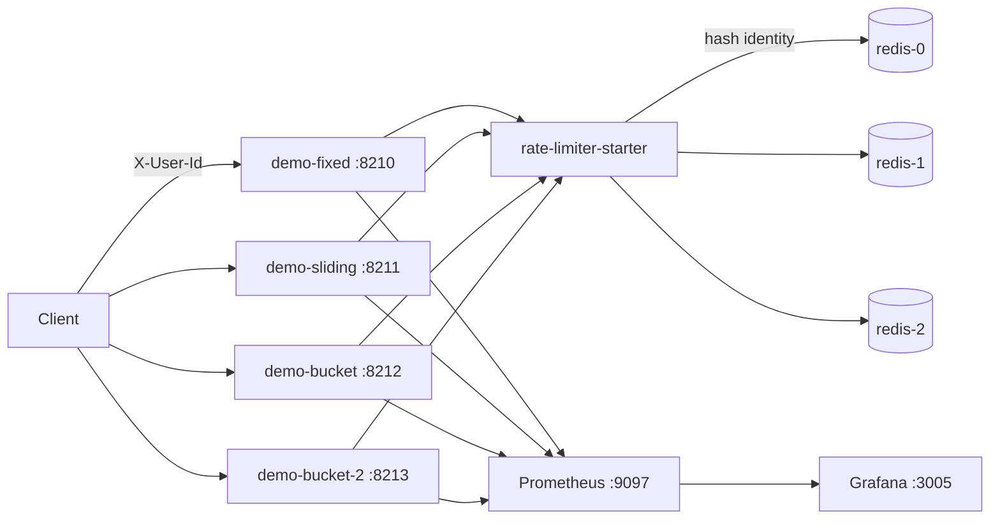
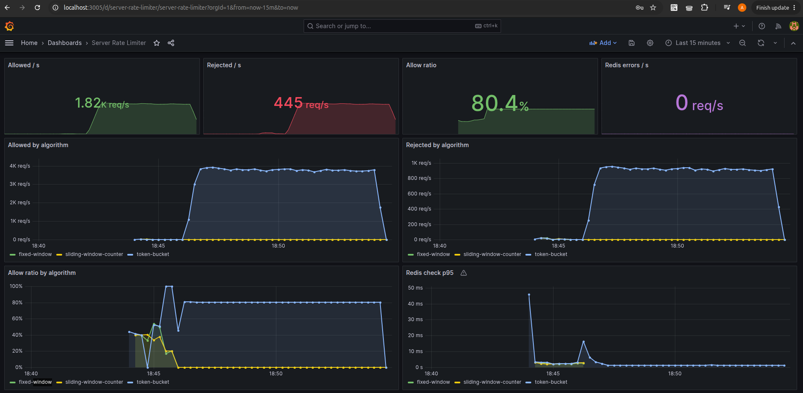
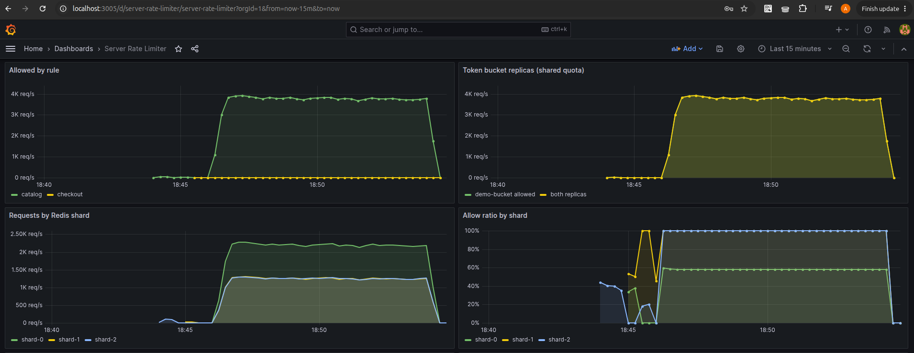

# server-rate-limiter

## Проблема

На входе API лимит часто стоит как готовый рычаг: nginx, API gateway, один счётчик в Redis. Он отрезает лишние запросы, но не показывает, какая политика это делает и чем она платит:

- **Fixed window** дёшев (`INCR` + TTL), но на границе окна пропускает burst `2N`: `N` в конце текущего окна и `N` в начале следующего.
- **Sliding window** едет вместе с запросом, дырки на границе нет. Лог точный и ест память, взвешенный счётчик — `O(1)` приближение.
- **Token bucket** копит жетоны со скоростью `limit / window` до `burst`. Средняя скорость гладкая, короткий всплеск после тишины разрешён.

Нужен per-key лимит на входе, общий для всех инстансов: один и тот же ключ не должен получать отдельную квоту на каждой реплике.

## Решение

**rate-limiter-starter** — Spring Boot starter. Алгоритм, лимиты и правила задаются в конфиге. Каждый check — один Lua-скрипт в Redis, поэтому квота не размножается по JVM.

**demo-api-service** — один и тот же API в четырёх контейнерах: fixed window, sliding window counter, token bucket и вторая реплика token bucket. Реплики делят ключи, лимит не удваивается. Квоты разложены по **трём Redis** через application-level sharding по `identity`.



## Алгоритмы

`rate-limiter.algorithm` — алгоритм по умолчанию. Правило может переопределить его своим `algorithm`.

| Код в конфиге | Идея | Память в Redis |
|---|---|---|
| `fixed-window` | счётчик на календарное окно | один `INCR` на окно |
| `sliding-window-log` | ZSET событий за последние `window` | по элементу на разрешённый запрос |
| `sliding-window-counter` | вес предыдущего окна + счётчик текущего | два счётчика |
| `token-bucket` | `tokens += rate * dt`, потолок `burst` | hash `tokens` + `ts` |

Время берётся из `TIME` внутри скрипта, не из часов приложения.

### fixed-window

Окно `floor(now / window)`. Первый `INCR` ставит `PEXPIRE` до конца окна. Запрос проходит, пока `count <= limit`.

На границе секунды оба соседних окна ещё «свежие», поэтому два пакета по `limit` проходят почти подряд. Это и есть дырка `2N`.

### sliding-window-log

Ключ — ZSET, score = время Redis. Перед проверкой выкидывается всё старше `window`. Если `ZCARD < limit`, запрос добавляется. Повтор через 50 мс после границы всё ещё видит хвост предыдущего окна, поэтому второй пакет получает 429.

Точный и дороже по памяти: каждая успешная попытка живёт в ZSET до конца окна. Под большим числом ключей лучше counter.

### sliding-window-counter

Приближение без лога:

```
weight   = (window - elapsed) / window
estimate = prev * weight + curr
```

`prev` — счётчик прошлого окна, `curr` — текущего. Память `O(1)` на ключ. Внутри одного окна при пустом `prev` совпадает с fixed window. На границе вес `prev` ещё большой, и второй пакет не проходит целиком. Это оценка, не точный лог: ошибка в пределах одного окна.

### token-bucket

Жетоны копятся непрерывно: `rate = limit / window`, потолок — `burst`. `burst: 0` значит «равен limit».

Fixed и sliding **не смотрят** на `burst`. Их потолок — `limit`. Поэтому в демо у catalog `burst == limit` (алгоритмы сравнимы на границе окна), а у checkout `limit: 5`, `burst: 20` (после тишины bucket пропускает пачку, остальные — только 5).

Скрипт атомарный: параллельные инстансы не могут вместе потратить один и тот же жетон.

## Правила и ключ

Длинный префикс побеждает короткий. Одинаковая длина — побеждает правило выше в списке. `/actuator` исключён.

```yaml
rate-limiter:
  algorithm: token-bucket          # fixed-window | sliding-window-log | sliding-window-counter | token-bucket
  key-prefix: rl                   # инстансы с одним prefix делят квоту
  on-redis-error: reject           # reject | allow
  key:
    strategy: header               # header | ip
    header: X-User-Id
    fallback-to-ip: true
  sharding:
    enabled: true
    nodes:
      - name: shard-0
        host: redis-0
        port: 6379
      - name: shard-1
        host: redis-1
        port: 6379
      - name: shard-2
        host: redis-2
        port: 6379
  rules:
    - name: catalog
      path-prefixes: [/api/catalog]
      limit: 20
      window: 1s
      burst: 20
    - name: checkout
      path-prefixes: [/api/checkout]
      limit: 5
      window: 1s
      burst: 20
```

Ключ Redis (cluster-shaped): `rl:{algorithm}:{rule}:{identity}` — identity в **hash-tag**, чтобы суффиксы окон внутри Lua (`base:windowId`) оставались в одном hash slot при переходе на Redis Cluster.

Пример: `rl:sliding-window-counter:checkout:{alice}`.

Алгоритм входит в ключ, поэтому три демо-инстанса не мешают друг другу. Две реплики token bucket используют один и тот же ключ **и тот же shard** для одного `X-User-Id`.

### Шардирование

`shard = CRC32(identity) % N`. Один identity всегда на одном Redis — квота атомарна. Разные пользователи размазываются по шардам.

`sharding.enabled=false` (по умолчанию в starter) — один `ReactiveStringRedisTemplate` Spring Boot, label шарда = `single-shard-name` (default). Демо включает sharding на три ноды.

`X-User-Id` чистится до `[A-Za-z0-9._@-]` и обрезается до 128 символов. Нет заголовка — remote address, нет и его — `anonymous` (все такие запросы делят одну корзину **и один shard**).

Redis шарда недоступен: по умолчанию 429 (`on-redis-error: reject`). Локальный счётчик не включается — иначе у каждого инстанса была бы своя квота.

Стартер можно звать и без фильтра: бин `RateLimiter.check(rule, identity)`.

## Заголовки

На каждый ограниченный ответ, и на 200, и на 429:

| Заголовок | Смысл |
|---|---|
| `X-RateLimit-Limit` | квота окна; у token bucket это `burst` |
| `X-RateLimit-Remaining` | сколько ещё можно |
| `X-RateLimit-Reset` | unix-время, когда окно сбросится / bucket снова полный |
| `X-RateLimit-Policy` | имя алгоритма |
| `X-RateLimit-Shard` | имя Redis-шарда (`shard-0` …) |
| `RateLimit-Limit` / `RateLimit-Remaining` | то же квотой |
| `RateLimit-Reset` | секунды до сброса |
| `RateLimit-Policy` | `20;w=1` или `20;w=1;burst=20` |
| `Retry-After` | только на 429, секунды до повтора, округление вверх |

Тело 429: `error`, `rule`, `algorithm`, `shard`, `limit`, `remaining`, `retryAfterMs`.

## Redis

| Key | Type | Назначение |
|---|---|---|
| `rl:{alg}:{rule}:{id}:{windowId}` | STRING | fixed window и sliding counter |
| `rl:sliding-window-log:{rule}:{id}` | ZSET | лог скользящего окна |
| `rl:token-bucket:{rule}:{id}` | HASH | `tokens`, `ts` |

В ключах `{id}` — Redis hash-tag (сам identity). Шард выбирается в приложении до Lua.

## Модули

| Модуль | Роль |
|---|---|
| `rate-limiter-starter` | Lua, `RateLimitWebFilter`, метрики |
| `demo-api-service` | `/api/catalog`, `/api/checkout`, `/api/search` |
| `scripts/gatling` | четыре профиля нагрузки |

## Стек

- Kotlin / Java 21 / Spring Boot 3 (WebFlux)
- Spring Data Redis Reactive + Lua
- Micrometer / Prometheus / Grafana
- Docker Compose / Gatling

## Запуск

```bash
# из корня репозитория
./gradlew :server-rate-limiter:rate-limiter-starter:test
./gradlew :server-rate-limiter:demo-api-service:bootJar

cd server-rate-limiter
docker compose up -d --build
```

- Fixed window: http://localhost:8210
- Sliding window counter: http://localhost:8211
- Token bucket: http://localhost:8212 и реплика http://localhost:8213
- Grafana: http://localhost:3005 (admin/admin) — dashboard **Server Rate Limiter**
- Prometheus: http://localhost:9097
- Redis shards: localhost:6383 (`shard-0`), :6393 (`shard-1`), :6394 (`shard-2`)

Чтобы на `:8211` поднять точный лог вместо counter, в compose поменяйте `RATE_LIMITER_ALGORITHM` на `sliding-window-log`.

```bash
curl -i localhost:8212/api/catalog/sku-1 -H 'X-User-Id: alice'
curl -i -X POST localhost:8212/api/checkout -H 'X-User-Id: alice' -H 'Content-Type: application/json' -d '{}'
```

Двадцать первый catalog-запрос того же пользователя за секунду — `429` и `Retry-After`. Тот же запрос с другим `X-User-Id` снова `200`: квота per-key (и, возможно, другой shard).

## Нагрузка (Gatling)

Отдельный Gradle-модуль [`scripts/gatling`](./scripts/gatling). Плагин Gatling 3.13: одна задача `gatlingRun` и `--simulation=...`.

Отчёт: `server-rate-limiter/scripts/gatling/build/reports/gatling/`. В отчёте и 200, и 429 считаются успешным ответом лимитера (есть квотные заголовки). Долю отказов смотрите по кодам ответа и в Grafana.

```bash
# ровный поток 50 rps при лимите 20/s — три алгоритма почти совпадают
./gradlew :server-rate-limiter:scripts:gatling:gatlingRun \
  --simulation=com.andver.ratelimit.gatling.SteadyTrafficSimulation \
  --non-interactive \
  -DDURATION_SECONDS=20 -DRPS=50

# пачка в конце окна и пачка сразу после — дырка fixed window
./gradlew :server-rate-limiter:scripts:gatling:gatlingRun \
  --simulation=com.andver.ratelimit.gatling.WindowBoundaryBurstSimulation \
  --non-interactive \
  -DCYCLES=8

# тишина, потом пачка на /api/checkout — bucket пускает burst, остальные только limit
./gradlew :server-rate-limiter:scripts:gatling:gatlingRun \
  --simulation=com.andver.ratelimit.gatling.SilenceThenBurstSimulation \
  --non-interactive

# 80 запросов на две реплики token bucket, один X-User-Id — квота общая
./gradlew :server-rate-limiter:scripts:gatling:gatlingRun \
  --simulation=com.andver.ratelimit.gatling.SharedBucketSimulation \
  --non-interactive \
  -DUSERS=80

# много user id размазывают load по shard-*; sticky user остаётся на одном
./gradlew :server-rate-limiter:scripts:gatling:gatlingRun \
  --simulation=com.andver.ratelimit.gatling.ShardSpreadSimulation \
  --non-interactive \
  -DDURATION_SECONDS=20 -DRPS=40
```

Свойства: `FIXED_URL`, `SLIDING_URL`, `BUCKET_URL`, `BUCKET_URL_2`, `DURATION_SECONDS`, `RPS`, `CATALOG_LIMIT`, `CYCLES`, `USERS`. `CATALOG_LIMIT` должен совпадать с `limit` правила catalog (по умолчанию 20).

Что видно на дашборде:

- **Steady** — allowed у всех трёх алгоритмов около `limit`, остальное rejected.
- **Boundary** — у fixed window allowed подскакивает почти до `2 * limit` на стыке секунд, sliding остаётся около `limit`.
- **Silence** — после паузы token bucket пропускает около `burst`, fixed и sliding около `limit` checkout.
- **Replicas** — сумма allowed двух token-bucket инстансов держится у одного лимита, а не у двух.
- **Shard spread** — RPS по `shard-0/1/2` при многих user; sticky user не прыгает между шардами.

## Метрики

| Metric | Смысл |
|---|---|
| `rl_requests_total{rule,algorithm,result,shard}` | `allowed`, `rejected`, `redis_error` |
| `rl_check_seconds{rule,algorithm,result,shard}` | время Lua-вызова, histogram |

Теги `rule`, `algorithm`, `shard` — кардинальность конфига/числа шардов, не пользователя. `application` отличает реплики API.




## Тесты

```bash
./gradlew :server-rate-limiter:rate-limiter-starter:test
./gradlew :server-rate-limiter:rate-limiter-starter:integrationTest
```

Integration (Redis через `docker run`): точный лимит fixed / sliding log / sliding counter / token bucket, сброс окна, refill после паузы, гонка из 40 параллельных check не выдаёт больше `limit`, разные identity и алгоритмы не делят корзину. Отдельно — два Redis: sticky identity на одном shard, много user размазываются, ключи не протекают на соседний shard.
