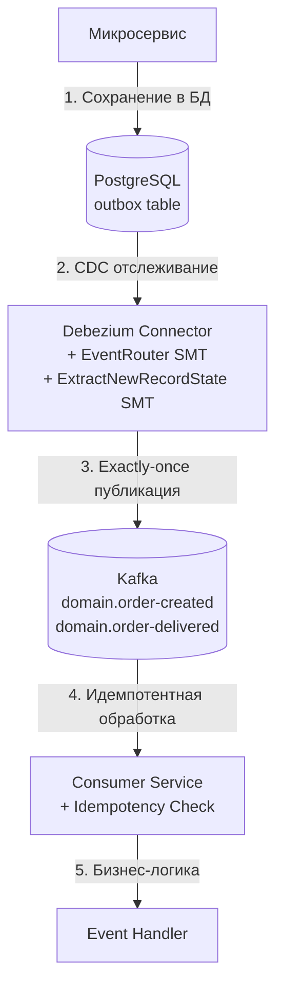

# transactional-outbox-engine

## 📌 Проблема

В микросервисной архитектуре возникает необходимость **гарантированной доставки событий** между сервисами с требованиями:
- **Атомарность** — событие должно быть опубликовано только если основная бизнес-операция успешно завершена
- **Exactly-once семантика** — событие должно быть доставлено ровно один раз, без дублирования
- **Надёжность** — события не должны теряться при сбоях системы
- **Производительность** — публикация событий не должна блокировать основную бизнес-логику

Основные ограничения классического подхода:
- **Прямая публикация в Kafka**  
  При сбое между сохранением данных в БД и публикацией в Kafka событие теряется. Нет гарантии атомарности.
- **Двухфазный коммит (2PC)**  
  Сложность реализации, проблемы с производительностью и доступностью при сбоях координатора.
- **Saga Pattern**  
  Сложная компенсационная логика, нет гарантии exactly-once доставки.
- **Отсутствие идемпотентности**  
  При повторной доставке событий возникает дублирование обработки.

---

## 🎯 Решение

**Transactional Outbox Pattern** с использованием **Debezium CDC** и **Kafka Connect SMT (Single Message Transforms)** для обеспечения:
- **Атомарности** — событие сохраняется в outbox таблицу в той же транзакции, что и основная бизнес-операция
- **Exactly-once семантики** — через Debezium с `exactly.once.support=REQUIRED` и идемпотентную обработку на стороне consumer
- **Автоматической публикации** — Debezium отслеживает изменения в outbox таблице и публикует их в Kafka
- **Маршрутизации событий** — EventRouter SMT автоматически маршрутизирует события в разные топики на основе типа события



---

## 🔧 Архитектура

### Debezium Connector с SMT

Коннектор использует два Single Message Transform:

1. **EventRouter** (`io.debezium.transforms.outbox.EventRouter`)
   - Извлекает payload из поля `payload` таблицы outbox
   - Использует поле `type` для маршрутизации в топики формата `domain.{type}`
   - Использует `partitioning_key` как ключ сообщения Kafka
   - Добавляет `idempotency_key` в заголовки сообщения

2. **ExtractNewRecordState** (`io.debezium.transforms.ExtractNewRecordState`)
   - Извлекает payload из Debezium envelope структуры
   - Удаляет обёртку со schema, оставляя только чистый JSON payload

### Exactly-once семантика

- **Debezium**: `exactly.once.support=REQUIRED` — гарантирует, что каждое изменение из outbox будет опубликовано в Kafka ровно один раз
- **Kafka Producer**: `enable.idempotence=true` — предотвращает дублирование сообщений на уровне Kafka
- **Consumer**: Идемпотентная обработка через проверку `idempotency_key` в БД с блокировкой `SELEct FOR UPDATE`

---

## Компоненты

## ⚙️ outbox-publisher-starter

Spring Boot стартер для публикации событий в outbox таблицу.

### 🛠️ Стек технологий
- **Java 21 / Kotlin**
- **Spring Boot 3**
- **Spring Data R2DBC**
- **PostgreSQL R2DBC Driver**
- **Jackson**

### 🔧 Основные компоненты

#### 1. OutboxPublisher
Интерфейс для публикации событий в outbox:

```kotlin
interface OutboxPublisher {
  fun publish(
    partitioningKey: String,
    eventType: String,
    payload: Any,
    idempotencyKey: UUID? = null
  ): Mono<OutboxEvent>
}
```

**Особенности:**
- `@Transactional(propagation = Propagation.MANDATORY)` — требует существующую транзакцию, гарантируя атомарность с основной операцией
- Автоматическая сериализация payload в JSON
- Поддержка кастомного `idempotencyKey` или автогенерация через БД

#### 2. WriteOutboxRepository
Репозиторий с кастомным методом для работы с JSONB:

```kotlin
@Query("""
  INSERT INTO outbox (partitioning_key, type, payload, idempotency_key, status, created_at)
  VALUES (:partitioningKey, :type, CAST(:payload AS jsonb), :idempotencyKey, :status, :createdAt)
  RETURNING *
""")
fun saveWithJsonb(...): Mono<OutboxEvent>
```

**Использование:**

```kotlin
dependencies {
  implementation(project(":transactional-outbox-engine:outbox-publisher-starter"))
}
```

**Пример использования:**

```kotlin
@Service
class OrderService(
  private val orderRepository: OrderRepository,
  private val outboxPublisher: OutboxPublisher
) {
  
  @Transactional
  fun createOrder(userId: Long, totalAmount: Double): Mono<Order> {
    val order = Order(userId = userId, totalAmount = totalAmount, status = OrderStatus.CREATED)
    
    return orderRepository.save(order)
      .flatMap { savedOrder ->
        // Публикация события в той же транзакции
        outboxPublisher.publish(
          partitioningKey = userId.toString(),
          eventType = "order.created",
          payload = mapOf(
            "orderId" to savedOrder.id,
            "userId" to userId,
            "totalAmount" to totalAmount
          )
        )
        .thenReturn(savedOrder)
      }
  }
}
```

**Настройки (application.yml):**

```yaml
spring:
  r2dbc:
    url: r2dbc:postgresql://localhost:5432/master
    username: demo
    password: demo
```

---

## ⚙️ outbox-consumer-starter

Spring Boot стартер для обработки событий из Kafka с гарантией идемпотентности.

### 🛠️ Стек технологий
- **Java 21 / Kotlin**
- **Spring Boot 3**
- **Spring Kafka**
- **Spring Data R2DBC**
- **PostgreSQL R2DBC Driver**
- **Jackson**

### 🔧 Основные компоненты

#### 1. OutboxEventConsumer
Kafka consumer, который:
- Подписывается на топики формата `domain.{eventType}`
- Извлекает `idempotencyKey` из заголовков сообщения
- Маршрутизирует события к соответствующим обработчикам

#### 2. IdempotentEventProcessor
Обрабатывает события с гарантией идемпотентности

**Особенности:**
- `SELECT FOR UPDATE` блокировка для предотвращения конкурентной обработки
- Проверка статуса сообщения перед обработкой
- Обновление статуса на `PROCESSED` или `FAILED`

#### 3. OutboxEventHandler
Интерфейс для обработчиков событий:

```kotlin
interface OutboxEventHandler {
  val eventType: String
  fun handleInternal(event: OutboxEvent): Mono<OutboxEvent>
}

abstract class AbstractOutboxEventHandler<T : Any>(
  protected val objectMapper: ObjectMapper,
  abstract val payloadType: Class<T>
) : OutboxEventHandler {
  // Автоматическая десериализация payload
}
```

**Использование:**

```kotlin
dependencies {
  implementation(project(":transactional-outbox-engine:outbox-consumer-starter"))
}
```

**Пример обработчика:**

```kotlin
@Component
class OrderCreatedHandler(
  objectMapper: ObjectMapper,
  private val notificationService: NotificationService
) : AbstractOutboxEventHandler<OrderCreatedPayload>() {
  
  override val eventType: String = "order.created"
  override val payloadType = OrderCreatedPayload::class.java
  
  override fun handle(event: OutboxEvent, payload: OrderCreatedPayload): Mono<Void> {
    return notificationService.sendOrderCreatedNotification(payload.userId, payload.orderId)
      .then()
  }
}
```

**Настройки (application.yml):**

```yaml
spring:
  kafka:
    bootstrap-servers: localhost:9092
    consumer:
      group-id: notification-service-outbox
      auto-offset-reset: earliest
      enable-auto-commit: false
    listener:
      ack-mode: manual

outbox:
  consumer:
    enabled: true
    topics: domain.order.created,domain.order.delivered
    group-id: ${spring.application.name}-outbox
```

---

## 🔧 Debezium Connector Configuration

Коннектор настроен с использованием двух SMT для трансформации событий:

### EventRouter SMT

```json
{
  "transforms": "outbox,unwrap",
  "transforms.outbox.type": "io.debezium.transforms.outbox.EventRouter",
  "transforms.outbox.route.by.field": "type",
  "transforms.outbox.route.topic.replacement": "domain.${routedByValue}",
  "transforms.outbox.table.field.event.key": "partitioning_key",
  "transforms.outbox.table.field.event.payload": "payload",
  "transforms.outbox.table.field.event.id": "id",
  "transforms.outbox.table.field.event.type": "type",
  "transforms.outbox.table.fields.additional.placement": "idempotency_key:header:idempotencyKey"
}
```

**Что делает:**
- Извлекает `type` из таблицы и создаёт топик `domain.{type}`
- Использует `partitioning_key` как ключ сообщения Kafka
- Добавляет `idempotency_key` в заголовки сообщения для идемпотентной обработки

### ExtractNewRecordState SMT

```json
{
  "transforms.unwrap.type": "io.debezium.transforms.ExtractNewRecordState",
  "transforms.unwrap.drop.tombstones": "false",
  "transforms.unwrap.delete.handling.mode": "none"
}
```

**Что делает:**
- Удаляет Debezium envelope структуру (schema + payload)
- Оставляет только чистый JSON payload в теле сообщения

### Exactly-once Support

```json
{
  "exactly.once.support": "REQUIRED"
}
```

**Гарантии:**
- Каждое изменение в outbox таблице будет опубликовано в Kafka ровно один раз
- При сбоях коннектор автоматически восстанавливается и продолжает с последней позиции

---

## 🛡️ Гарантии и Fault Tolerance

### Атомарность
- События сохраняются в outbox таблицу в той же транзакции, что и основная бизнес-операция
- `Propagation.MANDATORY` гарантирует, что publisher не может быть вызван вне транзакции

### Exactly-once доставка
- **Debezium**: `exactly.once.support=REQUIRED` гарантирует однократную публикацию в Kafka
- **Kafka Producer**: `enable.idempotence=true` предотвращает дублирование на уровне брокера
- **Consumer**: Идемпотентная обработка через `idempotency_key` с блокировкой `SELECT FOR UPDATE`

### Надёжность
- **WAL (Write-Ahead Log)**: Debezium использует PostgreSQL logical replication через `pgoutput`
- **Offset tracking**: Debezium отслеживает позицию чтения в отдельном топике Kafka
- **Retry механизм**: При сбоях коннектор автоматически переподключается и продолжает чтение

### Идемпотентность
- Каждое событие имеет уникальный `idempotency_key` (UUID)
- Consumer проверяет статус события в БД перед обработкой
- `SELECT FOR UPDATE` блокировка предотвращает конкурентную обработку одного события

---

## 🎬 Демо

### 1. Запуск окружения

```bash
cd transactional-outbox-engine
.././gradlew clean build
docker-compose up -d
```

### 2. Создание заказа (публикация события)

```bash
curl -X POST http://localhost:8888/api/orders \
  -H "Content-Type: application/json" \
  -d '{
    "userId": 123,
    "totalAmount": 99.99
  }'
```

**Что происходит:**
1. Заказ сохраняется в таблицу `orders`
2. Событие `order-created` публикуется в таблицу `outbox` в той же транзакции
3. Debezium отслеживает изменение и публикует в Kafka топик `domain.order-created`
4. Consumer обрабатывает событие и отправляет уведомление

### 3. Отметка заказа как доставленного

```bash
curl -X PUT http://localhost:8888/api/orders/1/deliver
```

**Что происходит:**
1. Статус заказа обновляется на `DELIVERED`
2. Событие `order-delivered` публикуется в `outbox`
3. Debezium публикует в топик `domain.order-delivered`
4. Consumer обрабатывает событие доставки

### 4. Проверка событий в outbox

```bash
docker exec -it postgres psql -U demo -d master -c \
  "SELECT * FROM outbox ORDER BY created_at DESC LIMIT 5;"
```

### 5. Проверка событий в Kafka

```bash
# Просмотр топиков
docker exec -it kafka kafka-topics --list --bootstrap-server localhost:9092

# Просмотр сообщений в топике
docker exec -it kafka kafka-console-consumer \
  --bootstrap-server localhost:9092 \
  --topic domain.order.created \
  --from-beginning
```

### 6. Проверка идемпотентности

При повторной обработке события (например, при retry) consumer проверяет статус в БД:

```sql
SELECT * FROM outbox 
WHERE idempotency_key = '...' AND type = 'order-created' 
FOR UPDATE;
```

Если статус уже `PROCESSED`, событие пропускается без повторной обработки.

---

## 📦 Структура проекта

```
transactional-outbox-engine/
├── outbox-model/                      # Общая модель данных
│   └── src/main/kotlin/
│       └── com/andver/outbox/publisher/model/
│           └── OutboxEvent.kt
├── outbox-publisher-starter/          # Spring Boot Starter для публикации событий
│   ├── src/main/kotlin/
│   │   └── com/andver/outbox/publisher/
│   │       ├── OutboxPublisherAutoConfiguration.kt
│   │       ├── OutboxPublisher.kt
│   │       ├── converter/
│   │       │   ├── StringToJsonConverter.kt
│   │       │   └── JsonToStringConverter.kt
│   │       ├── config/
│   │       │   └── R2dbcConfig.kt
│   │       └── repository/
│   │           └── WriteOutboxRepository.kt
│   └── build.gradle.kts
├── outbox-consumer-starter/           # Spring Boot Starter для обработки событий
│   ├── src/main/kotlin/
│   │   └── com/andver/outbox/consumer/
│   │       ├── OutboxConsumerAutoConfiguration.kt
│   │       ├── OutboxEventConsumer.kt
│   │       ├── handler/
│   │       │   └── OutboxEventHandler.kt
│   │       ├── repository/
│   │       │   └── LockingOutboxRepository.kt
│   │       └── service/
│   │           └── IdempotentEventProcessor.kt
│   └── build.gradle.kts
├── simple-order-microservice/         # Пример микросервиса с публикацией событий
│   ├── src/main/kotlin/
│   │   └── com/andver/example/outbox/order/
│   │       ├── SimpleOrderMicroserviceApp.kt
│   │       ├── controller/
│   │       │   └── OrderController.kt
│   │       ├── service/
│   │       │   └── OrderService.kt
│   │       ├── entity/
│   │       │   └── Order.kt
│   │       └── repository/
│   │           └── OrderRepository.kt
│   └── build.gradle.kts
├── simple-notification-microservice/  # Пример микросервиса с обработкой событий
│   ├── src/main/kotlin/
│   │   └── com/andver/example/outbox/notification/
│   │       ├── SimpleNotificationMicroserviceApp.kt
│   │       └── handler/
│   │           ├── OrderCreatedHandler.kt
│   │           └── OrderDeliveredHandler.kt
│   └── build.gradle.kts
├── debezium/
│   └── init-debezium.sh               # Инициализация Debezium коннектора
├── postgres/
│   └── init.sql                        # Схема БД (outbox, orders)
├── docker-compose.yml
└── README.md
```

---

## 🔍 Технические детали

### Схема таблицы outbox

```sql
CREATE TABLE outbox
(
    id               BIGSERIAL PRIMARY KEY,
    partitioning_key VARCHAR(255) NOT NULL,
    type             VARCHAR(100) NOT NULL,
    payload          JSONB        NOT NULL,
    idempotency_key  UUID         NOT NULL DEFAULT gen_random_uuid(),
    status           VARCHAR(50)  NOT NULL DEFAULT 'PENDING',
    created_at       TIMESTAMP    NOT NULL DEFAULT NOW(),
    processed_at     TIMESTAMP    NULL
);

CREATE UNIQUE INDEX idx_outbox_idempotency_key ON outbox (idempotency_key);
CREATE INDEX idx_outbox_status_created ON outbox (status, created_at);
```

### Формат сообщений в Kafka

**Топик:** `domain.order.created`  
**Ключ:** `partitioning_key` (например, `"123"`)  
**Значение:** JSON payload (например, `{"orderId": 1, "userId": 123, "totalAmount": 99.99}`)  
**Заголовки:** `idempotencyKey: "550e8400-e29b-41d4-a716-446655440000"`

### Жизненный цикл события

1. **PENDING** — событие создано в outbox, ожидает обработки Debezium
2. **PROCESSED** — событие успешно обработано consumer'ом
3. **FAILED** — произошла ошибка при обработке события

---

