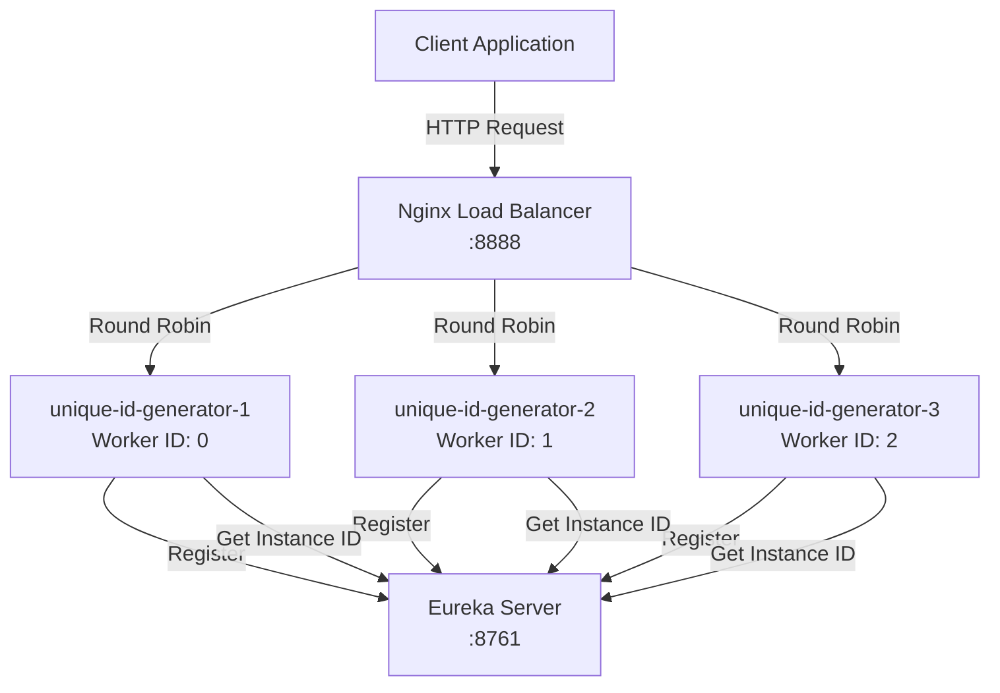

# unique-id-generator

## 📌 Проблема

В микросервисной архитектуре возникает необходимость генерации **уникальных идентификаторов** для сущностей (заказы, пользователи, транзакции и т.д.) с требованиями:
- **Глобальная уникальность** — идентификаторы должны быть уникальными во всей распределённой системе
- **Масштабируемость** — система должна генерировать миллионы ID в секунду
- **Отсутствие координации** — генерация ID не должна требовать синхронной координации между сервисами
- **Монотонность** — ID должны быть упорядочены по времени (хотя бы приблизительно)
- **Отказоустойчивость** — система должна продолжать работать при сбоях отдельных инстансов

Основные ограничения классических подходов:
- **UUID/GUID**  
  Не упорядочены по времени, занимают много места (128 бит), не читаемы для человека.
- **Автоинкремент в БД**  
  Требует синхронную координацию, создаёт узкое место производительности, сложно масштабировать.
- **Централизованный сервис**  
  Единая точка отказа, ограничения по пропускной способности.
- **Timestamp + Random**  
  Нет гарантии уникальности, возможны коллизии при высокой нагрузке.

**Типичные сценарии:**
- Генерация ID для заказов, платежей, пользователей
- Создание уникальных идентификаторов для событий в event-driven архитектуре
- Генерация ID для распределённых транзакций

---

## 🎯 Решение

**Snowflake Algorithm** — распределённый алгоритм генерации уникальных 64-битных ID, который объединяет:
- **Snowflake ID Generator** — реализация алгоритма Snowflake с автоматическим определением worker ID через Eureka
- **Eureka Service Discovery** — для автоматического распределения worker ID между инстансами
- **Nginx Load Balancer** — для распределения нагрузки между несколькими инстансами генератора
- **Горизонтальное масштабирование** — поддержка множественных инстансов без координации

Таким образом:
- каждый инстанс генерирует **уникальные ID** без координации с другими,
- система **масштабируется** горизонтально через добавление новых инстансов,
- **высокая производительность** — генерация ID происходит локально без обращения к БД,
- **отказоустойчивость** — при падении одного инстанса другие продолжают работать.



**Преимущества подхода:**
- ✅ **Глобальная уникальность** — комбинация timestamp + datacenter ID + worker ID + sequence гарантирует уникальность
- ✅ **Высокая производительность** — генерация ID происходит локально, без обращения к БД или внешним сервисам
- ✅ **Масштабируемость** — можно запускать множество инстансов, каждый с уникальным worker ID
- ✅ **Монотонность** — ID упорядочены по времени (приблизительно)
- ✅ **Компактность** — 64-битные ID (в отличие от 128-битных UUID)

---

## 🏗️ Архитектура решения

### Структура Snowflake ID

64-битный ID состоит из:
- **1 бит** — зарезервирован (всегда 0)
- **41 бит** — timestamp (миллисекунды с эпохи `twepoch = 1288834974657L`)
- **5 бит** — datacenter ID (0-31)
- **5 бит** — worker ID (0-31)
- **12 бит** — sequence number (0-4095)

```
┌─┬─────────────────────────────────┬──────────┬──────────┬────────────┐
│0│        Timestamp (41 bits)      │DC ID (5) │Worker(5) │Seq (12)    │
└─┴─────────────────────────────────┴──────────┴──────────┴────────────┘
```

**Максимальная производительность:**
- До **4096 ID в миллисекунду** на один инстанс (sequence: 0-4095)
- При нескольких инстансах производительность масштабируется линейно

### Поток генерации ID

1. **Регистрация в Eureka** — каждый инстанс регистрируется в Eureka с уникальным `instance-id`
2. **Определение Worker ID** — worker ID вычисляется как `hashCode(instanceId) % 32`
3. **Генерация ID** — при запросе:
   - Получаем текущий timestamp
   - Если timestamp совпадает с предыдущим, инкрементируем sequence
   - Если sequence переполнен (4096), ждём следующую миллисекунду
   - Собираем ID из timestamp, datacenter ID, worker ID и sequence
4. **Возврат ID** — возвращаем сгенерированный ID клиенту

---

## ⚙️ Компоненты

### unique-id-generator

Основной сервис для генерации уникальных ID.

#### 🛠️ Стек технологий
- **Kotlin** / Java 21
- **Spring Boot 3**
- **Spring Cloud Netflix Eureka Client**
- **Spring WebFlux** (реактивный REST API)

#### 🔧 Основные компоненты

##### 1. SnowflakeIdGenerator
Реализация алгоритма Snowflake для генерации уникальных ID.

**Особенности:**
- Автоматическое определение `workerId` из Eureka `instanceId`
- Защита от обратного хода часов (throws exception)
- Thread-safe генерация через `AtomicLong`
- Поддержка до 32 worker'ов на datacenter (5 бит)
- Поддержка до 32 datacenter'ов (5 бит)


##### 2. IdGeneratorController
REST контроллер для генерации ID.

**Эндпоинт:**
```
GET /id
```

**Ответ:**
```json
1234567890123456789
```

**Пример использования:**
```bash
curl http://localhost:8888/id
```

##### 3. Eureka Integration
- Автоматическая регистрация в Eureka при старте
- Использование `instanceId` для определения уникального `workerId`
- Health checks для мониторинга состояния инстансов

---

### simple-client

Тестовый клиент для демонстрации работы генератора ID.

**Назначение:**
- Создаёт пул worker'ов, которые постоянно запрашивают ID
- Демонстрирует распределение нагрузки через Nginx
- Показывает работу нескольких инстансов генератора

**Конфигурация:**
```yaml
client:
  pool-size: 10  # Количество параллельных worker'ов
```

---

### load-balancer (Nginx)

Nginx используется как load balancer для распределения запросов между инстансами.

**Конфигурация:**
- Round-robin балансировка между 3 инстансами
- Проксирование на порт `8888`
- Health checks через Docker Compose

---

## 🛡️ Отказоустойчивость (Fault Tolerance)

- **Независимые инстансы**  
  Каждый инстанс генерирует ID независимо. При падении одного инстанса другие продолжают работать.

- **Eureka Service Discovery**  
  Автоматическое обнаружение доступных инстансов. Nginx автоматически исключает недоступные инстансы.

- **Health Checks**  
  Docker Compose проверяет здоровье инстансов через `/actuator/health`. Недоступные инстансы не получают трафик.

- **Защита от обратного хода часов**  
  При обнаружении обратного хода системных часов генератор выбрасывает исключение, предотвращая генерацию дублирующихся ID.

---

## 🛡️ Масштабируемость (Scalability)

- **Горизонтальное масштабирование**  
  Можно запускать множество инстансов генератора. Каждый инстанс получает уникальный `workerId` через Eureka, что гарантирует уникальность генерируемых ID.

- **Высокая производительность**  
  Генерация ID происходит локально в памяти без обращения к БД или внешним сервисам. Каждый инстанс может генерировать до 4096 ID в миллисекунду.

- **Load Balancing**  
  Nginx распределяет запросы между инстансами, обеспечивая равномерную нагрузку.

- **Реактивная архитектура**  
  Использование Spring WebFlux обеспечивает неблокирующую обработку запросов и эффективное использование ресурсов.

---

## 🎬 Демо

### 1. Запуск окружения

```bash
cd unique-id-generator
.././gradlew clean build
docker-compose up -d
```

Система запускает:
- **Eureka Server** на порту `8761` для service discovery
- **Nginx Load Balancer** на порту `8888` для балансировки нагрузки
- **unique-id-generator-1, unique-id-generator-2, unique-id-generator-3** — три инстанса генератора ID
- **simple-client** — тестовый клиент для демонстрации

### 2. Генерация ID

```bash
curl http://localhost:8888/id
```

**Ответ:**
```
1234567890123456789
```

### 3. Проверка регистрации в Eureka

Откройте Eureka Dashboard в браузере:
```
http://localhost:8761
```

Вы увидите три зарегистрированных инстанса:
- `id-generator:unique-id-generator-1`
- `id-generator:unique-id-generator-2`
- `id-generator:unique-id-generator-3`

### 4. Нагрузочное тестирование

Запустите несколько запросов параллельно:

```bash
for i in {1..10}; do
  curl http://localhost:8888/id &
done
wait
```

Все запросы будут обработаны, и каждый получит уникальный ID.

### 5. Мониторинг логов

Проверьте логи инстансов генератора:

```bash
docker-compose logs -f unique-id-generator-1
```

Вы увидите логи генерации ID:
```
Generated id: 1234567890123456789
```

### 6. Проверка распределения нагрузки

Проверьте логи всех инстансов, чтобы убедиться, что Nginx распределяет запросы между ними:

```bash
docker-compose logs unique-id-generator-1 | grep "Generated id" | wc -l
docker-compose logs unique-id-generator-2 | grep "Generated id" | wc -l
docker-compose logs unique-id-generator-3 | grep "Generated id" | wc -l
```

### 7. Тестирование отказоустойчивости

Остановите один из инстансов:

```bash
docker-compose stop unique-id-generator-1
```

Продолжайте генерировать ID:

```bash
curl http://localhost:8888/id
```

Система продолжит работать, используя оставшиеся инстансы.

---

## 📦 Структура проекта

```
unique-id-generator/
├── unique-id-generator/              # Основной сервис генератора ID
│   ├── src/main/kotlin/com/andver/id/generator/
│   │   ├── UniqueIdGeneratorApp.kt
│   │   ├── SnowflakeIdGenerator.kt  # Реализация алгоритма Snowflake
│   │   ├── IdGenerator.kt           # Интерфейс генератора
│   │   └── controller/
│   │       └── IdGeneratorController.kt  # REST контроллер
│   ├── src/main/resources/
│   │   └── application.yml
│   └── build.gradle.kts
│
├── simple-client/                    # Тестовый клиент
│   ├── src/main/kotlin/com/andver/example/id/generator/
│   │   └── SimpleIdGeneratorClientApp.kt
│   ├── src/main/resources/
│   │   └── application.yml
│   └── build.gradle.kts
│
├── nginx/
│   └── nginx.conf                    # Конфигурация Nginx load balancer
│
├── docker-compose.yml                # Конфигурация Docker Compose
└── README.md
```

---

## 🔍 Технические детали

### Алгоритм Snowflake

**Формула генерации ID:**
```
id = ((timestamp - twepoch) << 22) | (datacenterId << 17) | (workerId << 12) | sequence
```

**Где:**
- `timestamp` — текущее время в миллисекундах
- `twepoch` — эпоха (1288834974657L) — 2010-11-04 09:42:54.657 UTC
- `datacenterId` — ID дата-центра (0-31)
- `workerId` — ID воркера (0-31), вычисляется из Eureka instanceId
- `sequence` — порядковый номер в пределах миллисекунды (0-4095)

**Ограничения:**
- Максимальная производительность: **4096 ID/мс** на инстанс
- Максимум **32 воркера** на дата-центр
- Максимум **32 дата-центра**
- ID валидны до **2199 года** (41 бит timestamp)

### Worker ID Generation

Worker ID вычисляется из Eureka `instanceId`:
```kotlin
workerId = abs(instanceId.hashCode() % 32)
```

Это гарантирует:
- Уникальность worker ID для каждого инстанса
- Стабильность worker ID при перезапуске (если instanceId не меняется)
- Распределение worker ID в диапазоне 0-31

### Thread Safety

Генерация ID thread-safe благодаря:
- `AtomicLong` для `lastTimestamp` и `sequence`
- `compareAndSet` для атомарного обновления состояния
- Spin-lock для обработки конкурентных запросов

---


